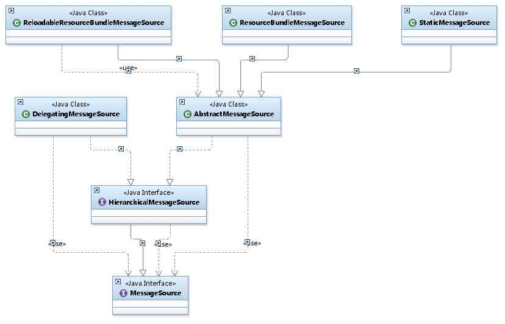

# 070-MessageSource内建实现

[TOC]

## 简介

- 预注册Bean名称为"messageSource" ,类型为MessageSource Bean
- 默认内建实现-DelegatingMessageSource
  - 层次性查找MessageSource对象

## 内建MessageSource初始化过程

 [060-初始化内建Bean：MessageSource-initMessageSource().md](../019-Spring应用上下文生命周期/060-初始化内建Bean：MessageSource-initMessageSource().md) 

## MessageSource

```java
public interface MessageSource {

	@Nullable
	String getMessage(String code, @Nullable Object[] args, @Nullable String defaultMessage, Locale locale);
	String getMessage(String code, @Nullable Object[] args, Locale locale) throws NoSuchMessageException;
	String getMessage(MessageSourceResolvable resolvable, Locale locale) throws NoSuchMessageException;

}
```

Spring定义了访问国际化信息的MessageSource接口，并提供了几个易用的实现类。MessageSource分别

- HierarchicalMessageSource 拓展了 MessageSource
- ApplicationContext接口扩展了MessageSource

这里我们主要看一下HierarchicalMessageSource接口的几个实现类



HierarchicalMessageSource接口最重要的两个实现类是

- ResourceBundleMessageSource

- ReloadableResourceBundleMessageSource

它们基于Java的ResourceBundle基础类实现，允许仅通过资源名加载国际化资源。

- ReloadableResourceBundleMessageSource提供了定时刷新功能，允许在不重启系统的情况下，更新资源的信息。
- StaticMessageSource主要用于程序测试，它允许通过编程的方式提供国际化信息。
- DelegatingMessageSource是为方便操作父MessageSource而提供的代理类。

仅仅举例ResourceBundleMessageSource的实现方式。

## 初始化的时机

```
//7、初始化信息源，和国际化相关.
initMessageSource();
```

在initMessageSource中获取自定义资源文件的方式为

```java
beanFactory.getBean(MESSAGE_ SOURCE_BEAN_NAME, MessageSource.class)
```

在这里Spring使用了硬编码的方式硬性规定了子定义资源文件必须为message，否则便会获取不到自定义资源配置，这也是为什么之前提到Bean的id如果部位message会抛出异常。

```java
protected void initMessageSource() {
         ConfigurableListableBeanFactory beanFactory = getBeanFactory();
         if (beanFactory.containsLocalBean(MESSAGE_SOURCE_BEAN_NAME)) {
             //如果在配置中已经配置了messageSource，那么将messageSource提取并记录在  
             //this.messageSource中
             this.messageSource = beanFactory.getBean(MESSAGE_SOURCE_BEAN_NAME, MessageSource.class);
             // Make MessageSource aware of parent MessageSource.
             if (this.parent != null && this.messageSource instanceof HierarchicalMessageSource) {
                 HierarchicalMessageSource hms = (HierarchicalMessageSource) this.messageSource;
                 if (hms.getParentMessageSource() == null) {
                     hms.setParentMessageSource(getInternalParentMessageSource());
                 }
             }
             if (logger.isDebugEnabled()) {
                 logger.debug("Using MessageSource [" + this.messageSource + "]");
             }
         }else {
             //如果用户并没有定义配置文件，那么使用临时的DelegatingMessageSource以便于作为调用  
             //getMessage方法的返回
             DelegatingMessageSource dms = new DelegatingMessageSource();
             dms.setParentMessageSource(getInternalParentMessageSource());
             this.messageSource = dms;
             beanFactory.registerSingleton(MESSAGE_SOURCE_BEAN_NAME, this.messageSource);
             if (logger.isDebugEnabled()) {
                 logger.debug("Unable to locate MessageSource with name '" + MESSAGE_SOURCE_BEAN_NAME +"': using default [" + this.messageSource + "]");
    }
}
```


通过读取并将自定义资源文件配置记录在容器中，那么就可以在获取资源文件的时候直接使用了，例如，在AbstractApplicationContext中的获取资源文件属性的方法：

```java
public String getMessage(String code, Object args[], Locale locale) throws NoSuchMessage Exception {
	return getMessageSource().getMessage(code, args, locale);
}
```

其中的getMessageSource()方法正是获取了之前定义的自定义资源配置。

