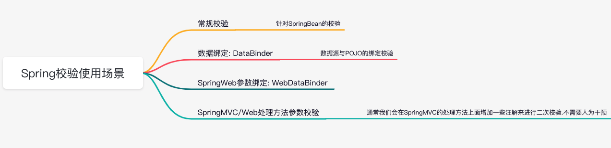

# 010-Spring校验使用场景

[TOC]

## 图示

## 场景总结

- Spring常规校验

- Spring数据绑定(DataBinder)

- Spring Web参数绑定 (WebDataBinder)

- Spring WebMVC/Web处理方法参数校验

## Spring常规校验

对SpringBean对象进行校验，

## Spring数据绑定(DataBinder)

数据源与pojo进行绑定 [013-Spring数据绑定](../013-Spring数据绑定) 

## Spring Web参数绑定 (WebDataBinder)

Servlet引擎的参数(Http请求参数)通常情况下是字符类型的,在进行转化时会进行相关的校验

- 比如 Spring转Long 

## Spring WebMVC/Web处理方法参数校验

通常我们会在SpringMVC的处理方法上面增加一些注解来进行二次校验.不需要人为干预