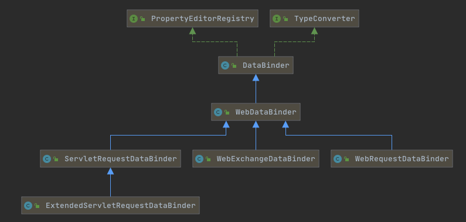

# 010-Spring类型转换的使用场景和实现

[TOC]

## Spring类型转换的历史

- 基于JavaBeans接口的类型转换实现
  - 基于java.beans.PropertyEditor接口拓展
- Spring3.0+通用类型转换实现

## Spring类型转换的使用场景

| 场景                                                         | 基于JavaBeans接口的类型转换实现PropertyEditor | Spring3.0+通用类型的实现 |
| ------------------------------------------------------------ | --------------------------------------------- | ------------------------ |
| [数据绑定](010-Spring类型转换的使用场景和实现.md)            | 是                                            | 是                       |
| [BeanWrapper](012-BeanWrapper中数据绑定的实现.md)            | 是                                            | 是                       |
| [Bean属性类型转换](013-Bean属性类型转换中数据绑定的实现.md)  | 是                                            | 是                       |
| [外部化配置类型转换](014-外部化配置类转换中类型转换的实现.md) | 否                                            | 是                       |

Bean属性类型转换主要是在BeanFactory在构造Bean的时候使用BeanWrapper进行类型转换

SpringBoot在处理外部化配置类型转换使用到了PropertyEditor

## 数据绑定和PropertyEditor的关系



我们可以看出DataBinder是实现了PropertyEditorRegistry 接口的,这个接口涵盖了属性编辑器的注册中心

### PropertyEditorRegistry源码

```java
public interface PropertyEditorRegistry {

	//	注册自定义的编辑器
	void registerCustomEditor(Class<?> requiredType, PropertyEditor propertyEditor);

	//注册自定义的编辑器
	void registerCustomEditor(@Nullable Class<?> requiredType, @Nullable String propertyPath, PropertyEditor propertyEditor);


  //根据类型和路径查找属性编辑器
	@Nullable
	PropertyEditor findCustomEditor(@Nullable Class<?> requiredType, @Nullable String propertyPath);

}

```

## BeanWrapper

## Bean属性类型转换

## 外部化配置类型转换