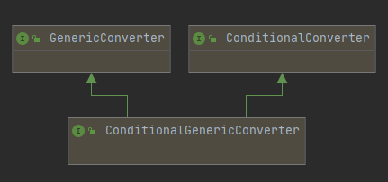

# 090-优化GenericConverter接口-ConditionGenericConverter

[TOC]

## GenericConerter接口

- 复合类型转换 org.springframework.core.convert.converter.GenericConverter
- 类型条件判断 org.springframework.core.convert.converter.ConditionalConverter

## 源码



```java
public interface ConditionalGenericConverter extends GenericConverter, ConditionalConverter {

}
```

## 典型实现

CollectionToArrayConverter 是一个集合转Array的转换器，我们观察特点

```java
final class CollectionToArrayConverter implements ConditionalGenericConverter {

	private final ConversionService conversionService;


	public CollectionToArrayConverter(ConversionService conversionService) {
		this.conversionService = conversionService;
	}


	@Override
	public Set<ConvertiblePair> getConvertibleTypes() {
		return Collections.singleton(new ConvertiblePair(Collection.class, Object[].class));
	}

	@Override
	public boolean matches(TypeDescriptor sourceType, TypeDescriptor targetType) {
		return ConversionUtils.canConvertElements(sourceType.getElementTypeDescriptor(),
				targetType.getElementTypeDescriptor(), this.conversionService);
	}

	@Override
	@Nullable
	public Object convert(@Nullable Object source, TypeDescriptor sourceType, TypeDescriptor targetType) {
		if (source == null) {
			return null;
		}
		Collection<?> sourceCollection = (Collection<?>) source;
		TypeDescriptor targetElementType = targetType.getElementTypeDescriptor();
		Assert.state(targetElementType != null, "No target element type");
		Object array = Array.newInstance(targetElementType.getType(), sourceCollection.size());
		int i = 0;
		for (Object sourceElement : sourceCollection) {
			Object targetElement = this.conversionService.convert(sourceElement,
					sourceType.elementTypeDescriptor(sourceElement), targetElementType);
			Array.set(array, i++, targetElement);
		}
		return array;
	}

}
```

### 首先获取转换类型对

```java
@Override
public Set<ConvertiblePair> getConvertibleTypes() {
    //可以看到这里
    return Collections.singleton(new ConvertiblePair(Collection.class, Object[].class));
}
```

可以看到这里是直接new了一个键值对，参数为Collection和Object

### 其次其match方法

```java
@Override
public boolean matches(TypeDescriptor sourceType, TypeDescriptor targetType) {
	return ConversionUtils.canConvertElements(sourceType.getElementTypeDescriptor(),
	targetType.getElementTypeDescriptor(), this.conversionService);
}
```

### 最后是转换方法

```java
@Override
@Nullable
public Object convert(@Nullable Object source, TypeDescriptor sourceType, TypeDescriptor targetType) {
    if (source == null) {
        return null;
    }
    Collection<?> sourceCollection = (Collection<?>) source;
    TypeDescriptor targetElementType = targetType.getElementTypeDescriptor();
    Assert.state(targetElementType != null, "No target element type");
    Object array = Array.newInstance(targetElementType.getType(), sourceCollection.size());
    int i = 0;
    for (Object sourceElement : sourceCollection) {
        Object targetElement = this.conversionService.convert(sourceElement,
                                                              sourceType.elementTypeDescriptor(sourceElement), targetElementType);
        Array.set(array, i++, targetElement);
    }
    return array;
}

```

## 