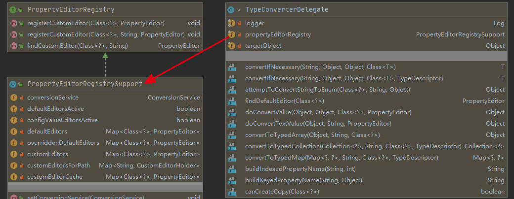
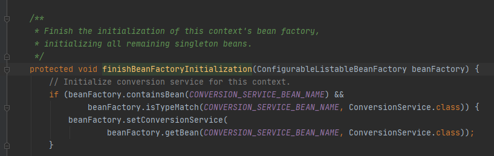
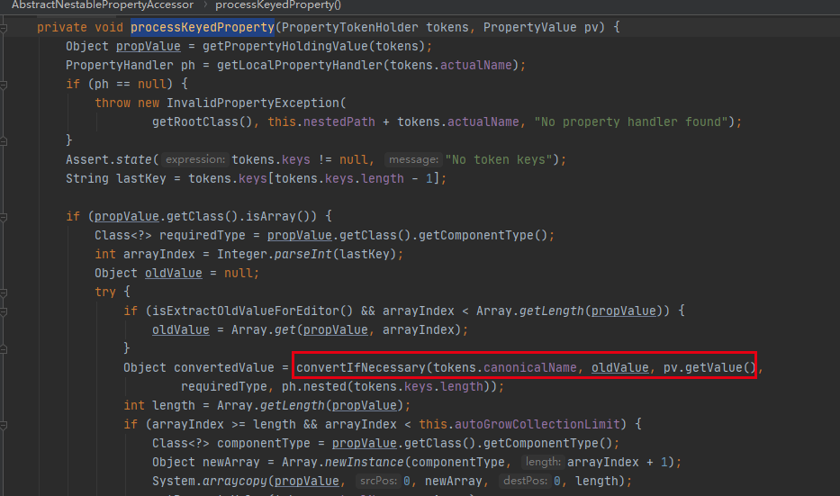
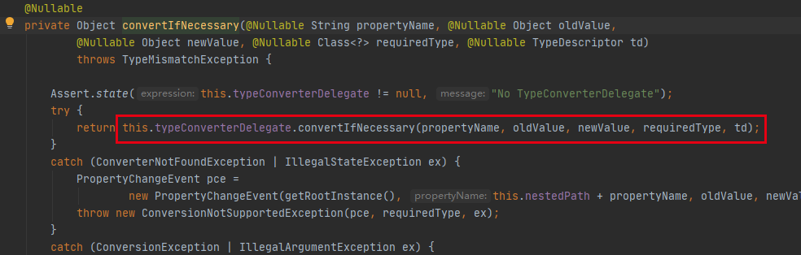

# 120-类型转换底层接口-TypeConverter

[TOC]

## 类型转换底层接口org.springframework.beans.TypeConverter

### TypeConverter的作用

TypeConverter实际上把两个语义合在一起了

- ConditionConverter - canConvert方法
- Convert - convert方法

合并成了convertNecessary 尽量转化

### TypeConverter关注点

- 起始版本： Spring2.0
- 核心方法： convertNecessary 重载方法
- 抽象实现：org.springframework.beans.TypeConverterSupport
- 简单实现：org.springframework.beans.TypeConverterDelegate

## TypeConverterSupport

- 实现接口 ： org.springframework.beans.TypeConverter
- 拓展实现 ： org.springframework.beans.PropertyEditorRegistrySupport
- 委派实现：org.springframework.beans.TypeConverterDelegate

通过实现PropertyEditorRegistrySupport，具备了注册PropertyEditor的能力,其具体的转化方法在委派实现TypeConverterDelegate中


## TypeConverterDelegate

- 构造来源 - org.springframework.beans.AbstractNestablePropertyAccessor 实现
  - org.springframework.beans.BeanWrapperImpl
- 依赖 - java.beans.PropertyEditor实现
  - 默认内建实现 org.springframework.beans.PropertyEditorRegistrySupport#registerDefaultEditors方法
  - 可选依赖：org.springframework.core.convert.ConversionService



- PropertyEditorRegistrySupport添加了所有默认的内建的PropertyEditor
- 如果不能解析，尝试使用ConversionService

## TypeConverter生命周期

- 注册ConvertionService到BeanFactory
- BeanFactory在初始化initantiatedBean时initBeanWrapper的时候设置到BeanWrapper
- BeanWrapper设置属性setPropertyValues时进行类型转换TypeConverter#convertIfNecessnary
- 代理类TypeConverterDelegate 代理执行

### 注册ConvertionService到BeanFactory

org.springframework.context.support.AbstractApplicationContext#finishBeanFactoryInitialization

可以看出必须是 name="conversionService" ,类型 是 ConvertionService的实现类才可以



### BeanFactory在初始化initantiatedBean时initBeanWrapper的时候设置到BeanWrapper

org.springframework.beans.factory.support.AbstractBeanFactory#initBeanWrapper

```java
	protected void initBeanWrapper(BeanWrapper bw) {
		bw.setConversionService(getConversionService());
		registerCustomEditors(bw);
	}
```

从factory中获取并设置进去，顺便注册一下CustomEditors

### BeanWrapper设置属性setPropertyValues时进行类型转换TypeConverter#convertIfNecessnary

org.springframework.beans.AbstractNestablePropertyAccessor#processKeyedProperty



### 代理类TypeConverterDelegate 代理执行

