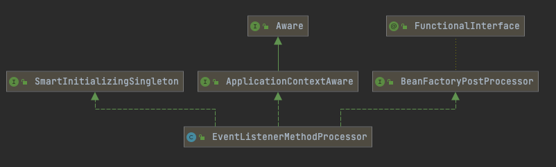

# 160-EventListener注解原理

[TOC]

## 原理简介


## 核心类

- org.springframework.context.event.EventListenerMethodProcessor



## 源码分析

EventListenerMethodProcessor 实现了 BeanFactoryPostProcessor ,在 BeanFactory 初始化完成之后,获取到所有的EventListenerFactory类型的工厂

```java
	@Override
	public void postProcessBeanFactory(ConfigurableListableBeanFactory beanFactory) {
		this.beanFactory = beanFactory;
		Map<String, EventListenerFactory> beans = beanFactory.getBeansOfType(EventListenerFactory.class, false, false);
		List<EventListenerFactory> factories = new ArrayList<>(beans.values());
		AnnotationAwareOrderComparator.sort(factories);
		this.eventListenerFactories = factories;
	}
```

通过Factory获取到 ApplicationListenerMethodAdapter

```java
public class DefaultEventListenerFactory implements EventListenerFactory, Ordered {

	private int order = LOWEST_PRECEDENCE;


	public void setOrder(int order) {
		this.order = order;
	}

	@Override
	public int getOrder() {
		return this.order;
	}


	@Override
	public boolean supportsMethod(Method method) {
		return true;
	}

	@Override
	public ApplicationListener<?> createApplicationListener(String beanName, Class<?> type, Method method) {
		return new ApplicationListenerMethodAdapter(beanName, type, method);
	}

}
```

