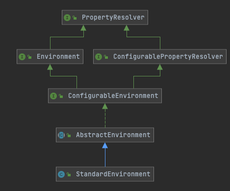

# 010-理解Spring-Environment抽象

[TOC]

## 一言蔽之

Spring Environment抽象都包含什么

- **统一的Spring配置属性管理**

Spring Framework 3.1 开始引入 Environment抽象, **它统一Spring配置属性的存储,** 包括占位符处理和**类型转换**, 不仅完整的个替换了 (PropertySourcesPlaceholderConfigurer) , 而且还支持更加丰富的配置属性源 (PropertySource)

- **条件化SpringBean装配管理**

通过 Environment Profiles 信息, 帮助Spring容器提供条件化地装配Bean

## UML



## Environment接口

- 核心接口- Envoronment
- 父接口-PropertyResolver
- 可配置接口-ConfigurableEnvironment
- 职责
  - 管理Spring配置属性源(org.springframework.core.env.MutablePropertySources)
  - 管理Profiles(org.springframework.core.env.Profiles)
  - 管理Java的SystemEnvironment
  - 管理Java的SystemProperties

### Environment父接口PropertyResolver

PropertyResolver 从名称来看,是属性的解析器,主要包含的功能是对属性的解析

```java
public interface PropertyResolver {
  //是否包含属性
	boolean containsProperty(String key);
  //获取属性
	@Nullable
	String getProperty(String key);
	String getProperty(String key, String defaultValue);
  // 获取属性并尝试转换类型,如果返回null则说明转换失败
	@Nullable
	<T> T getProperty(String key, Class<T> targetType);
	<T> T getProperty(String key, Class<T> targetType, T defaultValue);
  //
	String getRequiredProperty(String key) throws IllegalStateException;
	<T> T getRequiredProperty(String key, Class<T> targetType) throws IllegalStateException;
  //处理占位符${...}
	String resolvePlaceholders(String text);
	String resolveRequiredPlaceholders(String text) throws IllegalArgumentException;
}
```

从这个接口来看，很像是BeanFactory接口，封装了最顶层的属性解析（只读）的方法，获取属性，

值得注意的时尝试进行类型转换的

```
	<T> T getProperty(String key, Class<T> targetType);
```

一定使用了Spring类型转换机制

 [080-Spring类型转换在Environment中的运用.md](080-Spring类型转换在Environment中的运用.md) 

### Environment抽象

Environment抽象主要抽象了环境相关的行为,获取激活的Profile, 默认的ProfIle

```java
  public interface Environment extends PropertyResolver {
	//激活的Profile
	String[] getActiveProfiles();
	//默认的Profile
	String[] getDefaultProfiles();

	//提供的profiles 是否是和 getActiveProfiles() 激活的Profile一致
	@Deprecated
	boolean acceptsProfiles(String... profiles);

	//提供的profiles 是否是和 getActiveProfiles() 激活的Profile一致
	boolean acceptsProfiles(Profiles profiles);
}
```

这个接口实际上就将Profiles的概念引入到了Environment， 这里表明的意思是一个Environment对象对应了多个Profiles.

- 默认的Profiles（可以是多个)
- 激活的Profiles(可以是多个)

我们可以在外部化配置中使用`spring.profiles.active` 来指定激活的Profiles

### ConfigurableEnvironment接口

ConfigurableEnvironment接口抽象了可配置的环境信息

- 设置默认的和激活的Profile
- 获取PropertySources属性源
- 获取Map属性
- 合并Environment

```java
public interface ConfigurableEnvironment extends Environment,ConfigurablePropertyResolver {
	void setActiveProfiles(String... profiles);
	void addActiveProfile(String profile);
	void setDefaultProfiles(String... profiles);
  	//获取PropertySources属性源
	MutablePropertySources getPropertySources();
	
  	//获取系统变量
  	Map<String, Object> getSystemProperties();
  	//获取环境信息
	Map<String, Object> getSystemEnvironment();

	void merge(ConfigurableEnvironment parent);
}

```

其父接口ConfigurablePropertyResolver 提供了PropertyResolver解析相关的功能

- 设置转换服务 

[110-统一类型服务转换器-ConversionService.md](../014-Spring类型转换/110-统一类型服务转换器-ConversionService.md) 

- 设置Placeholder的前缀
- 设置Placeholder的后缀

```java
public interface ConfigurablePropertyResolver extends PropertyResolver {

	ConfigurableConversionService getConversionService();
	void setConversionService(ConfigurableConversionService conversionService);
  //设置Placeholder的前缀
	void setPlaceholderPrefix(String placeholderPrefix);
  //设置Placeholder的后缀
	void setPlaceholderSuffix(String placeholderSuffix);
  //设置分隔符
	void setValueSeparator(@Nullable String valueSeparator);
  //设置遇到无法解析的嵌套属性是是否报错
	void setIgnoreUnresolvableNestedPlaceholders(boolean ignoreUnresolvableNestedPlaceholders);
	//设置必须的属性
  void setRequiredProperties(String... requiredProperties);
  //校验必须的属性
	void validateRequiredProperties() throws MissingRequiredPropertiesException;
}

```

### 抽象实现：AbstractEnvironment抽象出通用逻辑

```java
public abstract class AbstractEnvironment implements ConfigurableEnvironment {
	//激活的Profiles
    private final Set<String> activeProfiles = new LinkedHashSet<>();
	//默认的Profiles
    private final Set<String> defaultProfiles = new LinkedHashSet<>(getReservedDefaultProfiles());
	//可变的属性源
    private final MutablePropertySources propertySources = new MutablePropertySources();
	//属性解析器
    private final ConfigurablePropertyResolver propertyResolver =
        new PropertySourcesPropertyResolver(this.propertySources);
}
```

两个值得注意

- MutablePropertySources的实现，这里new了一个MutablePropertySources，包含多个属性源，具有优先级
- ConfigurablePropertyResolver 的实现 PropertySourcesPropertyResolver 解析器，所有解析操作，均有它代理

例如获取属性的方法：就是由 PropertySourcesPropertyResolver 全权代理

```java
@Override
public <T> T getProperty(String key, Class<T> targetType, T defaultValue) {
    return this.propertyResolver.getProperty(key, targetType, defaultValue);
}
```

