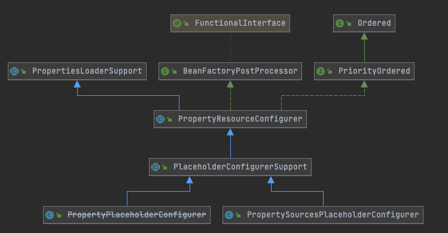

# 030-Environment占位符处理

[TOC]

## 一言蔽之

Environment通过聚合一个PropertySourcesPlaceholderConfigurer从而实现了对占位符属性的解析

调用的逻辑通过在PlaceholderConfigurerSupport里的BeanFactoryProcesser回调中获取bean后解析


## 核心类

- Spring 3.1 之前的占位符处理 
  - 组件 - org.springframework.beans.factory.config.PropertyPlaceholderConfigurer
  - 接口 - org.springframework.util.StringValueResolver

- Spring 3.1 之后的占位符处理
  - 组件 - org.springframework.context.support.PropertySourcesPlaceholderConfigurer
  - 接口 - org.springframework.beans.factory.config.EmbeddedValueResolver

主要是为了利用 Environment中 PropertySource机制

## UML



从类图结构上来看, PropertyPlaceholderConfigurer 和 PropertySourcesPlaceholderConfigurer 都是 PlaceholderConfigurerSupport 的子类

## PropertyPlaceholderConfigurer代码实例

```java
public class PropertyPlaceholderConfigurerDemo {
    public static void main(String[] args) {
        // 创建并且启动 Spring 应用上下文
        ClassPathXmlApplicationContext context = new ClassPathXmlApplicationContext("META-INF/placeholders-resolver.xml");
        User user = context.getBean("user", User.class);
        System.out.println(user);
        // 关闭 Spring 应用上下文
        context.close();
    }
}

```

配置文件

```java
<?xml version="1.0" encoding="UTF-8"?>
<beans xmlns="http://www.springframework.org/schema/beans"
       xmlns:xsi="http://www.w3.org/2001/XMLSchema-instance"
       xsi:schemaLocation="http://www.springframework.org/schema/beans
        https://www.springframework.org/schema/beans/spring-beans.xsd">

    <bean class="org.springframework.beans.factory.config.PropertyPlaceholderConfigurer" >
        <property name="location" value="classpath:/META-INF/default.properties"/>
        <property name="fileEncoding" value="UTF-8" />
    </bean>

    <bean id="user" class="org.geekbang.thinking.in.spring.ioc.overview.domain.User">
        <property name="id" value="${user.id}"/>
        <property name="name" value="${user.name}"/>
        <property name="city" value="${user.city}"/>
    </bean>

</beans>
```

## PropertySourcesPlaceholderConfigurer

```java
public class PropertyPlaceholderConfigurerDemo {

    public static void main(String[] args) {

        // 创建并且启动 Spring 应用上下文
        ClassPathXmlApplicationContext context = new ClassPathXmlApplicationContext("META-INF/placeholders-resolver.xml");

        User user = context.getBean("user", User.class);

        System.out.println(user);

        // 关闭 Spring 应用上下文
        context.close();
    }
}
```

配置文件

```java
<?xml version="1.0" encoding="UTF-8"?>
<beans xmlns="http://www.springframework.org/schema/beans"
       xmlns:xsi="http://www.w3.org/2001/XMLSchema-instance"
       xsi:schemaLocation="http://www.springframework.org/schema/beans
        https://www.springframework.org/schema/beans/spring-beans.xsd">

    <bean class="org.springframework.context.support.PropertySourcesPlaceholderConfigurer" >
        <!-- user.name  = "mercyblitz" 而非 "小马哥" -->
        <property name="location" value="classpath:/META-INF/default.properties"/>
        <property name="fileEncoding" value="UTF-8" />
    </bean>
    <bean id="user" class="org.geekbang.thinking.in.spring.ioc.overview.domain.User">
        <property name="id" value="${user.id}"/>
        <property name="name" value="${user.name}"/>
        <property name="city" value="${user.city}"/>
    </bean>

</beans>
```

