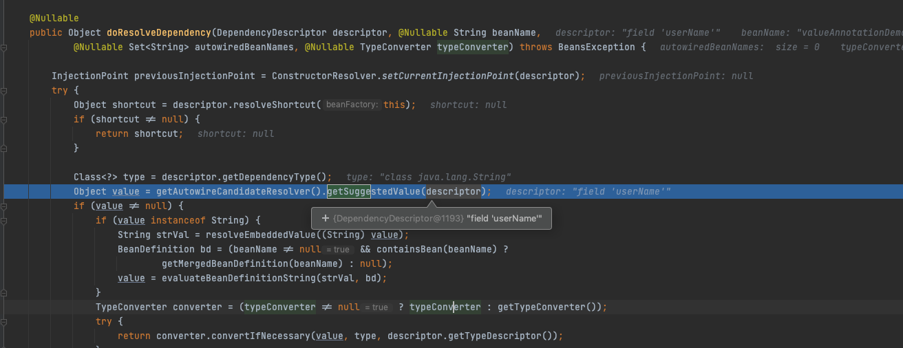

# 070-依赖注入-@Value

[TOC]

- 通过 @Value
  - org.springframework.beans.factory.annotation.AutowiredAnnotationBeanPostProcessor

 [140-@Autowired注入.md](../005-SpringIoC依赖注入/140-@Autowired注入.md) 

 [150-JSR-330-@Inject注入.md](../005-SpringIoC依赖注入/150-JSR-330-@Inject注入.md) 

## 代码实例

```java
public class ValueAnnotationDemo {

    @Value("${user.name}")
    private String userName;

    public static void main(String[] args) {
        AnnotationConfigApplicationContext context = new AnnotationConfigApplicationContext();
        // 注册 Configuration Class
        context.register(ValueAnnotationDemo.class);

        // 启动 Spring 应用上下文
        context.refresh();

        ValueAnnotationDemo valueAnnotationDemo = context.getBean(ValueAnnotationDemo.class);

        System.out.println(valueAnnotationDemo.userName); // "ec"

        // 关闭 Spring 应用上下文
        context.close();
    }
}
```

## 原理分析

```
doResolveDependency:1225, DefaultListableBeanFactory (org.springframework.beans.factory.support)
resolveDependency:1207, DefaultListableBeanFactory (org.springframework.beans.factory.support)
inject:640, AutowiredAnnotationBeanPostProcessor$AutowiredFieldElement (org.springframework.beans.factory.annotation)
inject:116, InjectionMetadata (org.springframework.beans.factory.annotation)
postProcessProperties:399, AutowiredAnnotationBeanPostProcessor (org.springframework.beans.factory.annotation)
populateBean:1422, AbstractAutowireCapableBeanFactory (org.springframework.beans.factory.support)
doCreateBean:594, AbstractAutowireCapableBeanFactory (org.springframework.beans.factory.support)
createBean:517, AbstractAutowireCapableBeanFactory (org.springframework.beans.factory.support)
lambda$doGetBean$0:323, AbstractBeanFactory (org.springframework.beans.factory.support)
getObject:-1, 1500608548 (org.springframework.beans.factory.support.AbstractBeanFactory$$Lambda$13)
getSingleton:222, DefaultSingletonBeanRegistry (org.springframework.beans.factory.support)
doGetBean:321, AbstractBeanFactory (org.springframework.beans.factory.support)
getBean:202, AbstractBeanFactory (org.springframework.beans.factory.support)
preInstantiateSingletons:879, DefaultListableBeanFactory (org.springframework.beans.factory.support)
finishBeanFactoryInitialization:878, AbstractApplicationContext (org.springframework.context.support)
refresh:550, AbstractApplicationContext (org.springframework.context.support)
main:40, ValueAnnotationDemo (org.geekbang.thinking.in.spring.environment)
```

代码入口

org.springframework.beans.factory.support.DefaultListableBeanFactory#doResolveDependency



```java
@Nullable
public Object doResolveDependency(DependencyDescriptor descriptor, @Nullable String beanName,
              @Nullable Set<String> autowiredBeanNames, @Nullable TypeConverter typeConverter) throws BeansException {

  InjectionPoint previousInjectionPoint = ConstructorResolver.setCurrentInjectionPoint(descriptor);
  try {
    Object shortcut = descriptor.resolveShortcut(this);
    if (shortcut != null) {
      return shortcut;
    }

    Class<?> type = descriptor.getDependencyType();
    //获取值${user.name}
    Object value = getAutowireCandidateResolver().getSuggestedValue(descriptor);

    if (value != null) {
      if (value instanceof String) {
        //解析逻辑
        String strVal = resolveEmbeddedValue((String) value);
        BeanDefinition bd = (beanName != null && containsBean(beanName) ?
                             getMergedBeanDefinition(beanName) : null);
        value = evaluateBeanDefinitionString(strVal, bd);
      }
      TypeConverter converter = (typeConverter != null ? typeConverter : getTypeConverter());
      try {
        //类型转换
        return converter.convertIfNecessary(value, type, descriptor.getTypeDescriptor());
      }
      catch (UnsupportedOperationException ex) {
        // A custom TypeConverter which does not support TypeDescriptor resolution...
        return (descriptor.getField() != null ?
                converter.convertIfNecessary(value, type, descriptor.getField()) :
                converter.convertIfNecessary(value, type, descriptor.getMethodParameter()));
      }
    }

```

```java
	@Override
	@Nullable
	public Object getSuggestedValue(DependencyDescriptor descriptor) {
		Object value = findValue(descriptor.getAnnotations());
		if (value == null) {
			MethodParameter methodParam = descriptor.getMethodParameter();
			if (methodParam != null) {
				value = findValue(methodParam.getMethodAnnotations());
			}
		}
		return value;
	}
```


```java
	@Nullable
	protected Object findValue(Annotation[] annotationsToSearch) {
		if (annotationsToSearch.length > 0) {   // qualifier annotations have to be local
			AnnotationAttributes attr = AnnotatedElementUtils.getMergedAnnotationAttributes(
					AnnotatedElementUtils.forAnnotations(annotationsToSearch), this.valueAnnotationType);
			if (attr != null) {
				return extractValue(attr);
			}
		}
		return null;
	}
```

```java
//解析属性值	
@Override
	@Nullable
	public String resolveEmbeddedValue(@Nullable String value) {
		if (value == null) {
			return null;
		}
		String result = value;
		for (StringValueResolver resolver : this.embeddedValueResolvers) {
			result = resolver.resolveStringValue(result);
			if (result == null) {
				return null;
			}
		}
		return result;
	}
```

## @Value底层实现

- 底层实现
  - org.springframework.beans.factory.annotation.AutowiredAnnotationBeanPostProcessor
  - org.springframework.beans.factory.support.DefaultListableBeanFactory#doResolveDependency

- 底层服务- org.springframework.beans.TypeConverter
  - 默认实现-org.springframework.beans.TypeConverterDelegate
    - java.beans.PropertyEditor
    - org.springframework.core.convert.ConversionService

## 源码分析