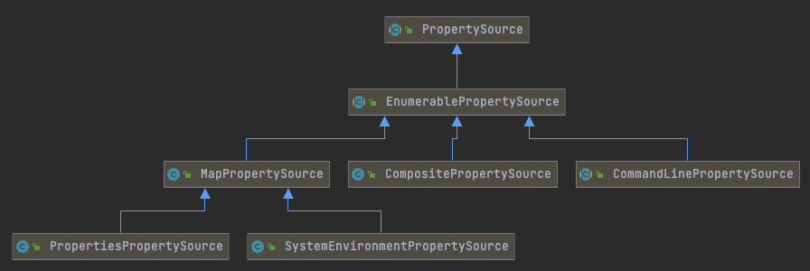

# 100-Spring配置属性源-PropertySource

[TOC]

##一言蔽之

PropertySource是属性配置源,是外部化配置的抽象,PropertySources通过组合模式,将这些抽象合在一起,加上优先级,就实现了一个外部化配置的优先级策略

##Spring配置属性源PropertySource

API

- 单配置属性源 - org.springframework.core.env.PropertySource
- 多配置属性源 - org.springframework.core.env.PropertySources

注解

- 单配置属性源 - @org.springframework.context.annotation.PropertySource
- 多配置属性源 - @org.springframework.context.annotation.PropertySources

关联

- 存储对象- org.springframework.core.env.MutablePropertySources
- 关联方法- org.springframework.core.env.ConfigurableEnvironment#getPropertySources

## PropertySources的重要概念

- 具有优先级,我们可以通过
  - addLast 添加到最后一个
  - addFirst 添加到



PropertySource的实现

- MapPropertySource
  - SystemEnvironmentOrioertySource
- CompositePropertySource
- CommandLinePropertySource 命令行的PropertySource

在Environment中进行了配置


```java
public class MutablePropertySources implements PropertySources {

	private final List<PropertySource<?>> propertySourceList = new CopyOnWriteArrayList<>();
	@Override
	public Iterator<PropertySource<?>> iterator() {
		return this.propertySourceList.iterator();
	}
	@Override
	public Spliterator<PropertySource<?>> spliterator() {
		return Spliterators.spliterator(this.propertySourceList, 0);
	}
	@Override
	public Stream<PropertySource<?>> stream() {
		return this.propertySourceList.stream();
	}
	@Override
	public boolean contains(String name) {
		return this.propertySourceList.contains(PropertySource.named(name));
	}
	@Override
	@Nullable
	public PropertySource<?> get(String name) {
		int index = this.propertySourceList.indexOf(PropertySource.named(name));
		return (index != -1 ? this.propertySourceList.get(index) : null);
	}
	public void addFirst(PropertySource<?> propertySource) {
		removeIfPresent(propertySource);
		this.propertySourceList.add(0, propertySource);
	}
	public void addLast(PropertySource<?> propertySource) {
		removeIfPresent(propertySource);
		this.propertySourceList.add(propertySource);
	}
	public void addBefore(String relativePropertySourceName, PropertySource<?> propertySource) {
		assertLegalRelativeAddition(relativePropertySourceName, propertySource);
		removeIfPresent(propertySource);
		int index = assertPresentAndGetIndex(relativePropertySourceName);
		addAtIndex(index, propertySource);
	}
	public void addAfter(String relativePropertySourceName, PropertySource<?> propertySource) {
		assertLegalRelativeAddition(relativePropertySourceName, propertySource);
		removeIfPresent(propertySource);
		int index = assertPresentAndGetIndex(relativePropertySourceName);
		addAtIndex(index + 1, propertySource);
	}
	public int precedenceOf(PropertySource<?> propertySource) {
		return this.propertySourceList.indexOf(propertySource);
	}

	@Nullable
	public PropertySource<?> remove(String name) {
		int index = this.propertySourceList.indexOf(PropertySource.named(name));
		return (index != -1 ? this.propertySourceList.remove(index) : null);
	}

	public void replace(String name, PropertySource<?> propertySource) {
		int index = assertPresentAndGetIndex(name);
		this.propertySourceList.set(index, propertySource);
	}


	protected void assertLegalRelativeAddition(String relativePropertySourceName, PropertySource<?> propertySource) {
		String newPropertySourceName = propertySource.getName();
		if (relativePropertySourceName.equals(newPropertySourceName)) {
			throw new IllegalArgumentException(
					"PropertySource named '" + newPropertySourceName + "' cannot be added relative to itself");
		}
	}

	protected void removeIfPresent(PropertySource<?> propertySource) {
		this.propertySourceList.remove(propertySource);
	}


	private void addAtIndex(int index, PropertySource<?> propertySource) {
		removeIfPresent(propertySource);
		this.propertySourceList.add(index, propertySource);
	}


	private int assertPresentAndGetIndex(String name) {
		int index = this.propertySourceList.indexOf(PropertySource.named(name));
		if (index == -1) {
			throw new IllegalArgumentException("PropertySource named '" + name + "' does not exist");
		}
		return index;
	}
}
```


