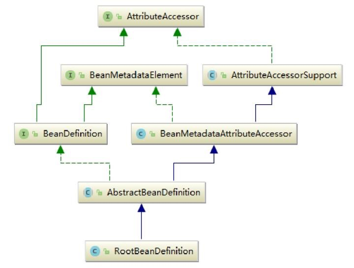

# BeanDefinition-Bean中真正存储的对象

Spring IoC容器管理我们定义的各种Bean对象及其相互关系，Bean对象在Spring实现中是以BeanDefinition来描述的，其继承体系如下图所示。


BeanDefinition是一个接口，在Spring中存在三种实现：

- RootBeanDefinition、
- ChildBean- Definition
- GenericBeanDefinition。

三种实现均继承了AbstractBeanDefiniton，

其中BeanDefinition是配置文件<bean>元素标签在容器中的内部表示形式。<bean>元素标签拥有class、scope、lazy-init等配置属性，BeanDefinition则提供了相应的beanClass、scope、lazyInit属性，BeanDefinition和<bean>中的属性是一一对应的。其中RootBeanDefinition是最常用的实现类，它对应一般性的<bean>元素标签，GenericBeanDefinition是自2.5版本以后新加入的bean文件配置属性定义类，是一站式服务类。

在配置文件中可以定义父<bean>和子<bean>，父<bean>用RootBeanDefinition表示，而子<bean>用ChildBeanDefiniton表示，而没有父<bean>的<bean>就使用RootBeanDefinition表示。AbstractBeanDefinition对两者共同的类信息进行抽象。
Spring通过BeanDefinition将配置文件中的<bean>配置信息转换为容器的内部表示，并将这些BeanDefiniton注册到BeanDefinitonRegistry中。

Spring容器的BeanDefinitionRegistry就像是Spring配置信息的内存数据库，主要是以map的形式保存，后续操作直接从BeanDefinitionRegistry中读取配置信息。

## 解析

略

