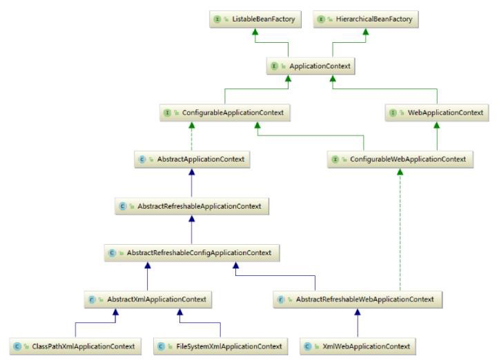

# 001-硬编码XML方式触发Spring上下文初始化

[TOC]

## 图解




```java
@Slf4j
public class ClassPathXmlApplicationContextExample {
  //读取配置文件
  ClassPathXmlApplicationContext applicationContext = new ClassPathXmlApplicationContext("sourcecode/beanFactoryTest.xml");
}
```

#### 刷新上下文

```java
	public ClassPathXmlApplicationContext(
			String[] configLocations, boolean refresh, @Nullable ApplicationContext parent)
			throws BeansException {

		super(parent);
		setConfigLocations(configLocations);
		if (refresh) {
			//重启、刷新、重置
			refresh();
		}
	}
```

#### 看到了refresh,基本就走的通用流程,仅仅只是获取BeanDefination的方式不同而已

