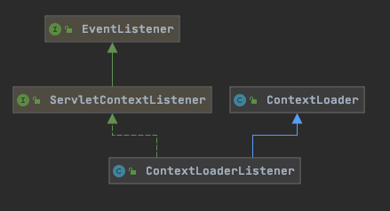

# 003-ServletContext触发上下文初始化

[TOC]

## 利用Servlet规范中的ServletContextListener回调创建容器

在 Servlet API 中有一个 ServletContextListener 接口，它能够监听 ServletContext 对象的生命周期，实际上就是监听 Web 应用的生命周期。

当Servlet 容器启动或终止Web 应用时，会触发ServletContextEvent 事件，该事件由ServletContextListener 来处理。在 ServletContextListener 接口中定义了处理ServletContextEvent 事件的两个方法。

## ServletContextListener

```java
public interface ServletContextListener extends EventListener {

    /**
 			* 当Servlet 容器启动Web 应用时调用该方法。在调用完该方法之后，容器再对Filter 初始化，
 			* 并且对那些在Web 应用启动时就需要被初始化的Servlet 进行初始化。
     */
    public void contextInitialized(ServletContextEvent sce);

    /**
			*	当Servlet 容器终止Web 应用时调用该方法。在调用该方法之前，容器会先销毁所有的Servlet 和Filter 过滤器。
     */
    public void contextDestroyed(ServletContextEvent sce);
}

```

## 图示



## 利用Servlet规范中的init方法回调创建容器

根据 [010-Servlet规范](../../16-JSR/010-Servlet规范)  中的初始化方法, servlet在被创建的时候,会被Servlet容器调用init方法

- javax.servlet.ServletContextListener#contextInitialized
- org.springframework.web.context.ContextLoader#initWebApplicationContext
- org.springframework.web.context.ContextLoader#configureAndRefreshWebApplicationContext
- refresh方法

#### 看到了refresh,基本就走的通用流程,仅仅只是获取BeanDefination的方式不同而已


