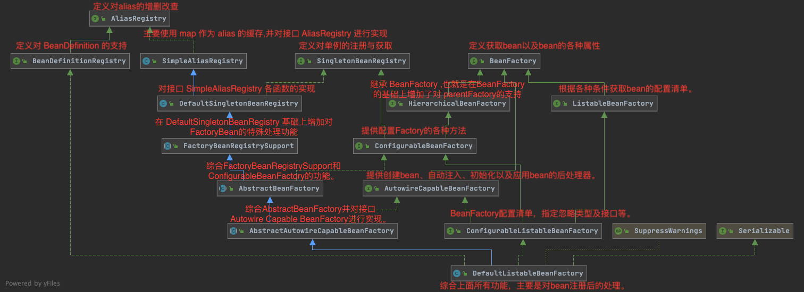

# 019-Spring应用上下文生命周期（Container Lifecycle）

[TOC]

## check

| 记录时间       | 操作     |
| -------------- | -------- |
| 2021年01月16日 | 整理完成 |

## 总体流程

# 应用上下文-ApplicationContext

## 层级结构

## 提供的核心功能

应用中提供配置的核心接口, 当应用运行时,它是只读read-only 的,但是如果其实现类支持reload, 则可以在运行时重新加载

ApplicationContext 提供的核心功能

- 因为继承了[`ListableBeanFactory`](https://docs.spring.io/spring/docs/current/javadoc-api/org/springframework/beans/factory/ListableBeanFactory.html),所以支持访问应用Bean组件的工厂方法,集合BeanFactory相关Bean的功能
- 因为继承了 [`ResourceLoader`](https://docs.spring.io/spring/docs/current/javadoc-api/org/springframework/core/io/ResourceLoader.html)接口, 所以拥有了加载通用资源的能力
- 因为继承了[`ApplicationEventPublisher`](https://docs.spring.io/spring/docs/current/javadoc-api/org/springframework/context/ApplicationEventPublisher.html)  接口, 所以拥有了发送事件和注册监听器的能力
- 因为继承了 [`MessageSource`](https://docs.spring.io/spring/docs/current/javadoc-api/org/springframework/context/MessageSource.html) 接口, 所有拥有了解析国际化消息的能力
- **子上下文的优先级更高** - 继承了 parent 上下文。在后代上下文中的定义将始终具有优先级。例如，这意味着整个web应用程序可以使用单个父上下文，而每个servlet都有独立于任何其他servlet的子上下文。

## 常用的ApplicationContext

The most commonly used `ApplicationContext` implementations are:

1. **[FileSystemXmlApplicationContext](https://docs.spring.io/spring-framework/docs/current/javadoc-api/org/springframework/context/support/FileSystemXmlApplicationContext.html)** – This container loads the definitions of the beans from an XML file. Here you need to provide the full path of the XML bean configuration file to the constructor.
2. **[ClassPathXmlApplicationContext](https://docs.spring.io/spring-framework/docs/current/javadoc-api/org/springframework/context/support/ClassPathXmlApplicationContext.html)** – This container loads the definitions of the beans from an XML file. Here you do not need to provide the full path of the XML file but you need to set CLASSPATH properly because this container will look bean configuration XML file in CLASSPATH.
3. **[WebXmlApplicationContext](https://docs.spring.io/spring-framework/docs/current/javadoc-api/org/springframework/web/context/support/XmlWebApplicationContext.html)** – This container loads the XML file with definitions of all beans from within a web application.

## 生命周期回调

为了支持一个标准 [BeanFactory](010-BeanFactory.md) 的生命周期内的所有功能, ApplicationContext 的所有实现类 会检测并调用 实现了接口的bean

-  [`ApplicationContextAware`](https://docs.spring.io/spring/docs/current/javadoc-api/org/springframework/context/ApplicationContextAware.html) 

-  [`ResourceLoaderAware`](https://docs.spring.io/spring/docs/current/javadoc-api/org/springframework/context/ResourceLoaderAware.html)
-  [`ApplicationEventPublisherAware`](https://docs.spring.io/spring/docs/current/javadoc-api/org/springframework/context/ApplicationEventPublisherAware.html) 
-  [`MessageSourceAware`](https://docs.spring.io/spring/docs/current/javadoc-api/org/springframework/context/MessageSourceAware.html) 

## 层次关系hierarchy

ApplicationContext允许上下文嵌套，通过保持父上下文可以维持一个上下文体系。对于Bean的查找可以在这个上下文体系中进行，首先检查当前上下文，其次检查父上下文，逐级向上，这样可以为不同的Spring应用提供一个共享的Bean定义环境。

