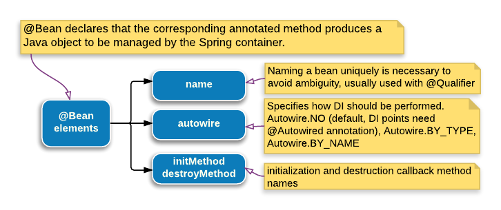

# Using Bean

> 版权声明
>
> 此篇文章参考于[logicbig](https://www.logicbig.com/),引用其中代码仅用于学习笔记,不用于商业用途

[原文地址](https://www.logicbig.com/tutorials/spring-framework/spring-core/using-bean-annotation.htm)l



这个`Bean`注解用在基于 Java 的配置方法,具有以下标签属性

### name :

指定 bean 的名称

```java
@Configuration
public class AppConfig {

    @Bean(name = "myBean")
    public MyBean createBean() {
       ......
    }
}
```

默认情况下,Spring 容器使用方法名关联这个 bean.

一个 bean 可以被关联到多个名称,额外的名称是别名(aliases)

指定一个特殊的,有意义的bean 的名称是非常有必要的,如果配置文件提供了多于一种的bean 实现类,在这种情况下,我们可以使用`@Qualifier`注解,可以指定注入的名称 bean,有专门的一章介绍 [07-inject-bean-by-name-and-using-qualifier.md](07-inject-bean-by-name-and-using-qualifier.md) 

#### **autowire :**

```java
@Configuration
public class AppConfig {

    @Bean(autowire = Autowire.BY_TYPE)
    public MyBean createBean(){
      ....
    }
}
```

`Autowire.NO` : 这是默认设置。在这种情况下，我们必须在注入点显式地使用`@Autowired`。

`Autowire.BY_TYPE` : 我们不需要使用`Autowired`去标注注入点,因为只有一个bean可以被注入。这个模式属性注入并不好使,必须要一个 setter

`Autowire.BY_NAME` : 如果这种模式的自动装配和注入提供者指定bean指定元素名称的一些价值的`@Bean`注释,我们必须使用`@qualifier`以及`@Autowired`标注注入点,有专门的一章介绍这种方式 [06-beans-auto-wiring.md](06-beans-auto-wiring.md) 

**initMethod/destroyMethod :**

可选的初始化以及销毁回调方法名称

```java
@Configuration
public class AppConfig {

    @Bean(initMethod = "init", destroyMethod = "destroy")
    public MyBean createBean() {
     ......
    }
}
```

销毁方法仅仅只有在单例的scope 才会被调用,其他 scope的 bean,Spring 不会进行管理这些 bean 的声明周期,

如果是单例，则在关闭应用程序上下文时调用此方法。

由于Spring还支持Java SE通用注释(JSR-250)，所以我们可以使用`@PostConstruct`和`@PreDestroy`来注释bean的方法，而不是使用这些元素

```java
public class AlwaysBeingUsedBean {

    @PostConstruct//初始化回调
    public void init() {
        System.out.println("AlwaysBeingUsedBean initializing");
    }
}
```

Spring 还支持 JSR-250的 `@Resource`,有专门的章节进行介绍 [08-inject-bean-by-name-and-using-resource.md](08-inject-bean-by-name-and-using-resource.md) 

