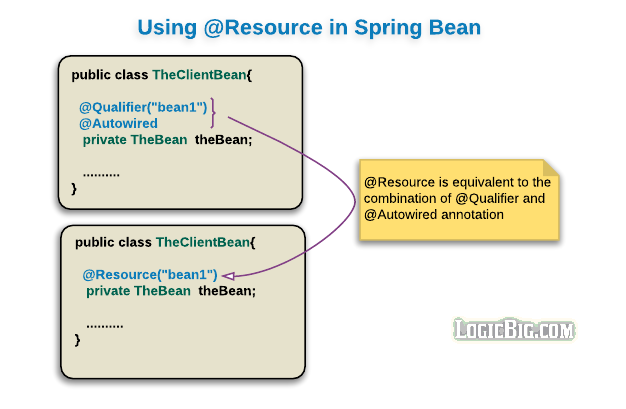

# 使用`@Resource`注解根据 name 注入 bean

> 版权声明
>
> 此篇文章参考于[logicbig](https://www.logicbig.com/),引用其中代码仅用于学习笔记,不用于商业用途

[原文地址](https://www.logicbig.com/tutorials/spring-framework/spring-core/spring-resource-example.html)

 Java SE Common Annotations (JSR-250) 中的 **@Resource** 可以替换掉 `@Autowire` 和 `@Qualifier`



## 实例

```java
package com.logicbig.example.client;

import com.logicbig.example.service.OrderService;
import org.springframework.beans.factory.annotation.Autowired;
import org.springframework.beans.factory.annotation.Qualifier;

import javax.annotation.Resource;
import java.util.Arrays;


public class OrderServiceClient {

    @Resource(name = "OrderServiceA")
    private OrderService orderService;

    public void showPendingOrderDetails() {
        for (String orderId : Arrays.asList("100", "200", "300")) {
            System.out.println(orderService.getOrderDetails(orderId));
        }
    }
}
```

## 值得注意的是

- `@Resource`可以不指定 name 的情况下使用
- 如果没有 name 属性,默认名称派生自字段名或setter方法
- `name`属性在 bean 定义指定`Autowire.BY_NAME`的情况下使用