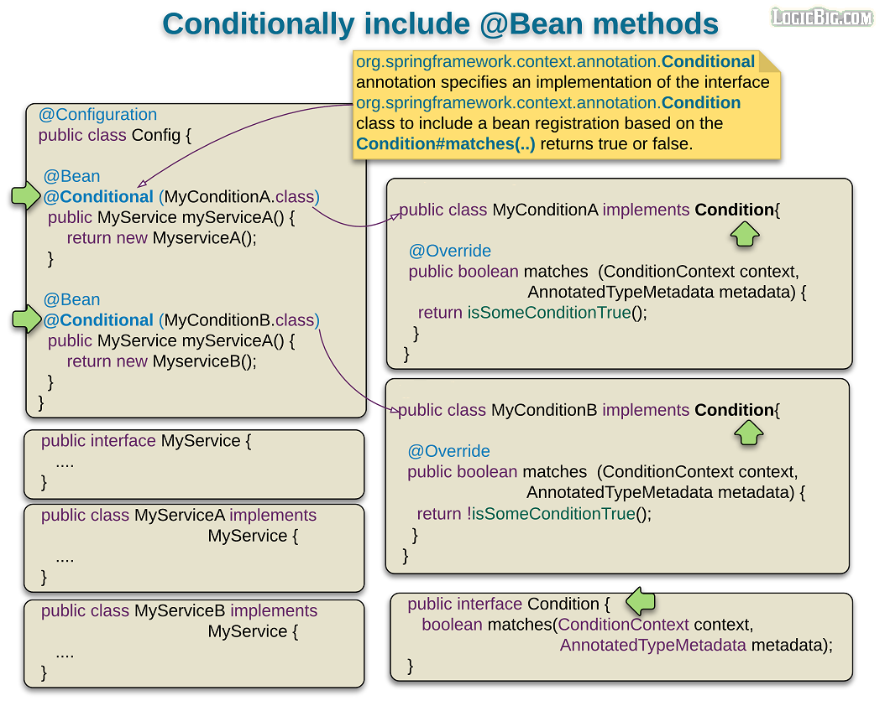
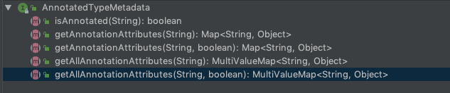

# Spring @Bean conditional 注册

> 版权声明
>
> 此篇文章参考于[logicbig](https://www.logicbig.com/),引用其文字/代码/图片仅用于学习笔记,不用于商业用途

Spring 4 开始, 提供了一个新的注解`@Conditional`,注解的目标是在一定的条件下 enbale 或者disable bean ,这些条件会在容器启动时被应用

## 原理



## @Conditional vs @Profile

- `@Conditional`注解和`@Profile`注解类似,但是前者更加灵活因为可以在 Java code 的方式写下条件而不是预先定义的属性 flag 和其他系统属性
- Spring 使用`@Condictional`作为了`@Profile`的元注解,所以前者更底层

我们可以看到

```java
.....
@Conditional(ProfileCondition.class)
public @interface Profile {
  ....
}
```

profile 接口是通过@Conditional 接口实现的

```java
class ProfileCondition implements Condition {

 @Override
 public boolean matches(ConditionContext context, AnnotatedTypeMetadata metadata) {
  if (context.getEnvironment() != null) {
   MultiValueMap<String, Object> attrs =
                          metadata.getAllAnnotationAttributes(
                                                       Profile.class.getName());
  if (attrs != null) {
   for (Object value : attrs.get("value")) {
    if (context.getEnvironment().acceptsProfiles(
                                              ((String[]) value))) {
     return true;
    }
   }
   return false;
  }
 }
 return true;
 }
}
```

## 形参第一个`ConditionContext`

这个门面接口 用来和`Condition`接口一起合作,你可以通过这个接口查询容器相关的信息


例如:

- `ConfigurableListableBeanFactory`的实例
- `Environment`
- `BeanDefinitionRegistry`

等等

## 形参第二个`AnnotatedTypeMetadata`



协助获取指定注解类型的相关信息,例如

- `@Conditional`注解上的相关 element 信息
- 可以帮我们获取`@Bean`注解`Component`.`@Lazy`,`@Scope`注解等等

## 实例

 [代码实例](../../../../00-code/02-spring-framework/src/main/java/cn/eccto/study/springframework/tutorials/ConditionalExample.java) 

#### 编写自己的 Condictional 类

```java
public class LocaleConditionCanada implements Condition {

    @Override
    public boolean matches(ConditionContext context, AnnotatedTypeMetadata metadata) {
        return Locale.getDefault()
                .equals(Locale.CANADA);
    }
}

public class LocaleConditionChina implements Condition {

    @Override
    public boolean matches(ConditionContext context, AnnotatedTypeMetadata metadata) {
        return Locale.getDefault()
                .equals(Locale.CHINA);
    }
}


```

#### 配置文件中指定

```java
@Configuration
public class ConditionalConfiguration {


    @Bean
    @Conditional(LocaleConditionChina.class)
    public LocaleService localeChinaService() {
        return new LocaleChinaServiceImpl();
    }


    @Bean
    @Conditional(LocaleConditionCanada.class)
    public LocaleService localeCanadaService() {
        return new LocaleCanadaServiceImpl();
    }

}
```

