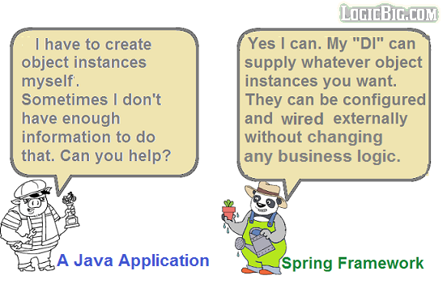

# Spring 概念以及例子

[原文链接](https://www.logicbig.com/tutorials/spring-framework/spring-core/quick-start.html)

1. **DI (Dependency Injection) :** 依赖注入,服务的实现类实例会被注入到目标对象的变量/属性上去(这里的属性/变量最好是用这个接口类型进行声明),通过构造器注入或者是 Setter 方法注入而不是这个目标对象主动创建他们,因此,这种方法激活了 POJO 对象可以被用在不同环境,不同实现类的场景
2. **IOC (Inversion of Control) container:** 在应用的具体操作中,框架代码调用应用代码获取信息而不是应用直接调用框架代码,因此,控制是反转的,一个 IoC 的例子是模板模式的子类,SpringIoc 提供一系列方法
3. **AOP (Aspect-Oriented Programming) :** 面向切面编程,这允许通过向应用程序代码中添加行为(方面)来分离横切关注点，而不是将应用程序涉及到那些关注点本身。这使得应用程序能够模块化，而不是将不同的关注点混合到一个地方。例如事务管理、日志记录等。
4. **Lightweight Alternative to Java EE :** Spring是使用POJO构建企业应用程序的轻量级解决方案。它可以用于servlet容器(例如Tomcat服务器)，并且不需要应用服务器。

## 什么是 SpringBean

 A bean is an object that is instantiated, assembled, and otherwise managed by a Spring IoC container. These beans are created with the configuration metadata that you supply to the container, for example, in the form of XML definitions.

## Example

 [tutorials](../../../00-code/02-spring-framework/src/main/java/cn/eccto/study/springframework/tutorials) 