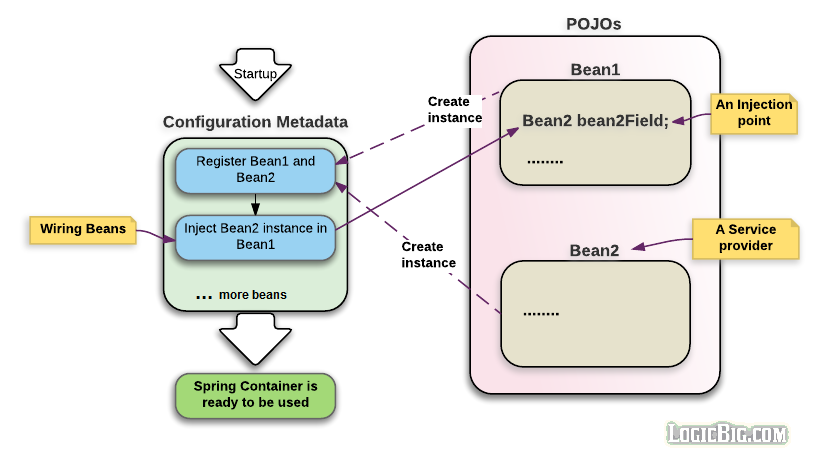

# 配置元数据

[原文地址](https://www.logicbig.com/tutorials/spring-framework/spring-core/configuration-metadata.html)

1. **XML-based Configuration :**基于 XML 的配置方式,所有的配置都配置在一个或者多个 xml 文件中,这种配置方式是比较冗长的配置方式,当项目需要大量的 xml 文件配置的时候,非常难以管理这些 xml
2. **Annotation-based configuration :** 基于注解的配置方式,从 spring 2.5开始允许基于注解的配置方式,我们任然得书写 xml 但是只要引入`component-scan`需要扫描的相关包,即会自动扫描包内的标注注解后的 Java 类
3. **Java-based configuration (JavaConfig):** 基于 Java 配置的配置方式,始于 Spring 3.0,是一种纯 Java 的配置方式,我们不需要任何 xml 文件即可完成配置,Java Config 提供一个真正面向对象的机制来进行依赖注入,这意味着我们可以充分完成代码复用,继承以及多态,应用开发者可以完全控制依赖的初始化以及注入

不管我们用什么方法进行配置,我们主要在下面三个地方使用这些配置的元数据:

1. **注入点(injection Points)**:是依赖需要被注入的点,这些注入的店可以是字段/setter 方法/构造器等,Spring 框架填充或者插入实例到注入点,整个过程发生在 bean 的加载过程中
2. **服务提供者(Service Provider)**:确切的服务实现类,这些实例会被注入到注入点,这些类他们会被注册成为 Spring Bean
3. **配置(The Configuration)**,这个可以是一个被标注`@Configuration`类.也可以是 xml,它连接了注入点以及依赖