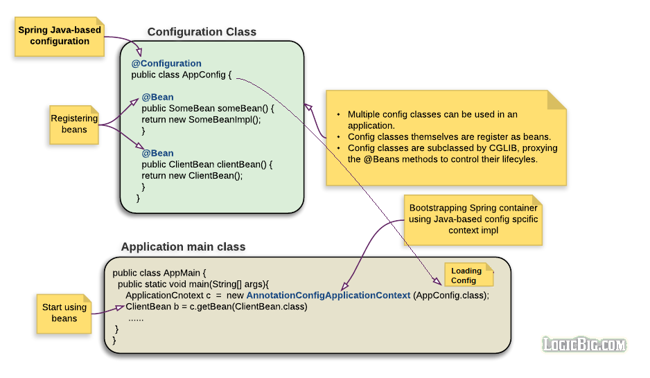

# 基于 Javad的配置

[原文地址](https://www.logicbig.com/tutorials/spring-framework/spring-core/java-config.html)

### @Configuration

这是一个类级别的注解,被标注的类可能会有许多放啊被标注`@Bean`注解,Spring 容器 会调用这些方法来获取对象的实例,所以容器可以注册他们成为 bean

```javascript
 package spring.example

   @Configuration
   public class MyAppConfig {
     @Bean
     public SomeBean someBean() {
    // instantiate, configure and return bean instance ...
     return new SomeBeanImpl();
     }
   }
```

等价于 Xml:

```xml
<bean name="someBean" class="spring.example.SomeBeanImpl"/>
```



`@Configuration`标注的类事实上就是 Spring 管理的工厂创建和注册的 bean 实例

## Bootstrapping Spring Container

在基于 Java 的 spring 配置中,容器在引导时会使用`AnnotationConfigApplicationContext`,如果是 web 程序`AnnotationConfigWebApplicationContext`

```java
 new AnnotationConfigApplicationContext(MyAppConfig.class);
```

我们也可以指定包名包含`@Configuration`注释的包

```java
 new AnnotationConfigApplicationContext("spring.example");
```

## Using multiple Configuration Classes

可以同时使用多个配置文件

```java
 new AnnotationConfigApplicationContext( AppConfig.class, DataSourceConfig.class )
```

包扫描时可以指定多个包进行扫描

```java
 new AnnotationConfigApplicationContext("example.spring.app","example.spring.datasource")
```

### 配置文件中的依赖注入

配置文件也会被当成一个 bean 注册到 Spring 的容器中,这意味着,我们可以把它当成一个正常的 spring bean 使用,例如,我们可以使用`@Autowired`注解去进行依赖注入,下面的例子,将一个配置文件注入到另一个配置文件

```java
package spring.example.di;

import org.springframework.beans.factory.annotation.Autowired;
import org.springframework.context.annotation. AnnotationConfigApplicationContext;
import org.springframework.context.annotation.Bean;
import org.springframework.context.annotation.Configuration;


@Configuration
public class AppConfig {
    @Autowired
    private DataSourceConfig dataSourceConfig;

    @Bean
    Client clientBean() {
        return new Client(dataSourceConfig.dataSourceBean());
    }

    public static void main(String[] args) {
        AnnotationConfigApplicationContext context =
          new AnnotationConfigApplicationContext(AppConfig.class, DataSourceConfig.class);
        context.getBean(Client.class).showData();
    }
}

@Configuration
class DataSourceConfig {

    @Bean
    DataSourceBean dataSourceBean() {
        return new DataSourceBean();
    }
}

class Client {
    private DataSourceBean dataSourceBean;

    Client(DataSourceBean dataSourceBean){
        this.dataSourceBean = dataSourceBean;
    }

    public void showData() {
        System.out.println(dataSourceBean.getData());
    }
}

class DataSourceBean {

    public String getData() {
        return "some data";
    }
}

```

我们也可以直接注入 `DataSourceBean` 到 `AppConfig`:

```java
package spring.example.di;

import org.springframework.beans.factory.annotation. Autowired;
import org.springframework.context.annotation .AnnotationConfigApplicationContext;
import org.springframework.context.annotation. Bean;
import org.springframework.context.annotation. Configuration;


@Configuration
public class AppConfig {
    @Autowired
    private DataSourceBean dataSourceBean;

    @Bean
    Client clientBean() {
        return new Client(dataSourceBean);
    }

    public static void main(String[] args) {
        AnnotationConfigApplicationContext context =
                  new AnnotationConfigApplicationContext(AppConfig.class, DataSourceConfig.class);
        context.getBean(Client.class).showData();
    }
}

@Configuration
class DataSourceConfig {

    @Bean
    DataSourceBean dataSourceBean() {
        return new DataSourceBean();
    }
}

class Client {
    private DataSourceBean dataSourceBean;

    Client(DataSourceBean dataSourceBean){
        this.dataSourceBean = dataSourceBean;
    }

    public void showData() {
        System.out.println(dataSourceBean.getData());
    }
}

class DataSourceBean {

    public String getData() {
        return "some data";
    }
}
```

## Constructor-base DI in the configuration class

#### @Configuration Classes are Subclassed by CGLIB

所有的`@Configration`类在启动时用CGLIB子类化,在子类中，子方法在调用父方法并创建新实例之前，首先检查容器是否有缓存的(作用域限定的)bean。

CGLIB代理是在`@Configuration`类中调用`@Bean`方法中的方法或字段来创建对协作对象的`bean`元数据引用的方法;这些方法不是用普通的Java语义调用的，而是通过容器来提供通常的Spring bean的生命周期管理和代理，甚至在通过对`@Bean`方法的编程调用引用其他bean时也是如此。

这就是为什么所有方法在多次请求的时候都会返回相同的实例(如果使用的是默认的实例)

必须要有`@Configuration`注解,不然这个运行时的操作不会进行

运行下面的代码,你会看到相同的输出两次,你也可以试试没有`@Configuration`查看差异

```java
@Configuration
public class SpringConfig {

    @Bean
    public String something(){
        return new String(System.nanoTime());
    }

        public static void main(String... strings) {
            AnnotationConfigApplicationContext context =
                    new AnnotationConfigApplicationContext(SpringConfig.class);
            System.out.println("Spring container started and is ready");
            SpringConfig bean = context.getBean(SpringConfig.class);
            System.out.println(bean.something());
            System.out.println(bean.something());
        }
}
```

## @ComponentScan


到目前为止，我们看到JavaConfig使用工厂方法(用`@Bean`注释)来提供bean实现。使用这种方法，我们必须自己创建bean实现实例。我们可以让spring扫描提供的包并自动创建所有实现，然后注入依赖项，而不是使用这种工厂方法。我们可以通过使用`@ComponentScan`和`@Configuration`来实现这一点。我们仍然不需要使用任何XML。