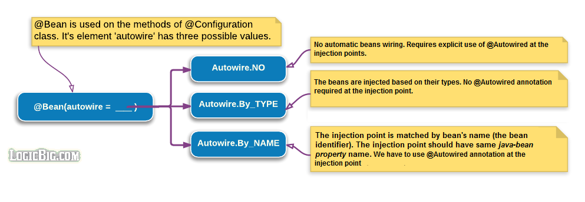
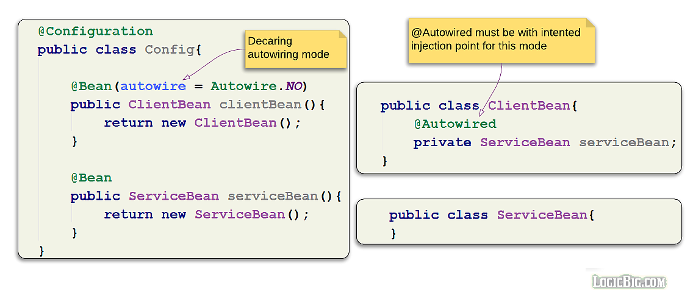
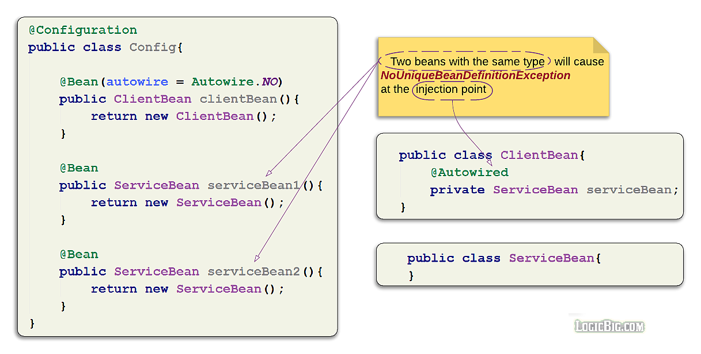
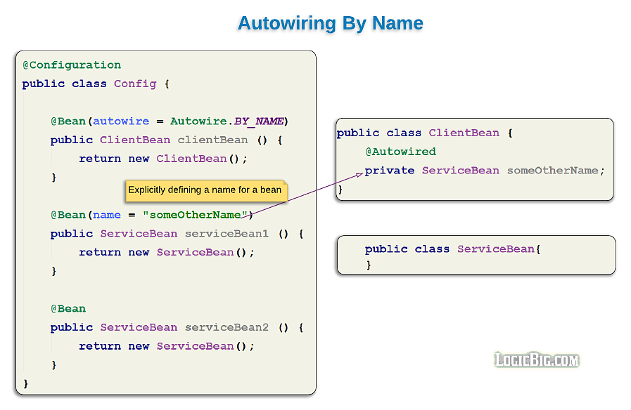

# Bean 的自动装配 (Beans Auto-wiring)

> 版权声明
>
> 此篇文章参考于logicbig,[原文地址](https://www.logicbig.com/tutorials/spring-framework/spring-core/auto-wiring.html),引用其中代码仅用于学习笔记,不用于商业用途


Spring容器可以隐式地自动装配依赖项。我们可以使用@Bean注释指定自动装配模式(默认模式除外)。

```java
 @Configuration
 public class Config{
    @Bean(autowire == <xyz>)
     public ABean aBean(){
        return new ABean();
    }
   .....
 }
```

autowire 属性分为三种:

- `Autowire.NO` 默认,需要手动指定`@Autowired`注解

- `Autowire.BY_NAME` 根据名称注入

- `Autowire.BY_TYPE ` 根据类型注入



## Autowire.NO

默认的注入方式,我们必须要在注入点手动的指定`@Autowired`注解,这意味着 Spring不会进行自动注入,我们必须通过在这些点指定`@Autowired`注解来告诉Spring bean连接应该在哪些点发生。

在找到@Autowired注解后，Spring会尝试将注入点类型与其他已注册的bean类型进行匹配，以获得成功的注入。



这意味着不能有任何冲突和歧义,必须有且只有一个 bean 是注入点的类型,不然那会报`NoUniqueBeanDefinitionException`



## Autowire.BY_TYPE

在这种注入模式下, 如果需要依赖注入,那么 Spring 会访问属性的类型,根据类型去匹配容器中已经注册的 bean 的实例,基本上都是基于类型匹配

- 使用时不需要指定`@Autowired`
- 在这种自动注入的情况下,属性注入并不生效,这里必须有一个 setter 
- Spring 会扫描 属性 setter返回值方法的类型然后进行匹配并且注入


## Autowire.BY_NAME

在这种注入模式下,bean 会根据name 属性进行匹配, name 就是 bean 的一个标识

- 我们可以使用`@Autowired`注解进行注入


上面代码中,在`ClientBean`中声明的 `ServiceBean` 有两个实例,但是这里并不会产生歧义,因为 在声明是,被`@Bean`注解标注的方法名会默认成为 bean 的` name` 属性

当然,我们也可以指定一个 `@Bean` 的 `name`标签



我们可以使用基于 setter 的构造器注入方式,依然也是采用 field name (bean property)匹配的方式

