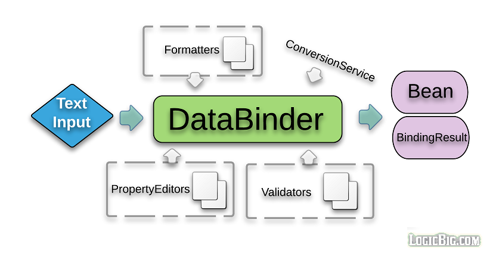

# Data Binding

动态地将属性值设置到目标对象。




类DataBinder提供此功能。BeanWrapper也有类似的功能，但是DataBinder还支持字段验证、字段格式化和绑定结果分析。

`BeanWrapper`是一个低级的类。`DataBinder`工作在更高的级别。`DataBinder`和`BeanWrapper`都使用`PropertyEditor`来解析和格式化属性值。我们应该使用`DataBinder`而不`是BeanWrapper`。`BeanWrapper`实际上被`DataBinder`本身所使用。

## 使用 DataBinder

```java
/**
 * 使用 {@link DataBinder} 对 javaBean 进行的属性进行绑定
 *
 * @author EricChen 2019/11/22 20:04
 */
public class DataBinderExample {
    public static void main(String[] args) {

        MutablePropertyValues mpv = new MutablePropertyValues();
        mpv.add("anInt", "10");

        TestBean testBean = new TestBean();
        DataBinder db = new DataBinder(testBean);

        db.bind(mpv);
        System.out.println(testBean);

    }

    public static class TestBean {
        private int anInt;

        public int getAnInt() {
            return anInt;
        }

        public void setAnInt(int anInt) {
            this.anInt = anInt;
        }

        @Override
        public String toString() {
            return "TestBean{anInt=" + anInt + '}';
        }
    }
}

```

上面的例子使用 DataBinder 对 JavaBean 的属性进行绑定,而不是使用 BeanWapper

## 使用 BindingResult

```java
/**
 * 本例介绍如何使用 {@link BindingResult},以及 {@link BeanWrapper} 和 {@link DataBinder} 的异常
 *
 * @author EricChen 2019/11/22 16:14
 * @see #bindWithBeanBinder DataBinder 在进行数据绑定时,如果类型不匹配,不会进行实际的转换,所以不会抛出异常
 * @see #bindWithBeanWapper BeanWrapper 在进行数据绑定时,如果类型不匹配,不会进行实际的转换,所以不会抛出异常TypeMismatchException
 */
public class DataBinderUsingBindingResultExample {
    public static void main(String[] args) {
        bindWithBeanBinder();
//        bindWithBeanWapper();
    }


    /**
     * DataBinder 在进行数据绑定时,如果类型不匹配,不会进行实际的转换,所以不会抛出异常
     */
    public static void bindWithBeanBinder() {
        MutablePropertyValues mpv = new MutablePropertyValues();
        mpv.add("anInt", "10x"); // 10x cannot be converted to int type

        TestBean testBean = new TestBean();
        DataBinder db = new DataBinder(testBean);

        db.bind(mpv);
        db.getBindingResult().getAllErrors().stream().forEach(System.out::println);
        System.out.println(testBean);
    }


    /**
     * BeanWrapper 在进行数据绑定时进行实际的转换,当类型不匹配时会抛出异常 {@link TypeMismatchException}
     */
    public static void bindWithBeanWapper() {
        MutablePropertyValues mpv = new MutablePropertyValues();
        mpv.add("anInt", "10x"); // 10x cannot be converted to int type

        BeanWrapper bw = new BeanWrapperImpl(new TestBean());
        bw.setPropertyValues(mpv);
        System.out.println(bw.getWrappedInstance());
    }

    public static class TestBean {
        private int anInt;

        public int getAnInt() {
            return anInt;
        }

        public void setAnInt(int anInt) {
            this.anInt = anInt;
        }

        @Override
        public String toString() {
            return "TestBean{anInt=" + anInt + '}';
        }
    }
}
```