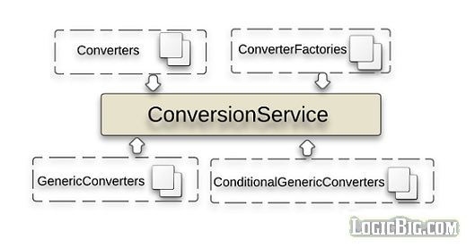

#### 转换服务

### Conversion Service

前面我们介绍了 JavaBean 的 API PropertyEditor, [44-property-editors.md](44-property-editors.md) ,它将 text 文本类型转化成对象

然而它有一下缺点:

- 线程非安全

Spring 推出了一个线程安全的解决方案: ConversionService

支持

- string
- number
- enum
- collection
- map
- 和其他基础类型



- ConversionService 接口
- Converters 接口
- ConverterFactories 接口
- GenericConverters 
- ConditionalGenericConverter接口

 [04-spring-type-conversion.md](../../03-validation-data-binding-type-conversion/04-spring-type-conversion.md) 

## ConversionService 接口的简介与使用

```java
package org.springframework.core.convert;

public interface ConversionService {

    boolean canConvert(Class<?> sourceType, Class<?> targetType);

    <T> T convert(Object source, Class<T> targetType);

    boolean canConvert(TypeDescriptor sourceType, TypeDescriptor targetType);

    Object convert(Object source, TypeDescriptor sourceType,
                                                   TypeDescriptor targetType);
}
```

#### 使用

```java
/**
 * 本实例演示了如何使用 {@link ConversionService} 的默认实现类 {@link DefaultConversionService}
 *
 * @author EricChen 2019/11/22 23:22
 */
public class ConversionServiceExample {
    public static void main(String[] args) {
        DefaultConversionService service = new DefaultConversionService();

        Currency currency = service.convert("USD", Currency.class);
        System.out.println(currency);

        Collection<String> list = service.convert("Deb, Mike, Kim", Collection.class);
        System.out.println(list);
    }
}

```

#### 输出

```
USD
[Deb, Mike, Kim]
```

## 自定义 Convert实例

```java
/**
 * 自定义 {@link Converter} 实现类以及使用方式
 *
 * @author EricChen 2019/11/24 11:43
 */
@Configuration
public class CustomConverterExample {


    public static void main(String[] args) {
        AnnotationConfigApplicationContext context = new AnnotationConfigApplicationContext(CustomConverterExample.class);
        ConversionService bean = context.getBean(ConversionService.class);
        LocalDateTime convert = bean.convert(new Date(), LocalDateTime.class);
        System.out.println(convert);
        String s = bean.convert(new Date(), String.class);
        System.out.println(s);
    }

    @Bean
    public ConversionService conversionService () {
        DefaultConversionService service = new DefaultConversionService();
        service.addConverter(new DateToLocalDateTimeConverter());
        service.addConverter(new DateToLocalStringConverter());
        return service;
    }


    /**
     * 注册自定义转化类,将 Date 类型转换为 LocalDateTime
     */
    public class DateToLocalDateTimeConverter implements Converter<Date, LocalDateTime> {

        @Override
        public LocalDateTime convert(Date source) {
            return LocalDateTime.ofInstant(source.toInstant(), ZoneId.systemDefault());
        }
    }

    public class DateToLocalStringConverter implements Converter<Date, String> {

        @Override
        public String convert(Date source) {
            return "121212";
        }
    }

}

```


## ConverterFactory

```java
/**
 * 本例是 自定义 一个{@link ConverterFactory} 实例,实例用于产生一个自定义的 {@link IdToEntityConverter}
 *
 * @author EricChen 2019/11/24 12:05
 * @see CustomConverterFactoryExample.IdToEntityConverterFactory  the Custom Converter Factory
 * @see CustomConverterFactoryExample.IdToEntityConverter the Custom Converter
 */
@Configuration
public class CustomConverterFactoryExample {

    @Bean
    public MyBean myBean() {
        return new MyBean();
    }

    @Bean
    public ConversionService conversionService() {
        DefaultConversionService service = new DefaultConversionService();
        service.addConverterFactory(new IdToEntityConverterFactory());
        return service;
    }

    public static void main(String[] args) {

        AnnotationConfigApplicationContext context = new
                AnnotationConfigApplicationContext(CustomConverterFactoryExample.class);

        MyBean myBean = context.getBean(MyBean.class);
        Entity entity = myBean.getEntity("1000", Order.class);
        System.out.println(entity);

        entity = myBean.getEntity("431", Customer.class);
        System.out.println(entity);
    }


    public static class MyBean {
        @Autowired
        private ConversionService service;

        public Entity getEntity(String entityId, Class<? extends Entity> type) {
            return service.convert(entityId, type);

        }
    }

    /**
     * ID 转换成 Entity 工厂
     */
    private static class IdToEntityConverterFactory implements ConverterFactory<String, Entity> {

        @Override
        public <T extends Entity> Converter<String, T> getConverter(Class<T> targetType) {
            return new IdToEntityConverter<>(targetType);
        }
    }

    /**
     * ID 转换成 Entity 转换器
     *
     * @param <T> 类型
     */
    private static class IdToEntityConverter<T extends Entity> implements Converter<String, T> {

        private Class<T> targetType;

        public IdToEntityConverter(Class<T> targetType) {
            this.targetType = targetType;
        }

        @Override
        public T convert(String id) {
            return EntityService.getEntity(id, targetType);
        }
    }

    /**
     * 根据传入类型获取指定 ID 的 Entity 子类
     */
    private static class EntityService {

        public static <T extends Entity> T getEntity(String id, Class<T> targetType) {
            if (targetType == Item.class) {
                return (T) findItemById(id);
            } else if (targetType == Order.class) {
                return (T) findOrderById(id);
            } else if (targetType == Customer.class) {
                return (T) findCustomerById(id);
            }
            return null;
        }

        private static Customer findCustomerById(String id) {
            return new Customer(id, "Mike");
        }

        private static Order findOrderById(String id) {
            return new Order(id, 400, new Date());

        }

        private static Item findItemById(String id) {
            return new Item(id, "some tiem", new BigDecimal(100));
        }
    }

    private abstract static class Entity {
        private final String id;

        public Entity(String id) {
            this.id = id;
        }

        public String getId() {
            return id;
        }
    }

    private static class Order extends Entity {
        private final int quantity;
        private final Date date;

        private Order(String id, int quantity, Date date) {
            super(id);
            this.quantity = quantity;
            this.date = date;
        }

        public int getQuantity() {
            return quantity;
        }

        public Date getDate() {
            return date;
        }

        @Override
        public String toString() {
            return "Order{" +
                    "quantity=" + quantity +
                    ", date=" + date +
                    '}';
        }
    }

    private static class Item extends Entity {
        private final String itemName;
        private final BigDecimal cost;

        public Item(String id, String itemName, BigDecimal cost) {
            super(id);
            this.itemName = itemName;
            this.cost = cost;
        }

        public String getItemName() {
            return itemName;
        }

        public BigDecimal getCost() {
            return cost;
        }

        @Override
        public String toString() {
            return "Item{" +
                    "itemName='" + itemName + '\'' +
                    ", cost=" + cost +
                    '}';
        }
    }

    private static class Customer extends Entity {
        private final String name;

        private Customer(String id, String name) {
            super(id);
            this.name = name;
        }

        public String getName() {
            return name;
        }

        @Override
        public String toString() {
            return "Customer{" +
                    "name='" + name + '\'' +
                    '}';
        }
    }
}
```

## GenericConveter

- `GenericConveter `是一个灵活的,非强制类型的转换器
- `getConvertibleTypes`方法返回一个`ConvertiblePair`的 Set,允许多个 source/target 类型
- `convert`方法的两个参数
  - `TypeDescriptor`包含属性内容信息,一个是源参数信息以及目标类型源参数信息

```java
package org.springframework.core.convert.converter;

public interface GenericConverter {

    public Set<ConvertiblePair> getConvertibleTypes();

    Object convert(Object source, TypeDescriptor sourceType,TypeDescriptor targetType);

}
```

#### 示例

```java
/**
 * 本代码简单展示了 {@link GenericConverterExample} 的使用方式
 *
 * @author EricChen 2019/11/24 14:12
 */
public class GenericConverterExample {
    public static void main(String[] args) {
        DefaultConversionService service = new DefaultConversionService();
        service.addConverter(new NumberToBigDecimalConverter());

        BigDecimal bd = service.convert(Double.valueOf("2222.336"), BigDecimal.class);
        bd = bd.setScale(2, BigDecimal.ROUND_HALF_UP);
        System.out.println(bd);
    }

    public static class NumberToBigDecimalConverter implements GenericConverter {

        @Override
        public Set<ConvertiblePair> getConvertibleTypes() {
            return Collections.singleton(new ConvertiblePair(Number.class, BigDecimal.class));
        }

        @Override
        public Object convert(Object source, TypeDescriptor sourceType, TypeDescriptor targetType) {
            if (sourceType.getType() == BigDecimal.class) {
                return source;
            }

            Number number = (Number) source;
            return new BigDecimal(number.doubleValue());
        }
    }
}

```


## CondictionalGenericConverter

- 一个特殊的`GenericConverter` 实现类
- 可以设置 `matches()`方法返回 true 时,才执行执行方法:

#### 实例: 


```java
/**
 * 条件通用转换器代码实例
 *
 * @see GenericConverterExample 示例的另一种方式
 * @author EricChen 2019/11/22 23:19
 */
public class ConditionalGenericConverterExample {

    public static void main(String[] args) {
        DefaultConversionService service = new DefaultConversionService();
        service.addConverter(new NumberToBigDecimalConverter());

        BigDecimal bd = service.convert(Double.valueOf("2222.336"), BigDecimal.class);
        bd = bd.setScale(2, BigDecimal.ROUND_HALF_UP);
        System.out.println(bd);

        //this will return the same BigDecimal instance without conversion
        bd = service.convert(new BigDecimal("898.33"), BigDecimal.class);
        System.out.println(bd);
    }

    public static class NumberToBigDecimalConverter implements ConditionalGenericConverter {

        /**
         * 条件匹配
         */
        @Override
        public boolean matches(TypeDescriptor sourceType, TypeDescriptor targetType) {
            return sourceType.getType() != BigDecimal.class;
        }

        @Override
        public Set<ConvertiblePair> getConvertibleTypes() {
            return Collections.singleton(new ConvertiblePair(Number.class, BigDecimal.class));
        }

        @Override
        public Object convert(Object source, TypeDescriptor sourceType, TypeDescriptor targetType) {
            Number number = (Number) source;
            return new BigDecimal(number.doubleValue());
        }
    }
}
```


## 使用ConversionService 进行数据绑定

默认情况下 DataBinder 使用 PropertyEditors 来进行数据绑定,他可以能再一个Converion Service 中在转换时设置属性,下面的示例展示了在进行类型转换的时候

- 默认情况下 DataBinder 没有任何的 ConersionService

```java
/**
 * ConversionServiceWithDataBinderExample
 *
 * @author EricChen 2019/11/24 14:20
 */
public class ConversionServiceWithDataBinderExample {
    public static void main (String[] args) {

        //  将当前时间设置进入
        MutablePropertyValues mpv = new MutablePropertyValues();
        mpv.add("date", new Date());

        DataBinder dataBinder = new DataBinder(new MyObject());
        DefaultConversionService service = new DefaultConversionService();
        //添加转换器
        service.addConverter(new DateToLocalDateTimeConverter());
        //commenting the following line will not populate date field
        //为 dataBinder 设置转换服务
        dataBinder.setConversionService(service);

        dataBinder.bind(mpv);
        dataBinder.getBindingResult()
                .getModel()
                .entrySet()
                .forEach(System.out::println);
    }

    private static class MyObject {
        private LocalDateTime date;

        public LocalDateTime getDate () {
            return date;
        }

        public void setDate (LocalDateTime date) {
            this.date = date;
        }

        @Override
        public String toString () {
            return "MyObject{" +
                    "date=" + date +
                    '}';
        }
    }

    private static class DateToLocalDateTimeConverter implements Converter<Date, LocalDateTime> {

        @Override
        public LocalDateTime convert (Date source) {
            return LocalDateTime.ofInstant(source.toInstant(), ZoneId.systemDefault());
        }
    }
}
```


## 所有内置的 Conver

### org.springframework.core.convert.converter

ConversionServiceConverter in ConvertingComparator

### org.springframework.core.convert.support

CharacterToNumber in CharacterToNumberFactory
EnumToIntegerConverter
EnumToStringConverter
IntegerToEnum in IntegerToEnumConverterFactory
NumberToCharacterConverter
NumberToNumber in NumberToNumberConverterFactory
ObjectToStringConverter
PropertiesToStringConverter
StringToBooleanConverter
StringToCharacterConverter
StringToCharsetConverter
StringToCurrencyConverter
StringToEnum in StringToEnumConverterFactory
StringToLocaleConverter
StringToNumber in StringToNumberConverterFactory
StringToPropertiesConverter
StringToTimeZoneConverter
StringToUUIDConverter
ZoneIdToTimeZoneConverter
ZonedDateTimeToCalendarConverter

### org.springframework.core.serializer.support

DeserializingConverter
SerializingConverter

### org.springframework.format.datetime

CalendarToDateConverter in DateFormatterRegistrar
CalendarToLongConverter in DateFormatterRegistrar
DateToCalendarConverter in DateFormatterRegistrar
DateToLongConverter in DateFormatterRegistrar
LongToCalendarConverter in DateFormatterRegistrar
LongToDateConverter in DateFormatterRegistrar

### org.springframework.format.datetime.joda

CalendarToReadableInstantConverter in JodaTimeConverters
DateTimeToCalendarConverter in JodaTimeConverters
DateTimeToDateConverter in JodaTimeConverters
DateTimeToDateMidnightConverter in JodaTimeConverters
DateTimeToInstantConverter in JodaTimeConverters
DateTimeToLocalDateConverter in JodaTimeConverters
DateTimeToLocalDateTimeConverter in JodaTimeConverters
DateTimeToLocalTimeConverter in JodaTimeConverters
DateTimeToLongConverter in JodaTimeConverters
DateTimeToMutableDateTimeConverter in JodaTimeConverters
DateToReadableInstantConverter in JodaTimeConverters
LocalDateTimeToLocalDateConverter in JodaTimeConverters
LocalDateTimeToLocalTimeConverter in JodaTimeConverters
LongToReadableInstantConverter in JodaTimeConverters

### org.springframework.format.datetime.standard

CalendarToInstantConverter in DateTimeConverters
CalendarToLocalDateConverter in DateTimeConverters
CalendarToLocalDateTimeConverter in DateTimeConverters
CalendarToLocalTimeConverter in DateTimeConverters
CalendarToOffsetDateTimeConverter in DateTimeConverters
CalendarToZonedDateTimeConverter in DateTimeConverters
InstantToLongConverter in DateTimeConverters
LocalDateTimeToLocalDateConverter in DateTimeConverters
LocalDateTimeToLocalTimeConverter in DateTimeConverters
LongToInstantConverter in DateTimeConverters
OffsetDateTimeToInstantConverter in DateTimeConverters
OffsetDateTimeToLocalDateConverter in DateTimeConverters
OffsetDateTimeToLocalDateTimeConverter in DateTimeConverters
OffsetDateTimeToLocalTimeConverter in DateTimeConverters
OffsetDateTimeToZonedDateTimeConverter in DateTimeConverters
ZonedDateTimeToInstantConverter in DateTimeConverters
ZonedDateTimeToLocalDateConverter in DateTimeConverters
ZonedDateTimeToLocalDateTimeConverter in DateTimeConverters
ZonedDateTimeToLocalTimeConverter in DateTimeConverters
ZonedDateTimeToOffsetDateTimeConverter in DateTimeConverters