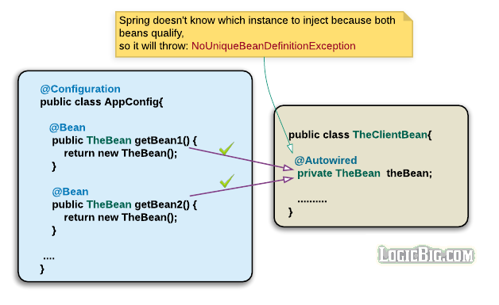
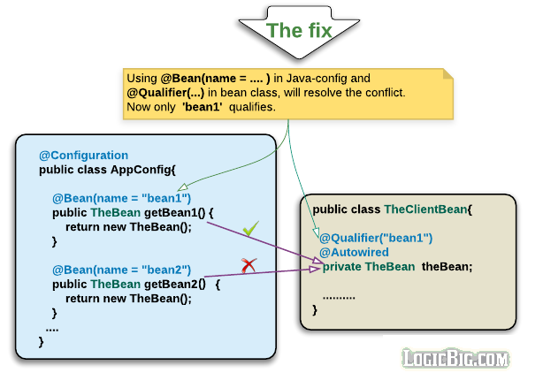
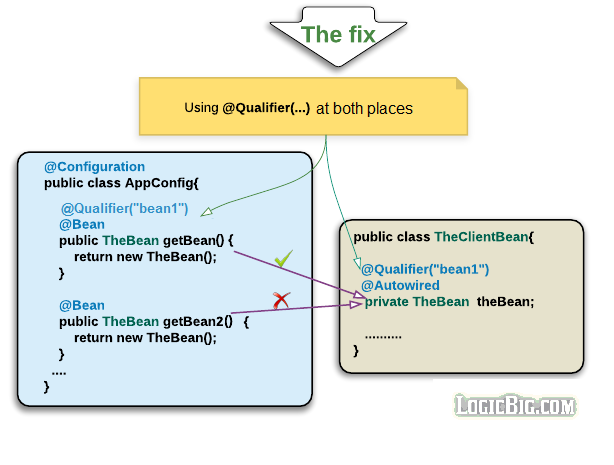

# 使用`@Qualifier`注入 bean

[原文地址](https://www.logicbig.com/tutorials/spring-framework/spring-core/inject-bean-by-name.html)

在下列情况下,需要为 bean 指定一个唯一的名称:

- 在配置中,一个 bean 的声明提供多于一个的实现类
- 当我们需要使用名称注入而不是使用类型注入的时候

值得注意的是,为了在注入点匹配 bean,这个属性的名称必须要匹配这个bean的定义名称

## 使用`Qualifier`匹配 bean

除了我们可以使用属性的名称进行匹配注入外,还可以使用`@Qualifier`标注注入点

下面图片显示当 TheBean 的声明有两个实现类时,就会排除 `NoUniqueBeanDefinitionException`

通过指定`@Qualifier`的方式指定

在声明bean 时和注入点都进行声明

