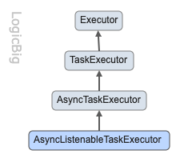
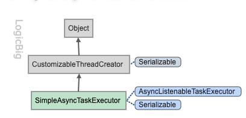

# Task Executing 

任务执行

Spring core 框架提供了text executing 相关的抽象,

- 这个抽象主要涉及到创建一个新的线程并在这个线程中黄建一个 Task
- Spring Task 抽象屏蔽了 JavaSE1.4 ,JavaSE5 以及 JavaEE 环境的差异
- Spring 隐式实现基于 java 的 [Java Executor framework](https://www.logicbig.com/tutorials/core-java-tutorial/java-multi-threading/executor-framework.html),或者是基于简单的 Java线程或者可以基于第三方库例如[Quartz](http://www.quartz-scheduler.org/)

## 接口



- Spring 的 Task 框架基于 `TaskExecutor`
- `TaskExecutor`接口和 java 中的`java.util.concurrent.Executor`一样
- `AsyncTaskExecutor`可以处理`Callable`的提交并返回一个`Future`
- `AsyncListenableTaskExecutor`返回一个`ListenableFuture`,可以设置一个监听器当完成时进行回调

## SimpleAsyncTaskExecutor



```java

/**
 * 使用{@link SimpleAsyncTaskExecutor} 执行一个简单的 task
 *
 * @author EricChen 2019/11/24 14:51
 */
public class TaskExecutorStandAloneExample {
    public static void main(String[] args) {
        TaskExecutor executor = new SimpleAsyncTaskExecutor();
        executor.execute(()-> {
            System.out.println("running task in thread: " +
                    Thread.currentThread()
                            .getName());
        });
        System.out.println("in main thread: " + Thread.currentThread()
                .getName());
    }

}

```

## 在 Bean 中使用 executor


```java
/**
 * 示例: 在 bean 中使用 {@link AsyncTaskExecutor}
 *
 * @author EricChen 2019/11/24 14:58
 */
@Configuration
public class AsyncTaskExecutorExample {
    @Bean
    MyBean myBean () {
        return new MyBean();
    }

    @Bean
    AsyncTaskExecutor taskExecutor () {
        SimpleAsyncTaskExecutor t = new SimpleAsyncTaskExecutor();
        //设置同时线程数
        t.setConcurrencyLimit(100);
        return t;
    }

    public static void main(String[] args) throws Exception{
        ApplicationContext context =
                new AnnotationConfigApplicationContext(AsyncTaskExecutorExample.class);
        MyBean bean = context.getBean(MyBean.class);
        bean.runTasks();
    }

    public static class MyBean {
        @Autowired
        private AsyncTaskExecutor executor;

        public void runTasks () throws Exception {
            List<Future<?>> futureList = new ArrayList<>();

            for (int i = 0; i < 122; i++) {
                Future<?> future = executor.submit(getTask(i));
                futureList.add(future);
            }

            for (Future<?> future : futureList) {
                System.out.println(future.get());
            }
        }

        private Callable<String> getTask (int i) {
            return () -> {
                System.out.printf("running task %d. Thread: %s%n",
                        i,
                        Thread.currentThread().getName());
                Thread.sleep(5000);
                return String.format("Task finished %d", i);
            };
        }
    }
}

```

## ListenableFutureCallback 示例

```java
/**
 * 具有成功或者失败回调的任务执行器
 *
 * @author EricChen 2019/11/24 15:02
 * @see AsyncListenableTaskExecutor  自定义监听 Task 执行器
 * @see ListenableFutureCallback 回调
 */
@Configuration
public class AsyncListableTaskExecutorExample {
    @Bean
    MyBean myBean() {
        return new MyBean();
    }

    @Bean
    AsyncListenableTaskExecutor taskExecutor() {
        SimpleAsyncTaskExecutor t = new SimpleAsyncTaskExecutor();
        t.setConcurrencyLimit(100);
        return t;
    }

    @Bean
    ListenableFutureCallback<String> taskCallback() {
        return new MyListenableFutureCallback();
    }

    public static void main(String[] args) throws Exception {
        ApplicationContext context =
                new AnnotationConfigApplicationContext(AsyncListableTaskExecutorExample.class);
        MyBean bean = context.getBean(MyBean.class);
        bean.runTasks();
    }


    private static class MyBean {
        @Autowired
        private AsyncListenableTaskExecutor executor;
        @Autowired
        private ListenableFutureCallback threadListenableCallback;


        public void runTasks() throws Exception {

            for (int i = 0; i < 10; i++) {
                ListenableFuture<String> f = executor.submitListenable(getTask(i));
                f.addCallback(threadListenableCallback);
            }
        }

        private Callable<String> getTask(int i) {
            return () -> {
                System.out.printf("running task %d. Thread: %s%n", i, Thread.currentThread().getName());
                int c = 10 / 0;//故意报错
                return String.format("Task finished %d", i);
            };
        }
    }

    /**
     * 自定义 Task 回调
     */
    private static class MyListenableFutureCallback implements ListenableFutureCallback<String> {
        @Override
        public void onFailure(Throwable ex) {
            System.out.println("faliure message: " + ex.getMessage());
            ex.printStackTrace();
        }

        @Override
        public void onSuccess(String result) {
            System.out.println("success object: " + result);
        }
    }
}

```

## ThreadPoolTaskExecutor


- `ThreadPoolTaskExecutor`是最常用的 executor,基于java SE [ScheduledThreadPoolExecutor](https://docs.oracle.com/en/java/javase/11/docs/api/java.base/java/util/concurrent/ScheduledThreadPoolExecutor.html)

- 提供了很多配置如
  - `corePoolSize`
  - `MaxPoolSize`
  - `KeepAliveSeconds`
  - `queueCapacity`

可以看出,`ThreadPoolTaskExecutor`接口也实现了`SchedulingTaskExecutor`此接口不是基于延迟/周期的，而是公开特定实现的调度特征

```java
/**
 * {@link ThreadPoolTaskExecutor} 代码实例
 *
 * @author EricChen 2019/11/24 15:13
 */
@Configuration
public class ThreadPoolTaskExecutorExample {
    public static void main (String[] args) {
        AnnotationConfigApplicationContext context =
                new AnnotationConfigApplicationContext(ThreadPoolTaskExecutorExample.class);
        MyBean bean = context.getBean(MyBean.class);
        bean.runTasks();
        ThreadPoolTaskExecutor t = context.getBean(ThreadPoolTaskExecutor.class);
        t.shutdown();
    }
    @Bean
    MyBean myBean () {
        return new MyBean();
    }

    @Bean
    TaskExecutor taskExecutor () {
        ThreadPoolTaskExecutor t = new ThreadPoolTaskExecutor();
        t.setCorePoolSize(10);
        t.setMaxPoolSize(100);
        t.setQueueCapacity(50);
        t.setAllowCoreThreadTimeOut(true);
        t.setKeepAliveSeconds(120);
        return t;
    }


    private static class MyBean {
        @Autowired
        private TaskExecutor executor;

        public void runTasks (){
            for (int i = 0; i < 100; i++) {
                executor.execute(getTask(i));
            }
        }

        private Runnable getTask (int i)  {
            return () -> {
                System.out.printf("running task %d. Thread: %s%n", i, Thread.currentThread().getName());
            };
        }
    }
}

```

## ConcurrentTaskExecutor


这个实现是[java.util.concurrent.Executor](https://docs.oracle.com/en/java/javase/11/docs/api/java.base/java/util/concurrent/Executor.html) 的适配器,方法`ConcurrentTaskExecutor#setTaskDecorator()`可用于装饰底层执行器。此装饰器可用于为任务执行提供一些监视/统计信息。


```java
@Configuration
public class ConcurrentTaskExecutorExample {
    @Bean
    MyBean myBean () {
        return new MyBean();
    }

    @Bean
    TaskExecutor taskExecutor () {
        ConcurrentTaskExecutor t = new ConcurrentTaskExecutor(Executors.newFixedThreadPool(3));
        t.setTaskDecorator(new TaskDecorator() {
            @Override
            public Runnable decorate (Runnable runnable) {
                return () -> {

                    MyTask task = (MyTask) runnable;
                    long t = System.currentTimeMillis();
                    task.run();
                    System.out.printf("time taken for task: %s , %s%n", task.getI(), (System.currentTimeMillis() - t));
                };
            }
        });
        return t;
    }
    public static void main (String[] args) {
        ApplicationContext context =
                new AnnotationConfigApplicationContext(ConcurrentTaskExecutorExample.class);
        MyBean bean = context.getBean(MyBean.class);
        bean.runTasks();
        ConcurrentTaskExecutor exec = context.getBean(ConcurrentTaskExecutor.class);
        ExecutorService service = (ExecutorService) exec.getConcurrentExecutor();
        service.shutdown();
    }


    private static class MyBean {
        @Autowired
        private TaskExecutor executor;

        public void runTasks () {
            for (int i = 0; i < 10; i++) {
                executor.execute(new MyTask(i));

            }
        }
    }

    private static class MyTask implements Runnable {

        private final int i;

        MyTask (int i) {
            this.i = i;
        }

        @Override
        public void run () {
            try {
                Thread.sleep(400);
            } catch (InterruptedException e) {
                e.printStackTrace();
            }
            System.out.printf("running task %d. Thread: %s%n", i, Thread.currentThread().getName());
        }


        public int getI () {
            return i;
        }
    }
}

```

