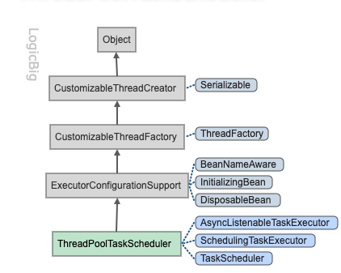
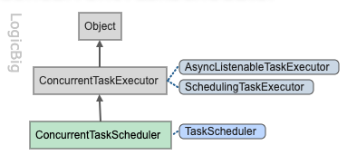

# TaskScheduling

任务调度

- 可以在未来执行一次或者根据指定频率执行

## TaskScheduler 接口

```java
package org.springframework.scheduling;

import java.util.Date;
import java.util.concurrent.ScheduledFuture;

public interface TaskScheduler {

	ScheduledFuture<?> schedule(Runnable task, Trigger trigger);
	ScheduledFuture<?> schedule(Runnable task, Date startTime);
	ScheduledFuture<?> scheduleAtFixedRate(Runnable task,
                                         Date startTime, long period);
	ScheduledFuture<?> scheduleAtFixedRate(Runnable task, long period);
	ScheduledFuture<?> scheduleWithFixedDelay(Runnable task,
                                         Date startTime, long delay);
	ScheduledFuture<?> scheduleWithFixedDelay(Runnable task, long delay);
}
```

特点:

- 看起来有点像 [JSE ScheduledExecutorService](https://www.logicbig.com/tutorials/core-java-tutorial/java-multi-threading/scheduled-executor.html)
- 看起来有点像JSE ([JSR-166](https://docs.oracle.com/en/java/javase/11/docs/api/java.base/java/util/concurrent/package-summary.html)),
- 看起来有点像 JEE ([JSR-236](https://javaee.github.io/javaee-spec/javadocs/javax/enterprise/concurrent/package-summary.html))

## TaskScheduler 实现类



[ThreadPoolTaskScheduler](http://docs.spring.io/spring/docs/current/javadoc-api/org/springframework/scheduling/concurrent/ThreadPoolTaskScheduler.html) 是一个JSE [ScheduledThreadPoolExecutor](https://docs.oracle.com/en/java/javase/11/docs/api/java.base/java/util/concurrent/ScheduledThreadPoolExecutor.html)的包装类

下面实例展示了在以固定速率调度任务,使用`ThreadPoolTaskScheduler`

```java
/**
 * 实例展示了在以固定速率调度任务,使用`ThreadPoolTaskScheduler`
 *
 * @author EricChen 2019/11/24 16:28
 */
public class ThreadPoolTaskSchedulerExample {
    public static void main(String[] args) throws Exception {
        ThreadPoolTaskScheduler scheduler = new ThreadPoolTaskScheduler();
        scheduler.setPoolSize(5);
        scheduler.initialize();

        for(int i = 0; i < 6; i++) {
//            每1000ms 执行一次
            scheduler.scheduleAtFixedRate(() -> System.out.printf("Task: %s, Time: %s:%n", Thread.currentThread().getName(), LocalTime.now()), 1000);

        }

        Thread.sleep(10000);
        System.out.println("shutting down after 10 sec");
        scheduler.getScheduledThreadPoolExecutor().shutdownNow();
    }

}

```

输出

```java
Task: ThreadPoolTaskScheduler-2, Time: 13:17:11.555:
Task: ThreadPoolTaskScheduler-1, Time: 13:17:11.555:
Task: ThreadPoolTaskScheduler-2, Time: 13:17:12.548:
Task: ThreadPoolTaskScheduler-1, Time: 13:17:12.548:
Task: ThreadPoolTaskScheduler-3, Time: 13:17:13.547:
Task: ThreadPoolTaskScheduler-4, Time: 13:17:13.547:
Task: ThreadPoolTaskScheduler-3, Time: 13:17:14.548:
Task: ThreadPoolTaskScheduler-1, Time: 13:17:14.548:
Task: ThreadPoolTaskScheduler-3, Time: 13:17:15.547:
Task: ThreadPoolTaskScheduler-2, Time: 13:17:15.547:
Task: ThreadPoolTaskScheduler-5, Time: 13:17:16.547:
Task: ThreadPoolTaskScheduler-3, Time: 13:17:16.547:
Task: ThreadPoolTaskScheduler-5, Time: 13:17:17.547:
Task: ThreadPoolTaskScheduler-3, Time: 13:17:17.547:
Task: ThreadPoolTaskScheduler-5, Time: 13:17:18.548:
Task: ThreadPoolTaskScheduler-1, Time: 13:17:18.548:
Task: ThreadPoolTaskScheduler-5, Time: 13:17:19.547:
Task: ThreadPoolTaskScheduler-2, Time: 13:17:19.547:
Task: ThreadPoolTaskScheduler-5, Time: 13:17:20.547:
Task: ThreadPoolTaskScheduler-4, Time: 13:17:20.547:
Task: ThreadPoolTaskScheduler-5, Time: 13:17:21.547:
Task: ThreadPoolTaskScheduler-5, Time: 13:17:21.547:
shutting down after 10 sec
```

## 使用触发器

Spring 提供了两个触发器的实现类

- PeriodicTrigger
- CornTrigger

### PeriodicTrigger

```java
public class PeriodicTriggerExample {
    public static void main (String[] args) throws InterruptedException {
        ThreadPoolTaskScheduler s = new ThreadPoolTaskScheduler();
        s.setPoolSize(5);
        s.initialize();
        for (int i = 0; i < 2; i++) {
            //设置 5 秒执行一次
            s.schedule(getTask(), new PeriodicTrigger(5, TimeUnit.SECONDS));
        }
        Thread.sleep(10000);
        System.out.println("shutting down after 10 sec");
        s.getScheduledThreadPoolExecutor().shutdownNow();
    }

    public static Runnable getTask () {
        return () -> System.out.printf("Task: %s, Time: %s:%n",
                Thread.currentThread().getName(),
                LocalTime.now());
    }
}
```

### CornTrigger

```java
public class CronTriggerExample {
    public static void main (String[] args) throws InterruptedException {
        System.out.println("Program starts at : " + LocalTime.now());
        ThreadPoolTaskScheduler s = new ThreadPoolTaskScheduler();
        s.setPoolSize(5);
        s.initialize();
        for (int i = 0; i < 2; i++) {
            s.schedule(getTask(), new CronTrigger("0/2 * * * * ? "));
        }
        Thread.sleep(10000);
        s.getScheduledThreadPoolExecutor().shutdown();
    }

    public static Runnable getTask () {
        return () -> System.out.printf("Task: %s, Time: %s:%n",
                Thread.currentThread().getName(),
                LocalTime.now());
    }
}
```

## ConcurrentTaskScheduler



`ScheduledExecutorService`类的适配器

- 继承`ConcurrentTaskExecutor`我们可以选择围绕底层执行器任务设置装饰器。

```java
public class ConcurrentTaskSchedulerExample {
    public static void main (String[] args) throws InterruptedException {
        ConcurrentTaskScheduler s = new ConcurrentTaskScheduler(Executors.newScheduledThreadPool(5));
        for (int i = 0; i < 10; i++) {
            final int finalI = i;
            s.schedule(() -> {
                try {
                    Thread.sleep(500);
                } catch (InterruptedException e) {
                    e.printStackTrace();
                }
                System.out.printf("task: %d. Thread: %s%n",
                        finalI,
                        Thread.currentThread().getName());
            }, new PeriodicTrigger(1000));
        }
        //shutting down after 3 sec
        Thread.sleep(3000);
        System.out.println("--- shutting down ----");
        ((ExecutorService) s.getConcurrentExecutor()).shutdown();
    }
}

```

输出

```java
task: 1. Thread: pool-1-thread-3
task: 4. Thread: pool-1-thread-5
task: 2. Thread: pool-1-thread-1
task: 0. Thread: pool-1-thread-2
task: 3. Thread: pool-1-thread-4
task: 6. Thread: pool-1-thread-5
task: 7. Thread: pool-1-thread-1
task: 9. Thread: pool-1-thread-4
task: 8. Thread: pool-1-thread-2
task: 5. Thread: pool-1-thread-3
task: 0. Thread: pool-1-thread-2
task: 1. Thread: pool-1-thread-5
task: 2. Thread: pool-1-thread-4
task: 3. Thread: pool-1-thread-3
task: 4. Thread: pool-1-thread-1
task: 6. Thread: pool-1-thread-2
task: 5. Thread: pool-1-thread-1
task: 8. Thread: pool-1-thread-3
task: 9. Thread: pool-1-thread-4
task: 7. Thread: pool-1-thread-5
--- shutting down ----
task: 0. Thread: pool-1-thread-2
task: 4. Thread: pool-1-thread-5
task: 3. Thread: pool-1-thread-4
task: 2. Thread: pool-1-thread-3
task: 1. Thread: pool-1-thread-1
task: 5. Thread: pool-1-thread-5
task: 6. Thread: pool-1-thread-2
task: 9. Thread: pool-1-thread-3
task: 8. Thread: pool-1-thread-4
task: 7. Thread: pool-1-thread-1
```

## DefaultManagedTaskScheduler


此实现通过JNDI查找隐式初始化底层任务调度器。

According to JSR-236 specification: The Java EE product provider (the application server) must bind a pre-configured, default [ManagedScheduledExecutorService](https://javaee.github.io/javaee-spec/javadocs/javax/enterprise/concurrent/ManagedScheduledExecutorService.html) so that application components can find it under the JNDI name `java:comp/DefaultManagedScheduledExecutorService`.

Spring's DefaultManagedTaskScheduler internally initializes the underlying scheduler from this JNDI look up. The scheduler must be used as a bean otherwise this class will work as super class `ConcurrentTaskScheduler`.

Also this class is not strictly JSR-236 based; it can work with any regular ScheduledExecutorService that can be found in JNDI.

In the following example we are not going to demonstrate implicit JNDI binding in a JEE server environment but instead we are going to bind "java:comp/DefaultManagedScheduledExecutorService" manually by using [SimpleNamingContextBuilder](http://docs.spring.io/spring/docs/current/javadoc-api/org/springframework/mock/jndi/SimpleNamingContextBuilder.html).

