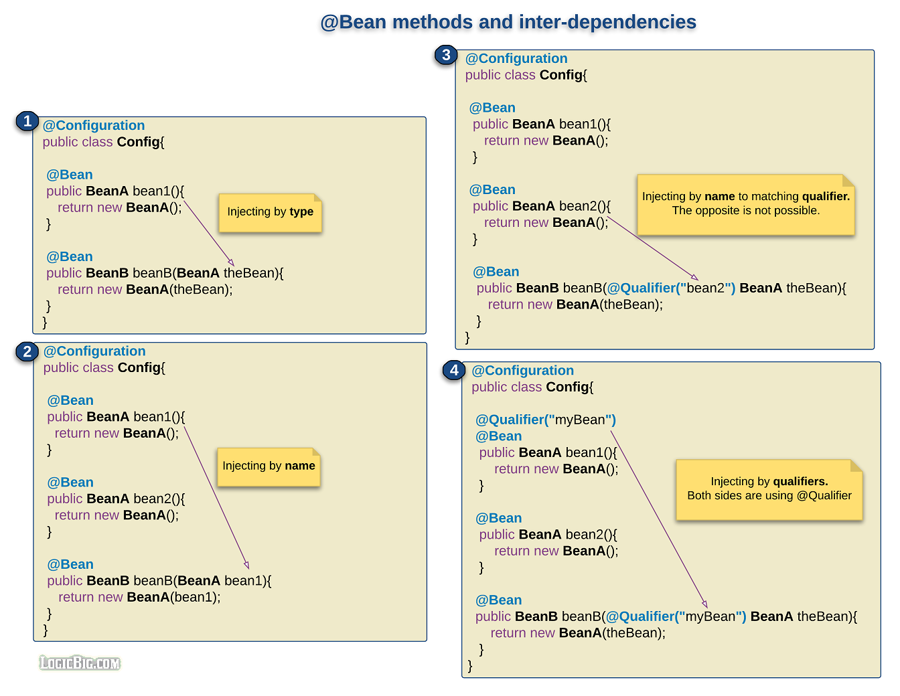

# @Bean方法参数中的依赖项注入

> 版权声明
>
> 此篇文章参考于[logicbig](https://www.logicbig.com/),引用其文字/代码/图片仅用于学习笔记,不用于商业用途

在@Bean 方法可以在形参上声明其他的 bean 完成初始化操作



## 使用`@Qualifier`

```java
public class InjectParameterByQualifier {

    public static void main (String[] args) {
        AnnotationConfigApplicationContext context =
                            new AnnotationConfigApplicationContext(
                                                Config.class);
        BeanB beanB = context.getBean(BeanB.class);
        System.out.println("In the main method: " + beanB.getBeanA());
    }

    @Configuration
    public static class Config {

        @Bean
        public BeanA bean1 () {
            BeanA beanA = new BeanA();
            System.out.println("method bean1: beanA created = " + beanA);
            return beanA;
        }

        @Qualifier("myBean")
        @Bean
        public BeanA bean2 () {
            BeanA beanA = new BeanA();
            System.out.println("method bean2: beanA created = " + beanA);
            return beanA;
        }

        @Bean
        public BeanB bean3 (@Qualifier("myBean") BeanA theBean) {
            BeanB beanB = new BeanB(theBean);
            System.out.println("method bean3: beanB created = " + beanB +
                                "\n with constructor param BeanA = " + theBean);

            return beanB;
        }
    }
}
```

## 