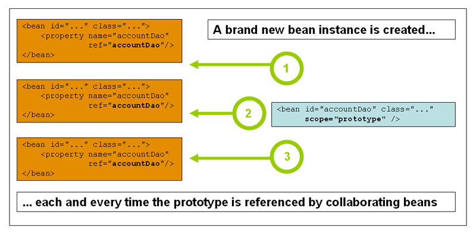

# Bean Scope (Bean 的作用域)

 

Spring 中Bean 的作用域:

| Scope                                                        | Description                                                  |
| :----------------------------------------------------------- | :----------------------------------------------------------- |
| [singleton](https://docs.spring.io/spring/docs/current/spring-framework-reference/core.html#beans-factory-scopes-singleton) | (Default) Scopes a single bean definition to a single object instance for each Spring IoC container. |
| [prototype](https://docs.spring.io/spring/docs/current/spring-framework-reference/core.html#beans-factory-scopes-prototype) | Scopes a single bean definition to any number of object instances. |
| [request](https://docs.spring.io/spring/docs/current/spring-framework-reference/core.html#beans-factory-scopes-request) | Scopes a single bean definition to the lifecycle of a single HTTP request. That is, each HTTP request has its own instance of a bean created off the back of a single bean definition. Only valid in the context of a web-aware Spring `ApplicationContext`. |
| [session](https://docs.spring.io/spring/docs/current/spring-framework-reference/core.html#beans-factory-scopes-session) | Scopes a single bean definition to the lifecycle of an HTTP `Session`. Only valid in the context of a web-aware Spring `ApplicationContext`. |
| [application](https://docs.spring.io/spring/docs/current/spring-framework-reference/core.html#beans-factory-scopes-application) | Scopes a single bean definition to the lifecycle of a `ServletContext`. Only valid in the context of a web-aware Spring `ApplicationContext`. |
| [websocket](https://docs.spring.io/spring/docs/current/spring-framework-reference/web.html#websocket-stomp-websocket-scope) | Scopes a single bean definition to the lifecycle of a `WebSocket`. Only valid in the context of a web-aware Spring `ApplicationContext`. |

## The Singleton Scope (Singleton 作用域)

Spring容器管理的一个单例 bean,所有根据 ID 获取它的请求,都会只返回这个实例


Spring 的单例与四人帮的设计模式里的单例的区别

- Spring 仅仅是容器实例内单例,一个 ClassLoader 可以有多个 Spring 容器实例
- 四人帮的设计模式是一个 ClassLoader 只有一个实例

```xml
<bean id="accountService" class="com.something.DefaultAccountService"/>

<!-- the following is equivalent, though redundant (singleton scope is the default) -->
<bean id="accountService" class="com.something.DefaultAccountService" scope="singleton"/>
```


## The Prototype Scope

每次请求,Spring容器返回的实例都是一个新的实例



配置方式:

```xml
<bean id="accountService" class="com.something.DefaultAccountService" scope="prototype"/>
```

## Request, Session, Application, and WebSocket Scopes

##### request Scope

在一次 HTTP 请求中,每个 Bean 定义对应一个实例,该作用域进在基于 Web 的 Sprng上下文(例如 SpringMVC)中才有效

注解:

```java
@RequestScope
@Component
public class LoginAction {
    // ...
}
```

xml:

```xml
<bean id="loginAction" class="com.something.LoginAction" scope="request"/>
```

##### Session Scope

在一个 HTTP Session 中,每个 Bean 定义对应一个实例,该作用域仅仅在基于 Web 的 Spring( 上下文例如 SpringMVC) 中才有效

注解:

```java
@SessionScope
@Component
public class UserPreferences {
    // ...
}
```

xml:

```xml
<bean id="userPreferences" class="com.something.UserPreferences" scope="session"/>
```

##### Application Scope

每一个 ServletContext 一个实例

注解

```
@ApplicationScope
@Component
public class AppPreferences {
    // ...
}
```

xml:

```xml
<bean id="appPreferences" class="com.something.AppPreferences" scope="application"/>
```

##### websocket Scope

定义每个 WebSocket 一个实例,只有在使用 Web 能力的 SpringApplicationContext 才有效

