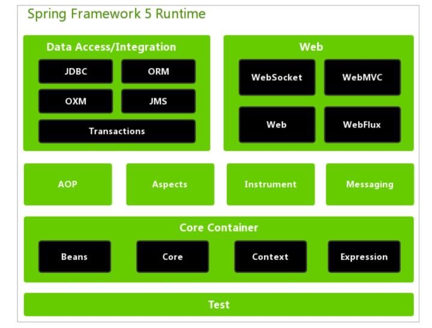

# Spring核心容器

核心容器由四个模块组成

- [spring-beans](#spring-beans)
- [spring-core](#spring-core)
- [spring-context](#spring-context)
- spring-expression(Spring Expression Language, SpEL) 

## spring-beans

spring-beans 和 springcore 是spring 框架的核心模块，包含了控制反转（Inversion of Controll， IOC) 和依赖注入（Dependency Injection, DI) 

- **BeanFactory 使用控制反转对应用程序的配置和依赖性规范与实际的应用程序代码进行了分离**

- **但是BeanFactory 实例化后并不会自动实例化Bean，而是等到Bean被使用时，BeanFactory才会对该Bean进行实例化与依赖关系的装配**

## spring-context

spring-context模块构架与核心模块上，拓展了 BeanFactory