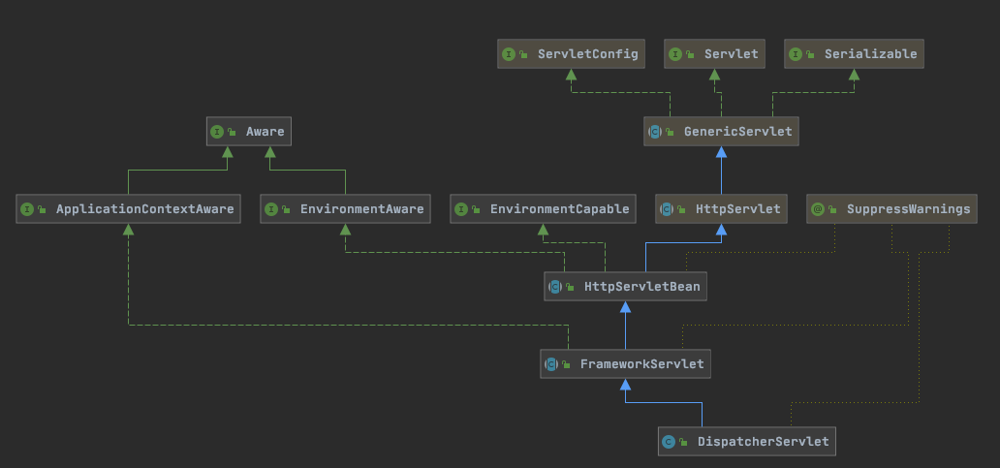

# 使用DispatcherServlet初始化上下文

一样,也是看到refresh就结束

## 目录

- 利用Servlet规范中的init方法回调创建容器

## 图示

## 利用Servlet规范中的init方法回调创建容器

根据 [010-Servlet规范](../../../16-JSR/010-Servlet规范)  中的初始化方法, servlet在被创建的时候,会被Servlet容器调用init方法

- javax.servlet.Servlet#init
- javax.servlet.GenericServlet#init(javax.servlet.ServletConfig)
- org.springframework.web.servlet.HttpServletBean#init
- org.springframework.web.servlet.FrameworkServlet#initServletBean
- org.springframework.web.servlet.FrameworkServlet#initWebApplicationContext
- org.springframework.web.servlet.FrameworkServlet#createWebApplicationContext(org.springframework.web.context.WebApplicationContext)
- org.springframework.web.servlet.FrameworkServlet#configureAndRefreshWebApplicationContext
- refresh方法

#### 看到了refresh,基本就走的通用流程,仅仅只是获取BeanDefination的方式不同而已

[000-refresh-通用核心初始化流程.md](../000-refresh-通用核心初始化流程.md) 

