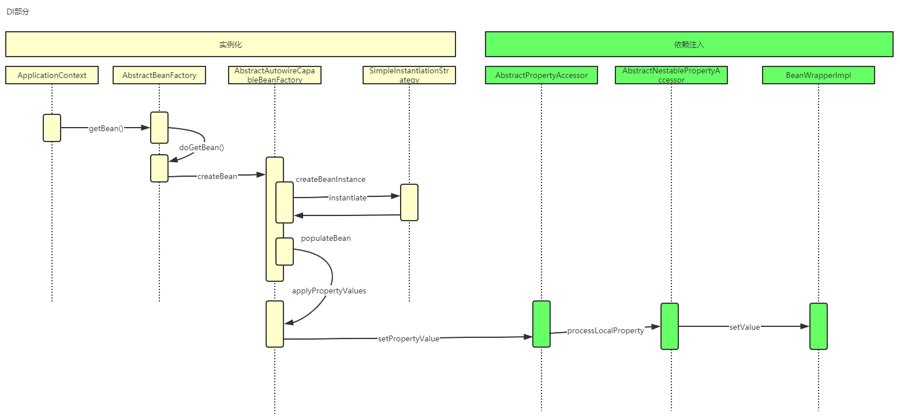

# Spring依赖注入的时机

## 目录

[TOC]						

## 依赖注入发生的时间

当Spring IoC容器完成了Bean定义资源的定位、载入和解析注册，IoC容器就可以管理Bean定义的相关数据了，但是此时IoC容器还没有对所管理的Bean进行依赖注入（DI），依赖注入在以下两种情况下发生：

- 用户第一次调用 **getBean()** 方法时，IoC容器触发依赖注入。
- 当用户在配置文件中将`＜bean＞`元素配置了 lazy-init=false 属性时，即让容器在解析注册Bean定义时进行预实例化，触发依赖注入。

## 核心接口

- [BeanFactory](#BeanFactory)
- [AbstractBeanFactory](#AbstractBeanFactory)

#### BeanFactory

BeanFactory 接口定义了Spring IoC容器的基本功能规范，是Spring IoC容器所应遵守的最低层和最基本的编程规范。

BeanFactory接口中定义了几个 **getBean** 方法，用于用户向IoC容器索取被管理的Bean的方法，我们通过分析其子类的具体实现来理解Spring IoC容器在用户索取Bean时如何完成依赖注入。

在BeanFactory中我们可以看到 getBean（String...）方法，但它的具体实现在 AbstractBeanFactory 中

#### AbstractBeanFactory

通过向IoC容器获取Bean的方法的分析，我们可以看到，在Spring中如果Bean定义为单例模式（Singleton）的，则容器在创建之前先从缓存中查找，以确保整个容器中只存在一个实例对象。如果Bean定义为原型模式（Prototype）的，则容器每次都会创建一个新的实例对象。除此之外，Bean定义还可以指定其生命周期范围。

- `org.springframework.beans.factory.support.AbstractBeanFactory#getBean(java.lang.String, java.lang.Class<T>)`
- `org.springframework.beans.factory.support.AbstractBeanFactory#doGetBean`

 [AbstractBeanFactory源码](010-核心类/010-AbstractBeanFactory.md) 

上面的源码只定义了根据 Bean 定义的不同模式采取的创建 Bean 实例对象的不同策略，具体的Bean 实例对象的创建过程由实现了 ObjectFactory 接口的匿名内部类的 createBean()方法完成，ObjectFactory 接口使 用 委 派 模 式，具体的 Bean 实例创建过程交由其实现类 AbstractAutowireCapableBeanFactory 完成。下面我们继续分析AbstractAutowireCapableBeanFactory的createBean()方法的源码，理解创建Bean实例的具体过程。

- org.springframework.beans.factory.support.AbstractAutowireCapableBeanFactory#createBean(java.lang.String, org.springframework.beans.factory.support.RootBeanDefinition, java.lang.Object[])

## 初始化流程

- [020-AbstractAutowireCapableBeanFactory.md](010-核心类/020-AbstractAutowireCapableBeanFactory.md) 
-  [030-SimpleInstantiationStrategy.md](010-核心类/030-SimpleInstantiationStrategy.md) 

## 初始化完毕

## 依赖注入

