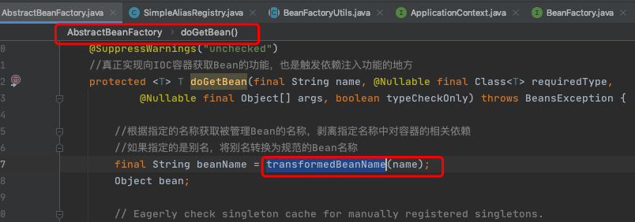
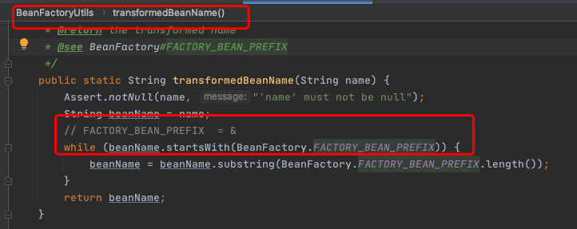

# 002-DI第一步-转换对应beanName

[TOC]

## 简述

或许很多人不理解转换对应beanName是什么意思，传入的参数name不就是beanName吗？其实不是，这里传入的参数可能是别名，也可能是FactoryBean，所以需要进行一系列的解析，这些解析内容包括如下内容。

去除FactoryBean的修饰符，也就是如果name="&aa"，那么会首先去除&而使name="aa"。

取指定alias所表示的最终beanName，例如别名A指向名称为B的bean则返回B；若别名A指向别名B，别名B又指向名称为C

## 源码分析

去除FactoryBean的修饰符，也就是如果name="&aa"，那么会首先去除&而使name="aa"。

