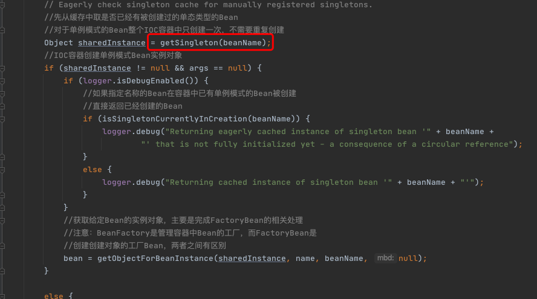
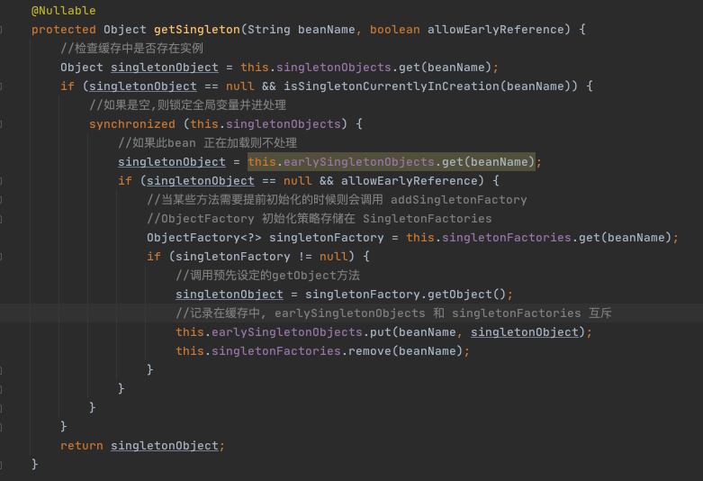

# 003-DI第二步-尝试从缓存中加载单例

[TOC]

## 简介

单例在Spring的同一个容器内只会被创建一次，后续再获取bean，就直接从单例缓存中获取了。

当然这里也只是尝试加载，首先尝试从缓存中加载，如果加载不成功则再次尝试从singletonFactories中加载。因为在创建单例bean的时候会存在依赖注入的情况，而在创建依赖的时候为了避免循环依赖，在Spring中创建bean的原则是不等bean创建完成就会将创建bean的ObjectFactory提早曝光加入到缓存中，一旦下一个bean创建时候需要依赖上一个bean则直接使用ObjectFactory。

## 源码

首先尝试从缓存中加载，如果加载不成功则再次尝试从singletonFactories中加载。

> org.springframework.beans.factory.support.AbstractBeanFactory#doGetBean
>
> org.springframework.beans.factory.support.DefaultSingletonBeanRegistry#getSingleton(java.lang.String, boolean)

因为在创建单例bean的时候会存在依赖注入的情况，而在创建依赖的时候为了避免循环依赖，在Spring中创建bean的原则是不等bean创建完成就会将创建bean的ObjectFactory提早曝光加入到缓存中，一旦下一个bean创建时候需要依赖上一个bean则直接使用ObjectFactory。

## 循环检测

这个方法因为涉及循环依赖的检测，以及涉及很多变量的记录存取

1. 这个方法首先尝试从 singletonObjects 里面获取实例，
2. 如果获取不到再从 earlySingletonObjects 里面获取，
3. 如果还获取不到，再尝试从 singletonFactories里面获取beanName对应的ObjectFactory，然后调用这个ObjectFactory的getObject来创建bean，并放到earlySingletonObjects 里面去，并且从 singletonFacotories里面remove掉这个ObjectFactory，而对于后续的所有内存操作都只为了循环依赖检测时候使用，也就是在 allowEarlyReference 为 true 的情况下才会使用。

这里涉及用于存储bean的不同的map，可能让读者感到崩溃，简单解释如下。

- singletonObjects：用于保存BeanName和创建bean实例之间的关系，bean name --> bean instance。
- singletonFactories：用于保存BeanName和创建bean的工厂之间的关系，bean name --> ObjectFactory。
- earlySingletonObjects：也是保存BeanName和创建bean实例之间的关系，与singletonObjects的不同之处在于，当一个单例bean被放到这里面后，那么当bean还在创建过程中，就可以通过getBean方法获取到了，其目的是用来检测循环引用。
- registeredSingletons：用来保存当前所有已注册的bean。

