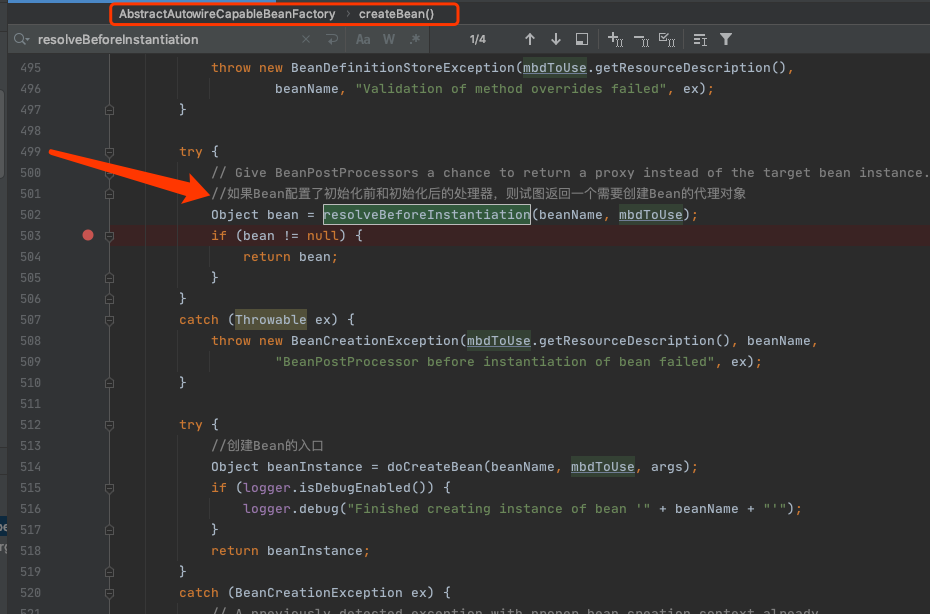
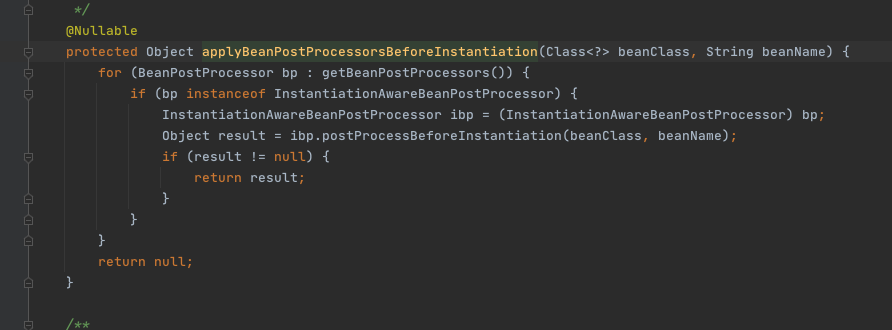
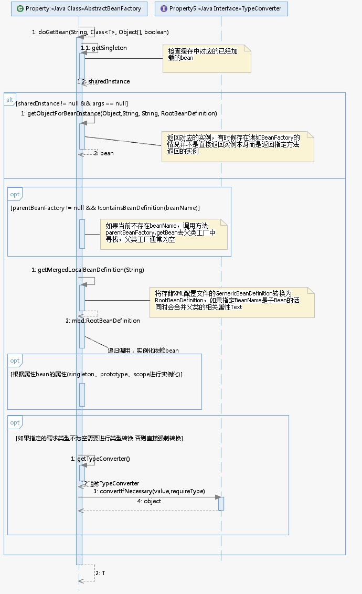

# bean的实例化

如果从缓存中得到了bean的原始状态，则需要对bean进行实例化。这里有必要强调一下，缓存中记录的只是最原始的bean状态，并不一定是我们最终想要的bean。

举个例子，假如我们需要对工厂bean进行处理，那么这里得到的其实是工厂bean的初始状态，但是我们真正需要的是工厂bean中定义的 factory-method方法中返回的 bean，而 getObjectForBeanInstance 就是完成这个工作的

## 总体流程

当经历过resolveBeforeInstantiation方法后，程序有两个选择，

- 如果创建了代理或者说重写了InstantiationAwareBeanPostProcessor的postProcessBeforeInstantiation方法并在方法postProcessBeforeInstantiation中改变了bean，则直接返回就可以了
- 否则需要进行常规bean的创建。而这常规bean的创建就是在doCreateBean中完成的。


## 入口

### createBean方法


如果创建了代理或者说重写了InstantiationAwareBeanPostProcessor的postProcessBeforeInstantiation方法并在方法postProcessBeforeInstantiation中改变了bean，则直接返回就可以了



## getObjectForBeanInstance

在getBean方法中，getObjectForBeanInstance是个高频率使用的方法，无论是从缓存中获得bean还是根据不同的scope策略加载bean。

总之，我们得到bean的实例后要做的第一步就是调用这个方法来检测一下正确性，其实就是用于检测当前bean是否是FactoryBean类型的bean，如果是，那么需要调用该bean对应的FactoryBean实例中的getObject()作为返回值。

无论是从缓存中获取到的bean还是通过不同的scope策略加载的bean都只是最原始的bean状态，并不一定是我们最终想要的bean。

举个例子，假如我们需要对工厂bean进行处理，那么这里得到的其实是工厂bean的初始状态，但是我们真正需要的是工厂bean中定义的factory-method方法中返回的bean，而getObjectForBeanInstance方法就是完成这个工作的。

```java
	//获取给定Bean的实例对象，主要是完成FactoryBean的相关处理
	protected Object getObjectForBeanInstance(
			Object beanInstance, String name, String beanName, @Nullable RootBeanDefinition mbd) {

		// Don't let calling code try to dereference the factory if the bean isn't a factory.
		//容器已经得到了Bean实例对象，这个实例对象可能是一个普通的Bean，
		//也可能是一个工厂Bean，如果是一个工厂Bean，则使用它创建一个Bean实例对象，
		//如果调用本身就想获得一个容器的引用，则指定返回这个工厂Bean实例对象
		//如果指定的名称是容器的解引用(dereference，即是对象本身而非内存地址)，
		//且Bean实例也不是创建Bean实例对象的工厂Bean
		if (BeanFactoryUtils.isFactoryDereference(name) && !(beanInstance instanceof FactoryBean)) {
			throw new BeanIsNotAFactoryException(transformedBeanName(name), beanInstance.getClass());
		}

		// Now we have the bean instance, which may be a normal bean or a FactoryBean.
		// If it's a FactoryBean, we use it to create a bean instance, unless the
		// caller actually wants a reference to the factory.
		//如果Bean实例不是工厂Bean，或者指定名称是容器的解引用，
		//调用者向获取对容器的引用，则直接返回当前的Bean实例
		if (!(beanInstance instanceof FactoryBean) || BeanFactoryUtils.isFactoryDereference(name)) {
			return beanInstance;
		}

		//处理指定名称不是容器的解引用，或者根据名称获取的Bean实例对象是一个工厂Bean
		//使用工厂Bean创建一个Bean的实例对象
		Object object = null;
		if (mbd == null) {
			//从Bean工厂缓存中获取给定名称的Bean实例对象
			object = getCachedObjectForFactoryBean(beanName);
		}
		//让Bean工厂生产给定名称的Bean对象实例
		if (object == null) {
			// Return bean instance from factory.
			FactoryBean<?> factory = (FactoryBean<?>) beanInstance;
			// Caches object obtained from FactoryBean if it is a singleton.
			//如果从Bean工厂生产的Bean是单态模式的，则缓存
			if (mbd == null && containsBeanDefinition(beanName)) {
				//从容器中获取指定名称的Bean定义，如果继承基类，则合并基类相关属性
				mbd = getMergedLocalBeanDefinition(beanName);
			}
			//如果从容器得到Bean定义信息，并且Bean定义信息不是虚构的，
			//则让工厂Bean生产Bean实例对象
			boolean synthetic = (mbd != null && mbd.isSynthetic());
			//调用FactoryBeanRegistrySupport类的getObjectFromFactoryBean方法，
			//实现工厂Bean生产Bean对象实例的过程
			object = getObjectFromFactoryBean(factory, beanName, !synthetic);
		}
		return object;
	}
```

从上面的代码来看，其实这个方法并没有什么重要的信息，大多是些辅助代码以及一些功能性的判断，而真正的核心代码却委托给了getObjectFromFactoryBean，我们来看看 getObjectForBeanInstance 中的所做的工作。

- 对FactoryBean正确性的验证。
- 对非FactoryBean不做任何处理。
- 对bean进行转换。
- 将从Factory中解析bean的工作委托给getObjectFromFactoryBean。

## getObjectFromFactoryBean

```java
	//Bean工厂生产Bean实例对象
	protected Object getObjectFromFactoryBean(FactoryBean<?> factory, String beanName, boolean shouldPostProcess) {
		//Bean工厂是单态模式，并且Bean工厂缓存中存在指定名称的Bean实例对象
		if (factory.isSingleton() && containsSingleton(beanName)) {
			//多线程同步，以防止数据不一致
			synchronized (getSingletonMutex()) {
				//直接从Bean工厂缓存中获取指定名称的Bean实例对象
				Object object = this.factoryBeanObjectCache.get(beanName);
				//Bean工厂缓存中没有指定名称的实例对象，则生产该实例对象
				if (object == null) {
					//调用Bean工厂的getObject方法生产指定Bean的实例对象
					object = doGetObjectFromFactoryBean(factory, beanName);
					// Only post-process and store if not put there already during getObject() call above
					// (e.g. because of circular reference processing triggered by custom getBean calls)
					Object alreadyThere = this.factoryBeanObjectCache.get(beanName);
					if (alreadyThere != null) {
						object = alreadyThere;
					}
					else {
						if (shouldPostProcess) {
							try {
								object = postProcessObjectFromFactoryBean(object, beanName);
							}
							catch (Throwable ex) {
								throw new BeanCreationException(beanName,
										"Post-processing of FactoryBean's singleton object failed", ex);
							}
						}
						//将生产的实例对象添加到Bean工厂缓存中
						this.factoryBeanObjectCache.put(beanName, object);
					}
				}
				return object;
			}
		}
		//调用Bean工厂的getObject方法生产指定Bean的实例对象
		else {
			Object object = doGetObjectFromFactoryBean(factory, beanName);
			if (shouldPostProcess) {
				try {
					object = postProcessObjectFromFactoryBean(object, beanName);
				}
				catch (Throwable ex) {
					throw new BeanCreationException(beanName, "Post-processing of FactoryBean's object failed", ex);
				}
			}
			return object;
		}
	}

```

上面我们已经讲述了FactoryBean的调用方法，如果bean声明为FactoryBean类型，则当提取bean时提取的并不是FactoryBean，而是FactoryBean中对应的getObject方法返回的bean，而doGetObjectFromFactoryBean正是实现这个功能的。

但是，我们看到在上面的方法中除了调用 object = factory.getObject() 得到我们想要的结果后并没有直接返回，而是接下来又做了些后处理的操作，这个又是做什么用的呢？

在Spring获取bean的规则中有这样一条：尽可能保证所有bean初始化后都会调用注册的 **BeanPostProcessor** 的 **postProcessAfterInitialization** 方法进行处理，在实际开发过程中大可以针对此特性设计自己的业务逻辑。




