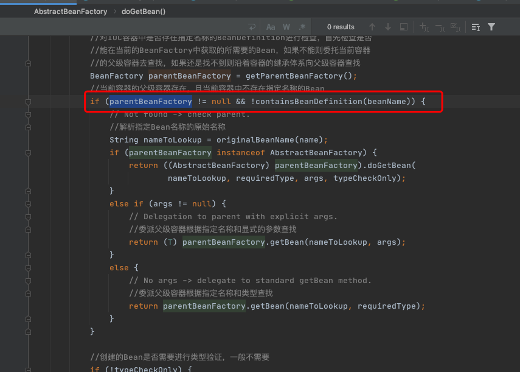

# 检测parentBeanFactory

[TOC]

从代码上看，如果缓存没有数据的话直接转到父类工厂上去加载了，这是为什么呢？

## 源码

```java
//org.springframework.beans.factory.support.AbstractBeanFactory#doGetBean		
BeanFactory parentBeanFactory = getParentBeanFactory();
//当前容器的父级容器存在，且当前容器中不存在指定名称的Bean
if (parentBeanFactory != null && !containsBeanDefinition(beanName)) {
  // Not found -> check parent.
  //解析指定Bean名称的原始名称
  String nameToLookup = originalBeanName(name);
  if (parentBeanFactory instanceof AbstractBeanFactory) {
    return ((AbstractBeanFactory) parentBeanFactory).doGetBean(
      nameToLookup, requiredType, args, typeCheckOnly);
  }
  else if (args != null) {
    // Delegation to parent with explicit args.
    //委派父级容器根据指定名称和显式的参数查找
    return (T) parentBeanFactory.getBean(nameToLookup, args);
  }
  else {
    // No args -> delegate to standard getBean method.
    //委派父级容器根据指定名称和类型查找
    return parentBeanFactory.getBean(nameToLookup, requiredType);
  }
}
```

可能读者忽略了一个很重要的判断条件：parentBeanFactory != null && !containsBean Definition (beanName)，parentBeanFactory != null。



parentBeanFactory如果为空，则其他一切都是浮云，这个没什么说的，但是 !containsBeanDefinition(beanName) 就比较重要了，它是在检测如果当前加载的XML配置文件中不包含beanName所对应的配置，就只能到parentBeanFactory去尝试下了，然后再去递归的调用getBean方法。


