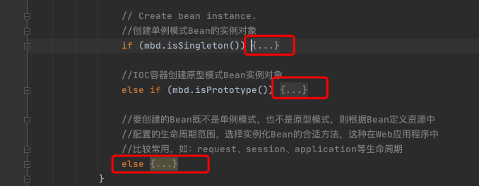
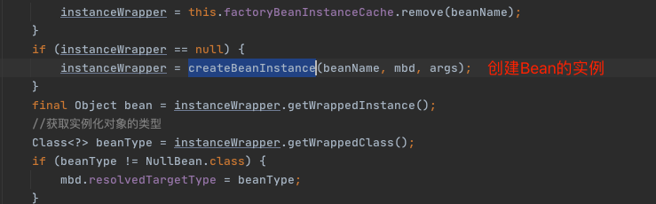
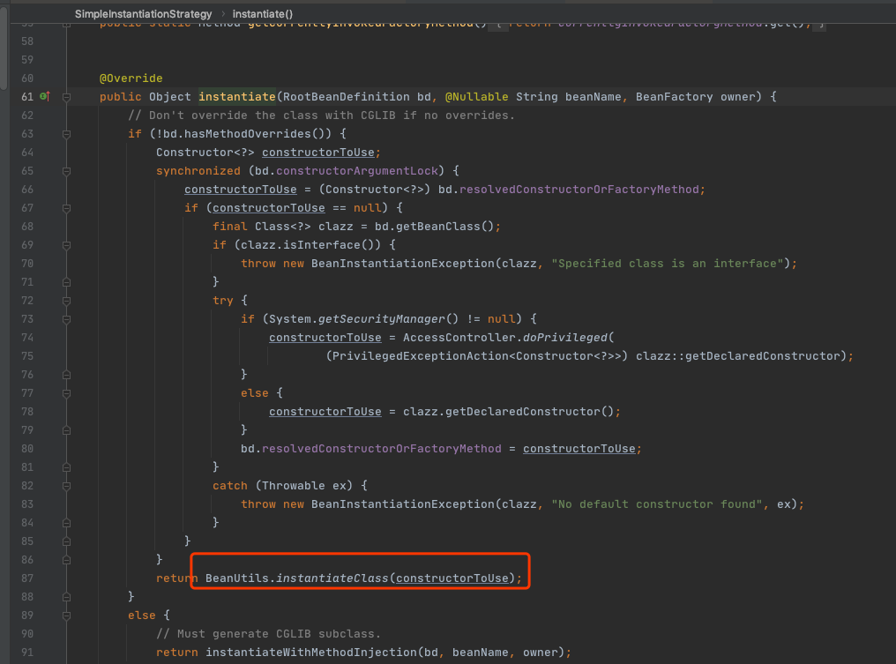
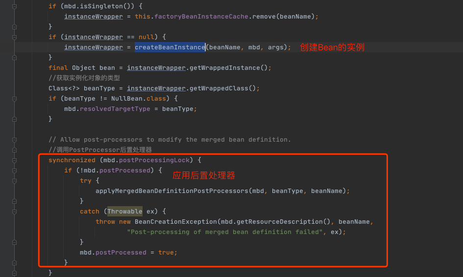

# 针对不同的scope进行bean的创建

我们都知道，在Spring中存在着不同的scope，其中默认的是singleton，但是还有些其他的配置诸如prototype、request之类的。在这个步骤中，Spring会根据不同的配置进行不同的初始化策略。




## 单例Bean的创建

> org.springframework.beans.factory.support.AbstractAutowireCapableBeanFactory#doCreateBean

```java
	//真正创建Bean的方法
	protected Object doCreateBean(final String beanName, final RootBeanDefinition mbd, final @Nullable Object[] args)
			throws BeanCreationException {

		// Instantiate the bean.
		//封装被创建的Bean对象
		BeanWrapper instanceWrapper = null;
		if (mbd.isSingleton()) {
			instanceWrapper = this.factoryBeanInstanceCache.remove(beanName);
		}
		if (instanceWrapper == null) {
			instanceWrapper = createBeanInstance(beanName, mbd, args);
		}
		final Object bean = instanceWrapper.getWrappedInstance();
		//获取实例化对象的类型
		Class<?> beanType = instanceWrapper.getWrappedClass();
		if (beanType != NullBean.class) {
			mbd.resolvedTargetType = beanType;
		}

		// Allow post-processors to modify the merged bean definition.
		//调用PostProcessor后置处理器
		synchronized (mbd.postProcessingLock) {
			if (!mbd.postProcessed) {
				try {
					applyMergedBeanDefinitionPostProcessors(mbd, beanType, beanName);
				}
				catch (Throwable ex) {
					throw new BeanCreationException(mbd.getResourceDescription(), beanName,
							"Post-processing of merged bean definition failed", ex);
				}
				mbd.postProcessed = true;
			}
		}

		// Eagerly cache singletons to be able to resolve circular references
		// even when triggered by lifecycle interfaces like BeanFactoryAware.
		//向容器中缓存单例模式的Bean对象，以防循环引用
		boolean earlySingletonExposure = (mbd.isSingleton() && this.allowCircularReferences &&
				isSingletonCurrentlyInCreation(beanName));
		if (earlySingletonExposure) {
			if (logger.isDebugEnabled()) {
				logger.debug("Eagerly caching bean '" + beanName +
						"' to allow for resolving potential circular references");
			}
			//这里是一个匿名内部类，为了防止循环引用，尽早持有对象的引用
			addSingletonFactory(beanName, () -> getEarlyBeanReference(beanName, mbd, bean));
		}

		// Initialize the bean instance.
		//Bean对象的初始化，依赖注入在此触发
		//这个exposedObject在初始化完成之后返回作为依赖注入完成后的Bean
		Object exposedObject = bean;
		try {
			//将Bean实例对象封装，并且Bean定义中配置的属性值赋值给实例对象
			populateBean(beanName, mbd, instanceWrapper);
			//初始化Bean对象
			exposedObject = initializeBean(beanName, exposedObject, mbd);
		}
		catch (Throwable ex) {
			if (ex instanceof BeanCreationException && beanName.equals(((BeanCreationException) ex).getBeanName())) {
				throw (BeanCreationException) ex;
			}
			else {
				throw new BeanCreationException(
						mbd.getResourceDescription(), beanName, "Initialization of bean failed", ex);
			}
		}

		if (earlySingletonExposure) {
			//获取指定名称的已注册的单例模式Bean对象
			Object earlySingletonReference = getSingleton(beanName, false);
			if (earlySingletonReference != null) {
				//根据名称获取的已注册的Bean和正在实例化的Bean是同一个
				if (exposedObject == bean) {
					//当前实例化的Bean初始化完成
					exposedObject = earlySingletonReference;
				}
				//当前Bean依赖其他Bean，并且当发生循环引用时不允许新创建实例对象
				else if (!this.allowRawInjectionDespiteWrapping && hasDependentBean(beanName)) {
					String[] dependentBeans = getDependentBeans(beanName);
					Set<String> actualDependentBeans = new LinkedHashSet<>(dependentBeans.length);
					//获取当前Bean所依赖的其他Bean
					for (String dependentBean : dependentBeans) {
						//对依赖Bean进行类型检查
						if (!removeSingletonIfCreatedForTypeCheckOnly(dependentBean)) {
							actualDependentBeans.add(dependentBean);
						}
					}
					if (!actualDependentBeans.isEmpty()) {
						throw new BeanCurrentlyInCreationException(beanName,
								"Bean with name '" + beanName + "' has been injected into other beans [" +
								StringUtils.collectionToCommaDelimitedString(actualDependentBeans) +
								"] in its raw version as part of a circular reference, but has eventually been " +
								"wrapped. This means that said other beans do not use the final version of the " +
								"bean. This is often the result of over-eager type matching - consider using " +
								"'getBeanNamesOfType' with the 'allowEagerInit' flag turned off, for example.");
					}
				}
			}
		}

		// Register bean as disposable.
		//注册完成依赖注入的Bean
		try {
			registerDisposableBeanIfNecessary(beanName, bean, mbd);
		}
		catch (BeanDefinitionValidationException ex) {
			throw new BeanCreationException(
					mbd.getResourceDescription(), beanName, "Invalid destruction signature", ex);
		}

		return exposedObject;
	}
```

## 创建BeanWrapper



使用反射,BeanUtils 来创建一个对象



## 应用后置处理器

