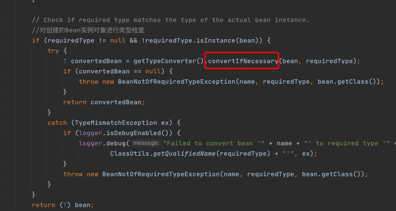

# 类型转换

程序到这里返回bean后已经基本结束了，通常对该方法的调用参数 requiredType 是为空的，但是可能会存在这样的情况，返回的bean其实是个String，但是requiredType 却传入Integer类型，那么这时候本步骤就会起作用了，它的功能是将返回的bean转换为requiredType所指定的类型。当然，String转换为Integer是最简单的一种转换，在Spring中提供了各种各样的转换器，用户也可以自己扩展转换器来满足需求。

经过上面的步骤后 bean 的加载就结束了，这个时候就可以返回我们所需要的 bean了，下图直观地反映了整个过程。

其中最重要的就是步骤8，针对不同的 scope 进行 bean 的创建，你会看到各种常用的 Spring 特性在这里的实现。

## 源码

如果指定的需求类型不为空需要进行类型转换,否则直接强制转换

