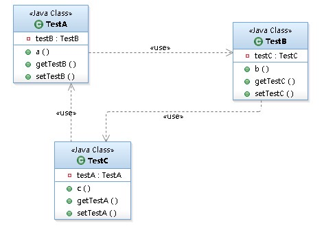

# 循环依赖问题

## 目录

- [什么是循环依赖](#什么是循环依赖)

- [Spring如何解决循环依赖问题](#Spring如何解决循环依赖问题)

## 什么是循环依赖

循环依赖就是循环引用,就是两个或者多个Bean之间互相持有对方, 比如 CircleA 引用 CircleB, CircleB 引用CircleC, CircleC 引用 CircleA .最终形成一个环

## Spring如何解决循环依赖问题

Spring容器循环依赖包含两个

- [构造器循环依赖](#构造器循环依赖)
- [setter循环依赖](#setter循环依赖)

### 构造器循环依赖

通过构造器注入构成的循环依赖,只能抛出 `BeanCurrentlyInCreationException` 表示循环依赖

Spring容器将每一个正在创建的bean标识符放在一个 "当前创建bean池"里时,抛出  `BeanCurrentlyInCreationException` 异常表示循环

### setter循环依赖