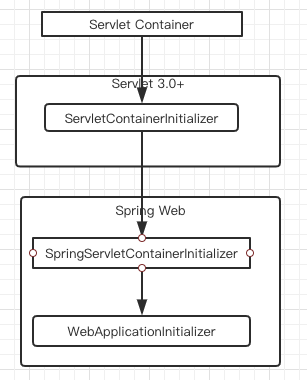
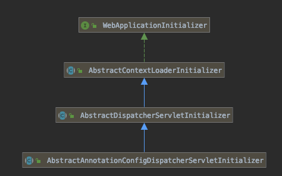

# DispatcherServlet

SpringMVC ,基于 front controller pattern (前端控制器模式) 进行开发的,核心的 `Servlet`是`DispatcherServlet`

DispatcherServlet 有以下特点:

- 提供了一个共享的请求处理算法
- 实际的处理由可配置的代理 components 来处理,

根据 Servlet Specification , servlet 需要在 web.xml 或者 Java configuration 中进行配置, `DispactcherServlet`使用 Spring 配置去发现和代理组件,可以进行

- request mapping 
- view resolution
- exception handling 

这种模型非常的灵活且支持不同的工作流

## Java 代码方式初始化 DispatcherServlet

Spring 提供了一个类 `WebApplicationInitializer`,可以在 Servlet 容器初始化的时候进行调用

```xml
/**
 * Custom initialization DispatcherServlet , using java configuration instead of xml config file
 * Implementations of this SPI will be detected automatically by {@link org.springframework.web.SpringServletContainerInitializer},
 * Which itself is bootstrapped automatically by servlet 3.0 container
 *
 * @see DispatcherServlet
 * @see AppConfig
 */
public class MyWebApplicationInitializer implements WebApplicationInitializer {


    public void onStartup(ServletContext servletContext) {

        //load spring web application
        AnnotationConfigWebApplicationContext context = new AnnotationConfigWebApplicationContext();
        context.register(AppConfig.class);
        context.refresh();

        //create and register the dispatcherServlet
        DispatcherServlet dispatcherServlet = new DispatcherServlet(context);
        ServletRegistration.Dynamic registration = servletContext.addServlet("app", dispatcherServlet);
        registration.setLoadOnStartup(1);
        registration.addMapping("/*");
    }
}

```

> 除了直接使用 ServletContext ,你也可以通过拓展 `AbstractAnnotationConfigDispatcherServletInitializer`类的方式,重写指定方法的方式进行特殊化处理

#### 值得注意的是

Servlet 容器在  Servlet 3.0 以后,提供了一个接口`ServletContainerInitializer`,用于在 库或者运行时注册 servlets,filter , listener 的机制



Spring web 中使用`SpringServletContainerInitializer`用以调用自定义的 Initializer 类


它的抽象实现类很多,主要是封装了一些特定需求的通用代码:



## 使用 web.xml 配置方式初始化 DispatcherServlet

```xml
<web-app>

    <listener>
        <listener-class>org.springframework.web.context.ContextLoaderListener</listener-class>
    </listener>

    <context-param>
        <param-name>contextConfigLocation</param-name>
        <param-value>/WEB-INF/app-context.xml</param-value>
    </context-param>

    <servlet>
        <servlet-name>app</servlet-name>
        <servlet-class>org.springframework.web.servlet.DispatcherServlet</servlet-class>
        <init-param>
            <param-name>contextConfigLocation</param-name>
            <param-value></param-value>
        </init-param>
        <load-on-startup>1</load-on-startup>
    </servlet>

    <servlet-mapping>
        <servlet-name>app</servlet-name>
        <url-pattern>/app/*</url-pattern>
    </servlet-mapping>

</web-app>
```

> Spring boot 中的初始化顺序这种方式的初始化有所不同:
>
> - web.xml 方式注册方式使用的实际是 Servlet Container 的容器的生命周期
> - SpringBoot 使用 Spring 配置去引导内置的 Servlet 容器
>
> Spring 配置中的`Filter` 和`Servlet`会被框架检测到并注册到Servlet 容器

## 上下文结构(Context hierarchy)

DispatcherServlet 在初始化的时候,会维护一个 Servlet WebApplicationContext ,其中包含 controllers , 视图解析器,web 相关的 bean,当然,也可以给指定一个根 WebApplicationContext 用于存储一些多个 Servlet 共享的 Bean:


- `Root WebApplicationContext` 里包含的一些基础设施的 bean.如数据仓库和业务 Service ,这些 bean 都是可以共享到多个 `Servlet`实例的
- `Servlet WebApplicationContext`存储一些 这个 Servlet 特定的一些 bean, 如 controllers,viewResolver 和 handlerMapping

```java
/**
 * 自定义 DispatcherServlet Hierarchy 层级结构,代码方式替换 xml 配置 2
 */
public class MyWebAppInitializer extends AbstractAnnotationConfigDispatcherServletInitializer {

    /**
     * 指定一个 Root WebApplicationContext ,通常用于注册一些可以在 Servlet 之间共享的 bean
     */
    @Override
    protected Class<?>[] getRootConfigClasses() {
        return new Class[]{RootConfig.class};
    }

    /**
     * 指定一个 Servlet WebApplicationContext ,通常是这个 Servlet 独享的 bean,
     * 同时,它也继承了 root 的所有
     */
    @Override
    protected Class<?>[] getServletConfigClasses() {
        return new Class[]{ServletConfig.class};
    }

    /**
     * 指定注册的 Servlet 的映射
     */
    @Override
    protected String[] getServletMappings() {
        return new String[]{"/app/*"};
    }
}

```

相同的方式,我们可以使用`AbstractAnnotationConfigDispatcherServletInitializer`的父抽象类`AbstractDispatcherServletInitializer`

```java
/**
 * 自定义 DispatcherServlet Hierarchy 层级结构,代码方式替换 xml 配置 3
 *
 * @see MyWebApplicationInitializer2
 */
public class MyWebApplicationInitializer3 extends AbstractDispatcherServletInitializer {


    @Override
    protected WebApplicationContext createServletApplicationContext() {
        AnnotationConfigWebApplicationContext context = new AnnotationConfigWebApplicationContext();
        context.register(AppConfig.class);
        return context;
    }

    @Override
    protected String[] getServletMappings() {
        return new String[]{"/app3/*"};
    }

    @Override
    protected WebApplicationContext createRootApplicationContext() {
        return null;
    }

    /**
     * 自定义注册 Servlet Filter
     */
    @Override
    protected Filter[] getServletFilters() {
        return new Filter[] {new HiddenHttpMethodFilter(), new CharacterEncodingFilter() };
    }
}
```

#### 值得注意的是

- 这里添加的 filter 都会直接关联到 DispatcherServlet

- `isAsyncSupported`方法规定了 Serlvet 是否支持同步
- 通过覆盖`createDispatcherServlet`方法,可以定制`DispatcherServlet`

## 配置详情

 [04-servlet-config.md](04-servlet-config.md) 

