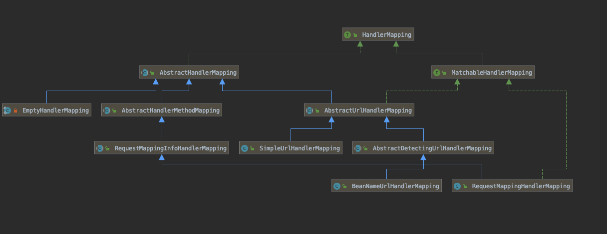

# 特殊的 Bean 类型(Special Bean Type)

前面说到,`DispatcherServlet`委派一些特殊的 bean 去执行请求和解析相应的返回

下面是 `DispatcherServlet`自动检测的类:

#### HandlerMapping

将一个 handler 和 一系列 拦截器( Interceptors )进行 mapping 关联,通常这些拦截器用于 前置处理或者后置处理

- 拦截器: 实现了`HandlerInterceptor`类的拦截器

> 简单来说就是维护了一个请求和处理器对象的映射关系

Spring 中有两个主要的 `HandlerMapping`的实现类

- `RequestMappingHandlerMapping`:支持`@RequestMapping`注解方法
- `SimpleUrlHandlerMapping`:从url映射到请求处理程序`bean`的接口

#### HandlerAdapter

协助 `DispatcherServlet` 调用这个 handler 对应的请求,主要是为了屏蔽`DispatcherServlet`的调用过程

#### HandlerExceptionResolver

解析错误的策略,有可能映射这些报错到 处理器,HTML 错误界面

#### ViewResolver

解析逻辑上的基于 String 的 view名称,通过一个 Handler 返回一个实际的view 来相应 response

#### LocaleResovler

解析`Locale`客户端,包括市区,用来国际化视图

#### ThemeResovler

主题解析器,解析 web 应用可以用到的主题 [Themes](https://docs.spring.io/spring/docs/current/spring-framework-reference/web.html#mvc-themeresolver)

####  MultipartResovler

多媒体解析器,一个解析多媒体请求的抽象,比如浏览器文件上传

#### FlashMapManager

存储和获取 `input`和`output` 的`FlashMap`,可以被用来从一个请求传递请求到另一个请求

## 初始化策略

`DispatcherServlet` 在初始化`init`方法时会调用初始化策略,主要初始化这9 个组件