# DispatcherServlet 执行过程

> 作者：WWWWDotPNG
> 链接：https://www.jianshu.com/p/dc64d02e49ac
> 来源：简书
> 著作权归作者所有。商业转载请联系作者获得授权，非商业转载请注明出处。

### Web应用部署初始化过程 (Web Application Deployement)

参考`Oracle`官方文档[Java Servlet Specification](https://link.jianshu.com/?t=http://download.oracle.com/otn-pub/jcp/servlet-3.0-fr-eval-oth-JSpec/servlet-3_0-final-spec.pdf)，可知Web应用部署的相关步骤如下：

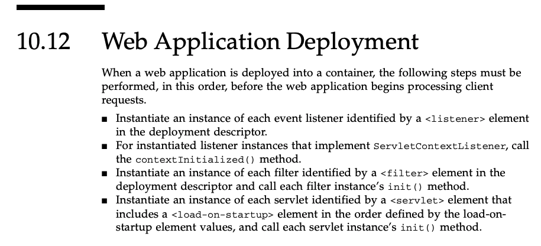


当一个Web应用部署到容器内时(eg.tomcat)，在Web应用开始响应执行用户请求前，以下步骤会被依次执行:

- 部署描述文件中(eg.tomcat的web.xml)由`<listener>`元素标记的事件监听器会被创建和初始化
- 对于所有事件监听器，如果实现了`ServletContextListener`接口，将会执行其实现的`contextInitialized()`方法
- 部署描述文件中由`<filter>`元素标记的过滤器会被创建和初始化，并调用其`init()`方法
- 部署描述文件中由`servlet`元素标记的servlet会根据`load-on-startup`的权值按顺序创建和初始化，并调用其`init()`方法

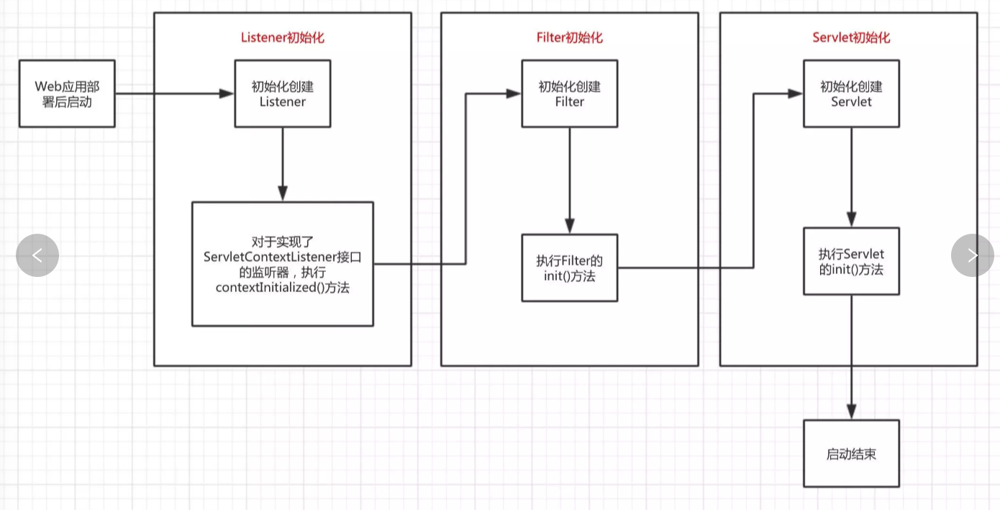

可以发现，在`tomcat`下`web应用`的初始化流程是，先初始化`listener`接着初始化`filter`最后初始化`servlet`，当我们清楚认识到`Web应用`部署到容器后的初始化过程后，就可以进一步深入探讨`SpringMVC`的启动过程。

### Spring MVC启动过程

接下来以一个常见的简单`web.xml`配置进行`Spring MVC`启动过程的分析，`web.xml`配置内容如下:

```xml
<web-app>

  <display-name>Web Application</display-name>

  <!--全局变量配置-->
  <context-param>
    <param-name>contextConfigLocation</param-name>
    <param-value>classpath:applicationContext-*.xml</param-value>
  </context-param>

  <!--监听器-->
  <listener>
    <listener-class>org.springframework.web.context.ContextLoaderListener</listener-class>
  </listener>
  
  <!--解决乱码问题的filter-->
  <filter>
    <filter-name>CharacterEncodingFilter</filter-name>
    <filter-class>org.springframework.web.filter.CharacterEncodingFilter</filter-class>
    <init-param>
      <param-name>encoding</param-name>
      <param-value>utf-8</param-value>
    </init-param>
  </filter>

  <filter-mapping>
    <filter-name>CharacterEncodingFilter</filter-name>
    <url-pattern>/*</url-pattern>
  </filter-mapping>

  <!--Restful前端控制器-->
  <servlet>
    <servlet-name>springMVC_rest</servlet-name>
    <servlet-class>org.springframework.web.servlet.DispatcherServlet</servlet-class>
    <init-param>
      <param-name>contextConfigLocation</param-name>
      <param-value>classpath:spring-mvc.xml</param-value>
    </init-param>
  </servlet>

  <servlet-mapping>
    <servlet-name>springMVC_rest</servlet-name>
    <url-pattern>/</url-pattern>
  </servlet-mapping>

</web-app>
```

#### Listener的初始化过程

首先定义了`<context-param>`标签，用于配置一个全局变量，`<context-param>`标签的内容读取后会被放进`application`中，做为Web应用的全局变量使用，接下来创建`listener`时会使用到这个全局变量，因此，Web应用在容器中部署后，进行初始化时会先读取这个全局变量，之后再进行上述讲解的初始化启动过程。

接着定义了一个`ContextLoaderListener类`的`listener`。查看`ContextLoaderListener`的类声明源码如下图:

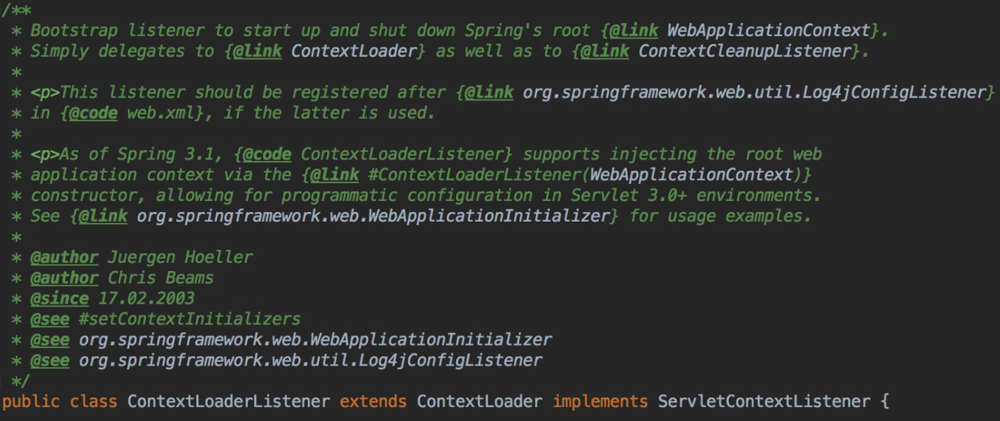

`ContextLoaderListener`类继承了`ContextLoader`类并实现了`ServletContextListener`接口，首先看一下前面讲述的`ServletContextListener`接口源码:

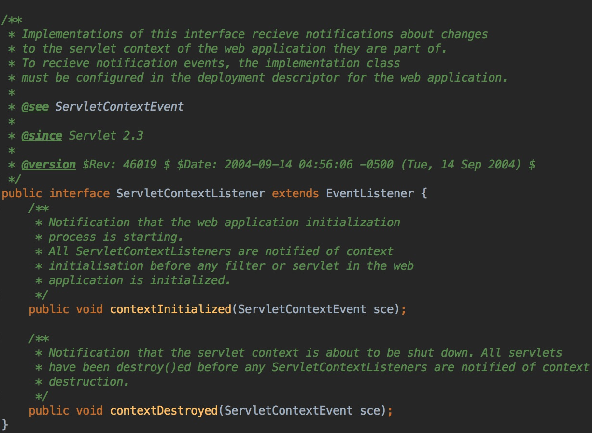

该接口只有两个方法`contextInitialized`和`contextDestroyed`，这里采用的是观察者模式，也称为为订阅-发布模式，实现了该接口的`listener`会向发布者进行订阅，当`Web应用`初始化或销毁时会分别调用上述两个方法。

继续看`ContextLoaderListener`，该`listener`实现了`ServletContextListener`接口，因此在`Web应用`初始化时会调用该方法，该方法的具体实现如下：

```java
 /**
     * Initialize the root web application context.
     */
    @Override
    public void contextInitialized(ServletContextEvent event) {
        initWebApplicationContext(event.getServletContext());
    }
```

`ContextLoaderListener`的`contextInitialized()`方法直接调用了`initWebApplicationContext()`方法，这个方法是继承自`ContextLoader类`，通过函数名可以知道，该方法是用于初始化Web应用上下文，即`IoC容器`，这里使用的是代理模式，继续查看`ContextLoader类`的`initWebApplicationContext()`方法的源码如下:

```java
 /**
     * Initialize Spring's web application context for the given servlet context,
     * using the application context provided at construction time, or creating a new one
     * according to the "{@link #CONTEXT_CLASS_PARAM contextClass}" and
     * "{@link #CONFIG_LOCATION_PARAM contextConfigLocation}" context-params.
     * @param servletContext current servlet context
     * @return the new WebApplicationContext
     * @see #ContextLoader(WebApplicationContext)
     * @see #CONTEXT_CLASS_PARAM
     * @see #CONFIG_LOCATION_PARAM
     */
    //servletContext，servlet上下文，即application对象
    public WebApplicationContext initWebApplicationContext(ServletContext servletContext) {
    /*
    首先通过WebApplicationContext.ROOT_WEB_APPLICATION_CONTEXT_ATTRIBUTE
    这个String类型的静态变量获取一个根IoC容器，根IoC容器作为全局变量
    存储在application对象中，如果存在则有且只能有一个
    如果在初始化根WebApplicationContext即根IoC容器时发现已经存在
    则直接抛出异常，因此web.xml中只允许存在一个ContextLoader类或其子类的对象
    */
        if (servletContext.getAttribute(WebApplicationContext.ROOT_WEB_APPLICATION_CONTEXT_ATTRIBUTE) != null) {
            throw new IllegalStateException(
                    "Cannot initialize context because there is already a root application context present - " +
                    "check whether you have multiple ContextLoader* definitions in your web.xml!");
        }

        Log logger = LogFactory.getLog(ContextLoader.class);
        servletContext.log("Initializing Spring root WebApplicationContext");
        if (logger.isInfoEnabled()) {
            logger.info("Root WebApplicationContext: initialization started");
        }
        long startTime = System.currentTimeMillis();

        try {
            // Store context in local instance variable, to guarantee that
            // it is available on ServletContext shutdown.
            // 如果当前成员变量中不存在WebApplicationContext则创建一个根WebApplicationContext
            if (this.context == null) {
                this.context = createWebApplicationContext(servletContext);
            }
            if (this.context instanceof ConfigurableWebApplicationContext) {
                ConfigurableWebApplicationContext cwac = (ConfigurableWebApplicationContext) this.context;
                if (!cwac.isActive()) {
                    // The context has not yet been refreshed -> provide services such as
                    // setting the parent context, setting the application context id, etc
                    if (cwac.getParent() == null) {
                        // The context instance was injected without an explicit parent ->
                        // determine parent for root web application context, if any.
                        //为根WebApplicationContext设置一个父容器
                        ApplicationContext parent = loadParentContext(servletContext);
                        cwac.setParent(parent);
                    }
                    //配置并刷新整个根IoC容器，在这里会进行Bean的创建和初始化
                    configureAndRefreshWebApplicationContext(cwac, servletContext);
                }
            }
            /*
            将创建好的IoC容器放入到application对象中，并设置key为WebApplicationContext.ROOT_WEB_APPLICATION_CONTEXT_ATTRIBUTE
            因此，在SpringMVC开发中可以在jsp中通过该key在application对象中获取到根IoC容器，进而获取到相应的Ben
            */
            servletContext.setAttribute(WebApplicationContext.ROOT_WEB_APPLICATION_CONTEXT_ATTRIBUTE, this.context);

            ClassLoader ccl = Thread.currentThread().getContextClassLoader();
            if (ccl == ContextLoader.class.getClassLoader()) {
                currentContext = this.context;
            }
            else if (ccl != null) {
                currentContextPerThread.put(ccl, this.context);
            }

            if (logger.isDebugEnabled()) {
                logger.debug("Published root WebApplicationContext as ServletContext attribute with name [" +
                        WebApplicationContext.ROOT_WEB_APPLICATION_CONTEXT_ATTRIBUTE + "]");
            }
            if (logger.isInfoEnabled()) {
                long elapsedTime = System.currentTimeMillis() - startTime;
                logger.info("Root WebApplicationContext: initialization completed in " + elapsedTime + " ms");
            }

            return this.context;
        }
        catch (RuntimeException ex) {
            logger.error("Context initialization failed", ex);
            servletContext.setAttribute(WebApplicationContext.ROOT_WEB_APPLICATION_CONTEXT_ATTRIBUTE, ex);
            throw ex;
        }
        catch (Error err) {
            logger.error("Context initialization failed", err);
            servletContext.setAttribute(WebApplicationContext.ROOT_WEB_APPLICATION_CONTEXT_ATTRIBUTE, err);
            throw err;
        }
    }
```

`initWebApplicationContext()`方法如上注解讲述，主要目的就是创建`root WebApplicationContext对象`即`根IoC容器`，其中比较重要的就是，整个`Web应用`如果存在`根IoC容器`则有且只能有一个，`根IoC容器`作为全局变量存储在`ServletContext`即`application对象`中。将`根IoC容器`放入到`application对象`之前进行了`IoC容器`的配置和刷新操作，调用了`configureAndRefreshWebApplicationContext()`方法，该方法源码如下:

```java
 protected void configureAndRefreshWebApplicationContext(ConfigurableWebApplicationContext wac, ServletContext sc) {
        if (ObjectUtils.identityToString(wac).equals(wac.getId())) {
            // The application context id is still set to its original default value
            // -> assign a more useful id based on available information
            String idParam = sc.getInitParameter(CONTEXT_ID_PARAM);
            if (idParam != null) {
                wac.setId(idParam);
            }
            else {
                // Generate default id...
                wac.setId(ConfigurableWebApplicationContext.APPLICATION_CONTEXT_ID_PREFIX +
                        ObjectUtils.getDisplayString(sc.getContextPath()));
            }
        }

        wac.setServletContext(sc);
        /*
        CONFIG_LOCATION_PARAM = "contextConfigLocation"
        获取web.xml中<context-param>标签配置的全局变量，其中key为CONFIG_LOCATION_PARAM
        也就是我们配置的相应Bean的xml文件名，并将其放入到WebApplicationContext中
        */
        String configLocationParam = sc.getInitParameter(CONFIG_LOCATION_PARAM);
        if (configLocationParam != null) {
            wac.setConfigLocation(configLocationParam);
        }

        // The wac environment's #initPropertySources will be called in any case when the context
        // is refreshed; do it eagerly here to ensure servlet property sources are in place for
        // use in any post-processing or initialization that occurs below prior to #refresh
        ConfigurableEnvironment env = wac.getEnvironment();
        if (env instanceof ConfigurableWebEnvironment) {
            ((ConfigurableWebEnvironment) env).initPropertySources(sc, null);
        }

        customizeContext(sc, wac);
        wac.refresh();
    }
```

比较重要的就是获取到了`web.xml`中的`标签`配置的全局变量`contextConfigLocation`，并最后一行调用了`refresh()`方法，`ConfigurableWebApplicationContext`是一个接口，通过对常用实现类`ClassPathXmlApplicationContext`逐层查找后可以找到一个抽象类`AbstractApplicationContext`实现了`refresh()`方法，其源码如下:

```java
@Override
    public void refresh() throws BeansException, IllegalStateException {
        synchronized (this.startupShutdownMonitor) {
            // Prepare this context for refreshing.
            prepareRefresh();

            // Tell the subclass to refresh the internal bean factory.
            ConfigurableListableBeanFactory beanFactory = obtainFreshBeanFactory();

            // Prepare the bean factory for use in this context.
            prepareBeanFactory(beanFactory);

            try {
                // Allows post-processing of the bean factory in context subclasses.
                postProcessBeanFactory(beanFactory);

                // Invoke factory processors registered as beans in the context.
                invokeBeanFactoryPostProcessors(beanFactory);

                // Register bean processors that intercept bean creation.
                registerBeanPostProcessors(beanFactory);

                // Initialize message source for this context.
                initMessageSource();

                // Initialize event multicaster for this context.
                initApplicationEventMulticaster();

                // Initialize other special beans in specific context subclasses.
                onRefresh();

                // Check for listener beans and register them.
                registerListeners();

                // Instantiate all remaining (non-lazy-init) singletons.
                finishBeanFactoryInitialization(beanFactory);

                // Last step: publish corresponding event.
                finishRefresh();
            }

            catch (BeansException ex) {
                if (logger.isWarnEnabled()) {
                    logger.warn("Exception encountered during context initialization - " +
                            "cancelling refresh attempt: " + ex);
                }

                // Destroy already created singletons to avoid dangling resources.
                destroyBeans();

                // Reset 'active' flag.
                cancelRefresh(ex);

                // Propagate exception to caller.
                throw ex;
            }

            finally {
                // Reset common introspection caches in Spring's core, since we
                // might not ever need metadata for singleton beans anymore...
                resetCommonCaches();
            }
        }
    }
```

该方法主要用于创建并初始化`contextConfigLocation类`配置的`xml文件`中的`Bean`，因此，如果我们在配置`Bean`时出错，在`Web应用`启动时就会抛出异常，而不是等到运行时才抛出异常。

整个`ContextLoaderListener类`的启动过程到此就结束了，可以发现，创建`ContextLoaderListener`是比较核心的一个步骤，主要工作就是为了创建`根IoC容器`并使用特定的`key`将其放入到`application`对象中，供整个`Web应用`使用，由于在`ContextLoaderListener类`中构造的`根IoC容器`配置的`Bean`是全局共享的，因此，在`<context-param>`标识的`contextConfigLocation`的`xml配置文件`一般包括:`数据库DataSource`、`DAO层`、`Service层`、`事务`等相关`Bean`。

在`JSP`中可以通过以下两种方法获取到`根IoC容器`从而获取相应`Bean`:

```java
WebApplicationContext applicationContext = (WebApplicationContext) application.getAttribute(WebApplicationContext.ROOT_WEB_APPLICATION_CONTEXT_ATTRIBUTE);

WebApplicationContext applicationContext = WebApplicationContextUtils.getWebApplicationContext(getServletContext());
```

#### Filter的初始化

在监听器`listener`初始化完成后，按照文章开始的讲解，接下来会进行`filter`的初始化操作，`filter`的创建和初始化中没有涉及`IoC容器`的相关操作，因此不是本文讲解的重点，本文举例的`filter`是一个用于编码用户请求和响应的过滤器，采用`utf-8`编码用于适配中文。

#### Servlet的初始化

`Web应用`启动的最后一个步骤就是创建和初始化相关`Servlet`，在开发中常用的`Servlet`就是`DispatcherServlet类`前端控制器，前端控制器作为中央控制器是整个`Web应用`的核心，用于获取分发用户请求并返回响应，借用网上一张关于`DispatcherServlet类`的类图，其类图如下所示:

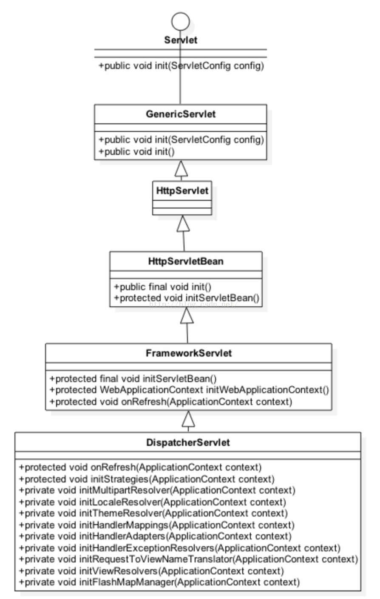

通过类图可以看出`DispatcherServlet类`的间接父类实现了`Servlet接口`，因此其本质上依旧是一个`Servlet`。`DispatcherServlet类`的设计很巧妙，上层父类不同程度的实现了相关接口的部分方法，并留出了相关方法用于子类覆盖，将不变的部分统一实现，将变化的部分预留方法用于子类实现，本文关注的是`DispatcherServelt类`的初始化过程，没有深入探讨其如何对用户请求做出响应，

通过对上述类图中相关类的源码分析可以绘制如下相关初始化方法调用逻辑:

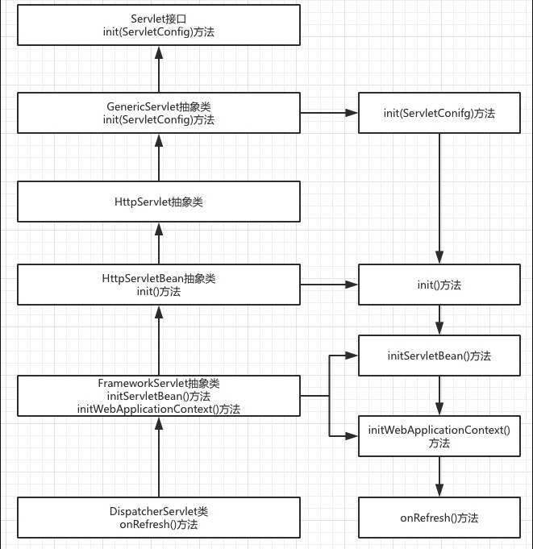

通过类图和相关初始化函数调用的逻辑来看，`DispatcherServlet类`的初始化过程将模板方法使用的淋漓尽致，其父类完成不同的统一的工作，并预留出相关方法用于子类覆盖去完成不同的可变工作。

`DispatcherServelt`类的本质是`Servlet`，通过文章开始的讲解可知，在`Web应用`部署到容器后进行`Servlet`初始化时会调用相关的`init(ServletConfig)`方法，因此，`DispatchServlet类`的初始化过程也由该方法开始。上述调用逻辑中比较重要的就是`FrameworkServlet抽象类`中的`initServletBean()`方法、`initWebApplicationContext()`方法以及`DispatcherServlet类`中的`onRefresh()`方法，接下来会逐一进行讲解。

首先查看一下`initServletBean()`的相关源码如下图所示:

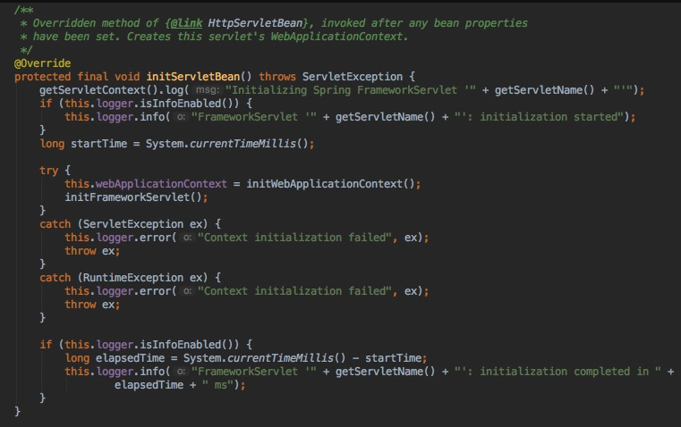

该方法是重写了`FrameworkServlet抽象类`父类`HttpServletBean抽象类`的`initServletBean()`方法，`HttpServletBean抽象类`在执行`init()`方法时会调用`initServletBean()`方法，由于多态的特性，最终会调用其子类`FrameworkServlet抽象类`的`initServletBean()`方法。该方法由`final`标识，子类就不可再次重写了。该方法中比较重要的就是`initWebApplicationContext()`方法的调用，该方法仍由`FrameworkServlet抽象类`实现，继续查看其源码如下所示:

```java
 /**
     * Initialize and publish the WebApplicationContext for this servlet.
     * <p>Delegates to {@link #createWebApplicationContext} for actual creation
     * of the context. Can be overridden in subclasses.
     * @return the WebApplicationContext instance
     * @see #FrameworkServlet(WebApplicationContext)
     * @see #setContextClass
     * @see #setContextConfigLocation
     */
    protected WebApplicationContext initWebApplicationContext() {
        /*
        获取由ContextLoaderListener创建的根IoC容器
        获取根IoC容器有两种方法，还可通过key直接获取
        */
        WebApplicationContext rootContext =
                WebApplicationContextUtils.getWebApplicationContext(getServletContext());
        WebApplicationContext wac = null;

        if (this.webApplicationContext != null) {
            // A context instance was injected at construction time -> use it
            wac = this.webApplicationContext;
            if (wac instanceof ConfigurableWebApplicationContext) {
                ConfigurableWebApplicationContext cwac = (ConfigurableWebApplicationContext) wac;
                if (!cwac.isActive()) {
                    // The context has not yet been refreshed -> provide services such as
                    // setting the parent context, setting the application context id, etc
                    if (cwac.getParent() == null) {
                        // The context instance was injected without an explicit parent -> set
                        // the root application context (if any; may be null) as the parent
                        /*
                        如果当前Servelt存在一个WebApplicationContext即子IoC容器
                        并且上文获取的根IoC容器存在，则将根IoC容器作为子IoC容器的父容器
                        */
                        cwac.setParent(rootContext);
                    }
                    //配置并刷新当前的子IoC容器，功能与前文讲解根IoC容器时的配置刷新一致，用于构建相关Bean
                    configureAndRefreshWebApplicationContext(cwac);
                }
            }
        }
        if (wac == null) {
            // No context instance was injected at construction time -> see if one
            // has been registered in the servlet context. If one exists, it is assumed
            // that the parent context (if any) has already been set and that the
            // user has performed any initialization such as setting the context id
            //如果当前Servlet不存在一个子IoC容器则去查找一下
            wac = findWebApplicationContext();
        }
        if (wac == null) {
            // No context instance is defined for this servlet -> create a local one
            //如果仍旧没有查找到子IoC容器则创建一个子IoC容器
            wac = createWebApplicationContext(rootContext);
        }

        if (!this.refreshEventReceived) {
            // Either the context is not a ConfigurableApplicationContext with refresh
            // support or the context injected at construction time had already been
            // refreshed -> trigger initial onRefresh manually here.
            //调用子类覆盖的onRefresh方法完成“可变”的初始化过程
            onRefresh(wac);
        }

        if (this.publishContext) {
            // Publish the context as a servlet context attribute.
            String attrName = getServletContextAttributeName();
            getServletContext().setAttribute(attrName, wac);
            if (this.logger.isDebugEnabled()) {
                this.logger.debug("Published WebApplicationContext of servlet '" + getServletName() +
                        "' as ServletContext attribute with name [" + attrName + "]");
            }
        }

        return wac;
    }
通过函数名不难发现，该方法的主要作用同样是创建一个WebApplicationContext对象，即Ioc容器，不过前文讲过每个Web应用最多只能存在一个根IoC容器，这里创建的则是特定Servlet拥有的子IoC容器，可能有些读者会有疑问，为什么需要多个Ioc容器，首先介绍一个父子IoC容器的访问特性，有兴趣的读者可以自行实验。

父子IoC容器的访问特性
在学习Spring时，我们都是从读取xml配置文件来构造IoC容器，常用的类有ClassPathXmlApplicationContext类，该类存在一个初始化方法用于传入xml文件路径以及一个父容器，我们可以创建两个不同的xml配置文件并实现如下代码:


//applicationContext1.xml文件中配置一个id为baseBean的Bean
ApplicationContext baseContext = new ClassPathXmlApplicationContext("applicationContext1.xml");

Object obj1 = baseContext.getBean("baseBean");

System.out.println("baseContext Get Bean " + obj1);

//applicationContext2.xml文件中配置一个id未subBean的Bean
ApplicationContext subContext = new ClassPathXmlApplicationContext(new String[]{"applicationContext2.xml"}, baseContext);

Object obj2 = subContext.getBean("baseBean");

System.out.println("subContext get baseContext Bean " + obj2);

Object obj3 = subContext.getBean("subBean");

System.out.println("subContext get subContext Bean " + obj3);

//抛出NoSuchBeanDefinitionException异常
Object obj4 = baseContext.getBean("subBean");

System.out.println("baseContext get subContext Bean " + obj4);


```

首先创建`baseContext`没有为其设置`父容器`，接着可以成功获取`id`为`baseBean`的`Bean`，接着创建`subContext`并将`baseContext`设置为其`父容器`，`subContext`可以成功获取`baseBean`以及`subBean`，最后试图使用`baseContext`去获取`subContext`中定义的`subBean`，此时会抛出异常`NoSuchBeanDefinitionException`，由此可见，`父子容器`类似于类的继承关系，子类可以访问父类中的成员变量，而父类不可访问子类的成员变量，同样的，`子容器`可以访问`父容器`中定义的`Bean`，但`父容器`无法访问`子容器`定义的`Bean`。

通过上述实验我们可以理解为何需要创建多个`Ioc容器`，`根IoC容器`做为全局共享的`IoC容器`放入`Web应用`需要共享的`Bean`，而`子IoC容器`根据需求的不同，放入不同的`Bean`，这样能够做到隔离，保证系统的安全性。

接下来继续讲解`DispatcherServlet类`的`子IoC容器`创建过程，如果当前`Servlet`存在一个`IoC容器`则为其设置`根IoC容器`作为其父类，并配置刷新该容器，用于构造其定义的`Bean`，这里的方法与前文讲述的`根IoC容器类似`，同样会读取用户在`web.xml`中配置的``中的``值，用于查找相关的`xml配置文件`用于构造定义的`Bean`，这里不再赘述了。如果当前`Servlet`不存在一个`子IoC容器`就去查找一个，如果仍然没有查找到则调用
 `createWebApplicationContext()`方法去创建一个，查看该方法的源码如下图所示:

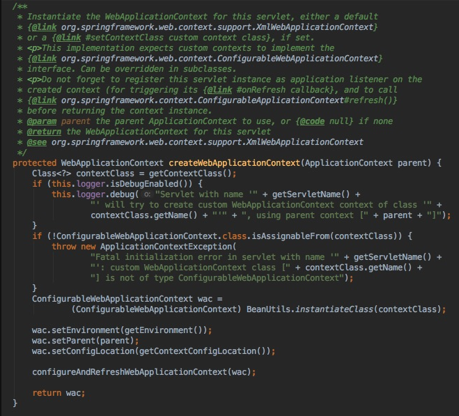

该方法用于创建一个`子IoC容器`并将`根IoC容器`做为其父容器，接着进行配置和刷新操作用于构造相关的`Bean`。至此，`根IoC容器`以及相关`Servlet`的`子IoC容器`已经配置完成，`子容器`中管理的`Bean`一般只被该`Servlet`使用，因此，其中管理的`Bean`一般是“局部”的，如`SpringMVC`中需要的各种重要组件，包括`Controller`、`Interceptor`、`Converter`、`ExceptionResolver`等。相关关系如下图所示:

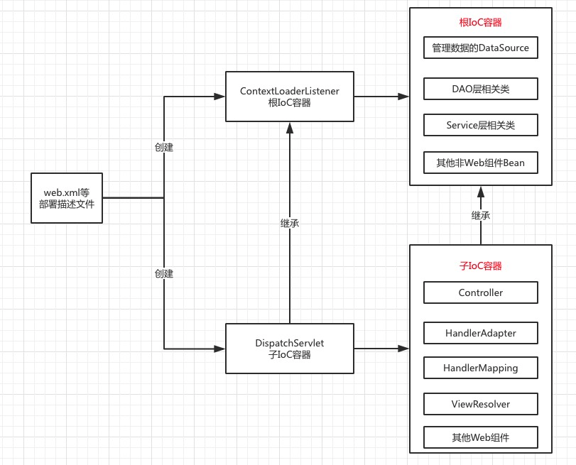

当`IoC子容器`构造完成后调用了`onRefresh()`方法，该方法的调用与`initServletBean()`方法的调用相同，由父类调用但具体实现由子类覆盖，调用`onRefresh()`方法时将前文创建的`IoC子容器`作为参数传入，查看`DispatcherServletBean类`的`onRefresh()`方法源码如下:

```java
    /**
     * This implementation calls {@link #initStrategies}.
     */
    //context为DispatcherServlet创建的一个IoC子容器
    @Override
    protected void onRefresh(ApplicationContext context) {
        initStrategies(context);
    }

    /**
     * Initialize the strategy objects that this servlet uses.
     * <p>May be overridden in subclasses in order to initialize further strategy objects.
     */
    protected void initStrategies(ApplicationContext context) {
        initMultipartResolver(context);
        initLocaleResolver(context);
        initThemeResolver(context);
        initHandlerMappings(context);
        initHandlerAdapters(context);
        initHandlerExceptionResolvers(context);
        initRequestToViewNameTranslator(context);
        initViewResolvers(context);
        initFlashMapManager(context);
    }
```

`onRefresh()`方法直接调用了`initStrategies()`方法，源码如上，通过函数名可以判断，该方法用于初始化创建`multipartResovle`来支持图片等文件的上传、本地化解析器、主题解析器、`HandlerMapping`处理器映射器、`HandlerAdapter`处理器适配器、异常解析器、视图解析器、flashMap管理器等，这些组件都是`SpringMVC`开发中的重要组件，相关组件的初始化创建过程均在此完成。

由于篇幅问题本文不再进行更深入的探讨，有兴趣的读者可以阅读本系列文章的其他博客内容。

至此，`DispatcherServlet类`的创建和初始化过程也就结束了，整个`Web应用`部署到容器后的初始化启动过程的重要部分全部分析清楚了，通过前文的分析我们可以认识到层次化设计的优点，以及`IoC容器`的继承关系所表现的隔离性。分析源码能让我们更清楚的理解和认识到相关初始化逻辑以及配置文件的配置原理。

## 总结

这里给出一个简洁的文字描述版`SpringMVC启动过程`:

tomcat web容器启动时会去读取`web.xml`这样的`部署描述文件`，相关组件启动顺序为: `解析` => `解析` => `解析` => `解析`，具体初始化过程如下:

- 1、解析`<context-param>`里的键值对。
- 2、创建一个`application`内置对象即`ServletContext`，servlet上下文，用于全局共享。
- 3、将`<context-param>`的键值对放入`ServletContext`即`application`中，`Web应用`内全局共享。
- 4、读取`<listener>`标签创建监听器，一般会使用`ContextLoaderListener类`，如果使用了`ContextLoaderListener类`，`Spring`就会创建一个`WebApplicationContext类`的对象，`WebApplicationContext类`就是`IoC容器`，`ContextLoaderListener类`创建的`IoC容器`是`根IoC容器`为全局性的，并将其放置在`appication`中，作为应用内全局共享，键名为`WebApplicationContext.ROOT_WEB_APPLICATION_CONTEXT_ATTRIBUTE`，可以通过以下两种方法获取

```java
WebApplicationContext applicationContext = (WebApplicationContext) application.getAttribute(WebApplicationContext.ROOT_WEB_APPLICATION_CONTEXT_ATTRIBUTE);

WebApplicationContext applicationContext1 = WebApplicationContextUtils.getWebApplicationContext(application);
```

这个全局的`根IoC容器`只能获取到在该容器中创建的`Bean`不能访问到其他容器创建的`Bean`，也就是读取`web.xml`配置的`contextConfigLocation`参数的`xml文件`来创建对应的`Bean`。

- 5、`listener`创建完成后如果有``则会去创建`filter`。
- 6、初始化创建``，一般使用`DispatchServlet类`。
- 7、`DispatchServlet`的父类`FrameworkServlet`会重写其父类的`initServletBean`方法，并调用`initWebApplicationContext()`以及`onRefresh()`方法。
- 8、`initWebApplicationContext()`方法会创建一个当前`servlet`的一个`IoC子容器`，如果存在上述的全局`WebApplicationContext`则将其设置为`父容器`，如果不存在上述全局的则`父容器`为null。
- 9、读取``标签的``配置的`xml文件`并加载相关`Bean`。
- 10、`onRefresh()`方法创建`Web应用`相关组件。

## DispatcherServlet 执行流程

首先，让我们站在`Spring MVC`的四大组件:`DispatcherServlet`、`HandlerMapping`、`HandlerAdapter`以及`ViewResolver`的角度来看一下`Spring MVC`对用户请求的处理过程，有如下时序图:

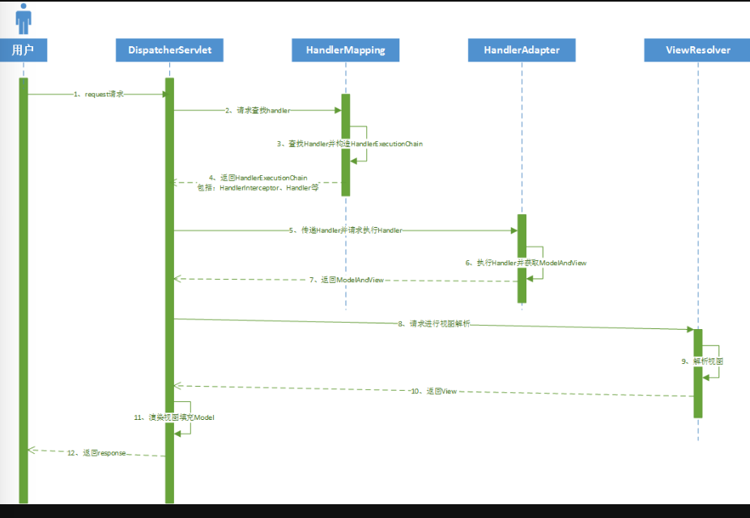

具体处理过程如下:

- 1、用户请求发送至`DispatcherServlet类`进行处理。
- 2、`DispatcherServlet类`遍历所有配置的`HandlerMapping类`请求查找`Handler`。
- 3、`HandlerMapping类`根据`request请求`的`URL`等信息查找能够进行处理的`Handler`，以及相关拦截器`interceptor`并构造`HandlerExecutionChain`。
- 4、`HandlerMapping类`将构造的`HandlerExecutionChain类`的对象返回给前端控制器`DispatcherServlet类`。
- 5、前端控制器拿着上一步的`Handler`遍历所有配置的`HandlerAdapter类`请求执行`Handler`。
- 6、`HandlerAdapter类`执行相关`Handler`并获取`ModelAndView类`的对象。
- 7、`HandlerAdapter类`将上一步`Handler`执行结果的`ModelAndView 类`的对象返回给前端控制器。
- 8、`DispatcherServlet类`遍历所有配置的`ViewResolver类`请求进行视图解析。
- 9、`ViewResolver类`进行视图解析并获取`View`对象。
- 10、`ViewResolver类`向前端控制器返回上一步骤的`View`对象。
- 11、`DispatcherServlet类`进行视图`View`的渲染，填充`Model`。
- 12、`DispatcherServlet类`向用户返回响应。

通过时序图和上面的讲解不难发现，整个`Spring MVC`对于用户请求的响应和处理都是以`DispatcherServlet类`为核心，其他三大组件均与前端控制器进行交互，三大组件之间没有交互并且互相解耦，因此，三大组件可以替换不同的实现而互相没有任何影响，提高了整个架构的稳定性并且降低了耦合度。接下来会按照上述的响应过程逐一进行讲解。

`DispatcherServlet类`本质上依旧是一个`Servlet`并且其父类实现了`Servlet接口`，我们知道，`Servlet`执行`Service()`方法对用户请求进行响应，根据前一篇文章的分析方法可以得到人如下的调用逻辑图:


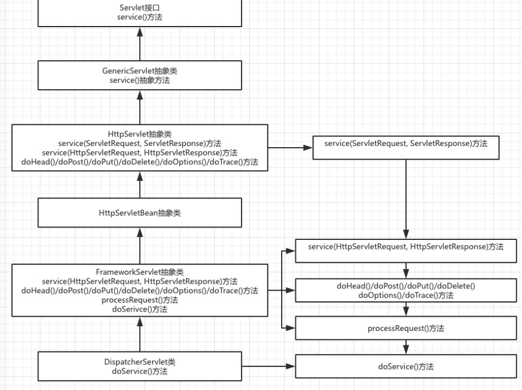

从上图的源码调用逻辑可以看出，`HttpServlet抽象类`实现了`Servlet接口`的`service(ServletRequest, ServletResponse)`的方法，因此，用户请求的第一执行方法为该方法，该方法紧接着直接调用了`service(HttpServletRequest, HttpServletResponse)`方法，其子类`FrameworkServlet抽象类`重写了该方法，因为多态的特性最终是调用了`FrameworkServlet抽象类`的`service(HttpServletRequest, HttpServletResponse)`方法，`FrameworkServlet抽象类`同样也重写了`doHead()`、`doPost()`、`doPut()`、`doDelete()`、`doOptions()`、`doTrace()`方法，`service(ServletRequest, ServletResponse)`方法根据请求类型的不同分别调用上述方法，上述六个方法都调用了`processRequest()`方法，而该方法最终调用了`DispatcherServlet类`的`doService()`方法。通过层层分析，我们找到了最终要调用的处理用户请求的方法，`doService()`之前的方法调用都比较简单，这里不再逐一来查看源码，有兴趣的读者可以自行查阅。

查看`doService()`的源码如下:

```java
 /**
     * Exposes the DispatcherServlet-specific request attributes and delegates to {@link #doDispatch}
     * for the actual dispatching.
     */
    @Override
    protected void doService(HttpServletRequest request, HttpServletResponse response) throws Exception {
        if (logger.isDebugEnabled()) {
            String resumed = WebAsyncUtils.getAsyncManager(request).hasConcurrentResult() ? " resumed" : "";
            logger.debug("DispatcherServlet with name '" + getServletName() + "'" + resumed +
                    " processing " + request.getMethod() + " request for [" + getRequestUri(request) + "]");
        }

        // Keep a snapshot of the request attributes in case of an include,
        // to be able to restore the original attributes after the include.
        Map<String, Object> attributesSnapshot = null;
        if (WebUtils.isIncludeRequest(request)) {
            attributesSnapshot = new HashMap<String, Object>();
            Enumeration<?> attrNames = request.getAttributeNames();
            while (attrNames.hasMoreElements()) {
                String attrName = (String) attrNames.nextElement();
                if (this.cleanupAfterInclude || attrName.startsWith(DEFAULT_STRATEGIES_PREFIX)) {
                    attributesSnapshot.put(attrName, request.getAttribute(attrName));
                }
            }
        }

        // Make framework objects available to handlers and view objects.
        /*
        将当前Servlet的子IoC容器放入request请求中
        由此，我们可以访问到当前IoC子容器以及根IoC容器中的Bean
        */
        request.setAttribute(WEB_APPLICATION_CONTEXT_ATTRIBUTE, getWebApplicationContext());
        request.setAttribute(LOCALE_RESOLVER_ATTRIBUTE, this.localeResolver);
        request.setAttribute(THEME_RESOLVER_ATTRIBUTE, this.themeResolver);
        request.setAttribute(THEME_SOURCE_ATTRIBUTE, getThemeSource());

        FlashMap inputFlashMap = this.flashMapManager.retrieveAndUpdate(request, response);
        if (inputFlashMap != null) {
            request.setAttribute(INPUT_FLASH_MAP_ATTRIBUTE, Collections.unmodifiableMap(inputFlashMap));
        }
        request.setAttribute(OUTPUT_FLASH_MAP_ATTRIBUTE, new FlashMap());
        request.setAttribute(FLASH_MAP_MANAGER_ATTRIBUTE, this.flashMapManager);

        try {
            //真正进行用户请求的处理
            doDispatch(request, response);
        }
        finally {
            if (!WebAsyncUtils.getAsyncManager(request).isConcurrentHandlingStarted()) {
                // Restore the original attribute snapshot, in case of an include.
                if (attributesSnapshot != null) {
                    restoreAttributesAfterInclude(request, attributesSnapshot);
                }
            }
        }
    }
doService()方法主要进行一些参数的设置，并将部分参数放入request请求中，真正执行用户请求并作出响应的方法则为doDispatch()方法，查看doDispatch()方法的源码如下:


    /**
     * Process the actual dispatching to the handler.
     * <p>The handler will be obtained by applying the servlet's HandlerMappings in order.
     * The HandlerAdapter will be obtained by querying the servlet's installed HandlerAdapters
     * to find the first that supports the handler class.
     * <p>All HTTP methods are handled by this method. It's up to HandlerAdapters or handlers
     * themselves to decide which methods are acceptable.
     * @param request current HTTP request
     * @param response current HTTP response
     * @throws Exception in case of any kind of processing failure
     */
    protected void doDispatch(HttpServletRequest request, HttpServletResponse response) throws Exception {
        //用户的request请求
        HttpServletRequest processedRequest = request;
        //HandlerExecutionChain局部变量
        HandlerExecutionChain mappedHandler = null;
        //判断是否解析了文件类型的数据，如果有最终需要清理
        boolean multipartRequestParsed = false;

        WebAsyncManager asyncManager = WebAsyncUtils.getAsyncManager(request);

        try {
            //ModelAndView局部变量
            ModelAndView mv = null;
            //处理异常局部变量
            Exception dispatchException = null;

            try {
                //检查是否包含文件等类型的数据
                processedRequest = checkMultipart(request);
                multipartRequestParsed = (processedRequest != request);

                // Determine handler for the current request.
                //向HandlerMapping请求查找HandlerExecutionChain
                mappedHandler = getHandler(processedRequest);
                //如果HandlerExecutionChain为null，则没有能够进行处理的Handler，抛出异常
                if (mappedHandler == null || mappedHandler.getHandler() == null) {
                    noHandlerFound(processedRequest, response);
                    return;
                }

                // Determine handler adapter for the current request.
                //根据查找到的Handler请求查找能够进行处理的HandlerAdapter
                HandlerAdapter ha = getHandlerAdapter(mappedHandler.getHandler());

                // Process last-modified header, if supported by the handler.
                //判断自上次请求后是否有修改，没有修改直接返回响应
                String method = request.getMethod();
                boolean isGet = "GET".equals(method);
                if (isGet || "HEAD".equals(method)) {
                    long lastModified = ha.getLastModified(request, mappedHandler.getHandler());
                    if (logger.isDebugEnabled()) {
                        logger.debug("Last-Modified value for [" + getRequestUri(request) + "] is: " + lastModified);
                    }
                    if (new ServletWebRequest(request, response).checkNotModified(lastModified) && isGet) {
                        return;
                    }
                }
                
                /*
                按顺序依次执行HandlerInterceptor的preHandle方法
                如果任一HandlerInterceptor的preHandle方法没有通过则不继续进行处理
                */
                if (!mappedHandler.applyPreHandle(processedRequest, response)) {
                    return;
                }

                // Actually invoke the handler.
                //通过HandlerAdapter执行查找到的handler
                mv = ha.handle(processedRequest, response, mappedHandler.getHandler());

                if (asyncManager.isConcurrentHandlingStarted()) {
                    return;
                }

                applyDefaultViewName(processedRequest, mv);
                //逆序执行HandlerInterceptor的postHandle方法
                mappedHandler.applyPostHandle(processedRequest, response, mv);
            }
            catch (Exception ex) {
                dispatchException = ex;
            }
            catch (Throwable err) {
                // As of 4.3, we're processing Errors thrown from handler methods as well,
                // making them available for @ExceptionHandler methods and other scenarios.
                dispatchException = new NestedServletException("Handler dispatch failed", err);
            }
            //渲染视图填充Model，如果有异常渲染异常页面
            processDispatchResult(processedRequest, response, mappedHandler, mv, dispatchException);
        }
        catch (Exception ex) {
            //如果有异常按倒序执行所有HandlerInterceptor的afterCompletion方法
            triggerAfterCompletion(processedRequest, response, mappedHandler, ex);
        }
        catch (Throwable err) {
            //如果有异常按倒序执行所有HandlerInterceptor的afterCompletion方法
            triggerAfterCompletion(processedRequest, response, mappedHandler,
                    new NestedServletException("Handler processing failed", err));
        }
        finally {
            if (asyncManager.isConcurrentHandlingStarted()) {
                // Instead of postHandle and afterCompletion
                if (mappedHandler != null) {
                    //倒序执行所有HandlerInterceptor的afterCompletion方法
                    mappedHandler.applyAfterConcurrentHandlingStarted(processedRequest, response);
                }
            }
            else {
                // Clean up any resources used by a multipart request.
                //如果请求包含文件类型的数据则进行相关清理工作
                if (multipartRequestParsed) {
                    cleanupMultipart(processedRequest);
                }
            }
        }
    }


```

根据上述源码并结合文章开始讲解的`DispatcherServlet类`结合三大组件对用户请求的处理过程不难理解相关处理流程。

`doDispatch()`方法通过调用`getHandler()`方法并传入`reuqest`通过`HandlerMapping`查找`HandlerExecutionChain`，查看其源码如下:


```java
  /**
     * Return the HandlerExecutionChain for this request.
     * <p>Tries all handler mappings in order.
     * @param request current HTTP request
     * @return the HandlerExecutionChain, or {@code null} if no handler could be found
     */
    protected HandlerExecutionChain getHandler(HttpServletRequest request) throws Exception {
        for (HandlerMapping hm : this.handlerMappings) {
            if (logger.isTraceEnabled()) {
                logger.trace(
                        "Testing handler map [" + hm + "] in DispatcherServlet with name '" + getServletName() + "'");
            }
            HandlerExecutionChain handler = hm.getHandler(request);
            if (handler != null) {
                return handler;
            }
        }
        return null;
    }
```

`getHandler()`方法遍历了开发者配置的所有`HandlerMapping类`根据`request`请求来查找`HandlerExecutionChain`，从这里可以看出，`Spring MVC`是支持用户配置多个`HandlerMapping类`的，在处理用户请求时会逐一查找，找到后立即返回，因此，如果多个`HandlerMapping类`都能够处理同一`request`请求，只会返回第一个能够处理的`HandlerMapping类`构造的`HandlerExecutionChain`，所以在配置`HandlerMapping类`时需要注意不要对同一请求多次进行处理，由于篇幅问题`HandlerMapping类`如何具体查找`Handler`并构造`HandlerExecutionChain`的细节不在此进行讲解，如有兴趣可以查阅本系列文章的第三篇[SpringMVC HandlerMapping源码分析](https://www.jianshu.com)。

如果没有找到对应的`HandlerExecutionChain`对象，则会执行`noHandlerFound()`方法，继续查看其源码如下:

```java
/**
     * No handler found -> set appropriate HTTP response status.
     * @param request current HTTP request
     * @param response current HTTP response
     * @throws Exception if preparing the response failed
     */
    protected void noHandlerFound(HttpServletRequest request, HttpServletResponse response) throws Exception {
        if (pageNotFoundLogger.isWarnEnabled()) {
            pageNotFoundLogger.warn("No mapping found for HTTP request with URI [" + getRequestUri(request) +
                    "] in DispatcherServlet with name '" + getServletName() + "'");
        }
        if (this.throwExceptionIfNoHandlerFound) {
            throw new NoHandlerFoundException(request.getMethod(), getRequestUri(request),
                    new ServletServerHttpRequest(request).getHeaders());
        }
        else {
            response.sendError(HttpServletResponse.SC_NOT_FOUND);
        }
    }
```

如果没有找到对应的`HandlerExecutionChain`则会抛出异常`NoHandlerFoundException`，在开发的过程中，如果我们将具体的`URL`写错了则会遇到这个404错误。

继续查看`doDispatch()`方法的源码，如果找到了`HandlerExecutionChain`接下来会调用`getHandlerAdapter()`方法来查找能够对`Handler`进行处理的`HandlerAdapter`，查看其源码如下:


```java
    /**
     * Return the HandlerAdapter for this handler object.
     * @param handler the handler object to find an adapter for
     * @throws ServletException if no HandlerAdapter can be found for the handler. This is a fatal error.
     */
    protected HandlerAdapter getHandlerAdapter(Object handler) throws ServletException {
        for (HandlerAdapter ha : this.handlerAdapters) {
            if (logger.isTraceEnabled()) {
                logger.trace("Testing handler adapter [" + ha + "]");
            }
            if (ha.supports(handler)) {
                return ha;
            }
        }
        throw new ServletException("No adapter for handler [" + handler +
                "]: The DispatcherServlet configuration needs to include a HandlerAdapter that supports this handler");
    }
```

与`HandlerMapping`类似，查找能够处理具体`Handler`的`HandlerAdapter`时同样会遍历所有配置了的`HandlerAdapter`，`HandlerAdapter`是一个接口包含一个`support()`方法，该方法根据`Handler`是否实现某个特定的接口来判断该`HandlerAdapter`是否能够处理这个具体的`Handler`，这里使用适配器模式，通过这样的方式就可以支持不同类型的`HandlerAdapter`。如果没有查找到能够处理`Handler`的`HandlerAdapter`则会抛出异常，如果在开发的过程中`Handler`在实现接口时出现了问题就可能会遇到上述异常。

查找到了对应的`HandlerAdapter`后就会调用`HandlerExecutionChain`的`applyPreHandle()`方法来执行配置的所有`HandlerInteceptor`的`preHandle()`方法，查看其源码如下:


```java
    /**
     * Apply preHandle methods of registered interceptors.
     * @return {@code true} if the execution chain should proceed with the
     * next interceptor or the handler itself. Else, DispatcherServlet assumes
     * that this interceptor has already dealt with the response itself.
     */
    boolean applyPreHandle(HttpServletRequest request, HttpServletResponse response) throws Exception {
        HandlerInterceptor[] interceptors = getInterceptors();
        if (!ObjectUtils.isEmpty(interceptors)) {
            for (int i = 0; i < interceptors.length; i++) {
                HandlerInterceptor interceptor = interceptors[i];
                if (!interceptor.preHandle(request, response, this.handler)) {
                    triggerAfterCompletion(request, response, null);
                    return false;
                }
                this.interceptorIndex = i;
            }
        }
        return true;
    }
```

`HandlerExecutionChain`的`applyPreHandle()`方法会按照顺序依次调用`HandlerInterceptor`的`preHandle()`方法，但当任一`HandlerInterceptor`的`preHandle()`方法返回了`false`就不再继续执行其他`HandlerInterceptor`的`preHandle()`方法，而是直接跳转执行`triggerAfterCompletion()`方法，查看该方法源码如下:


```dart
    /**
     * Trigger afterCompletion callbacks on the mapped HandlerInterceptors.
     * Will just invoke afterCompletion for all interceptors whose preHandle invocation
     * has successfully completed and returned true.
     */
    void triggerAfterCompletion(HttpServletRequest request, HttpServletResponse response, Exception ex)
            throws Exception {

        HandlerInterceptor[] interceptors = getInterceptors();
        if (!ObjectUtils.isEmpty(interceptors)) {
            for (int i = this.interceptorIndex; i >= 0; i--) {
                HandlerInterceptor interceptor = interceptors[i];
                try {
                    interceptor.afterCompletion(request, response, this.handler, ex);
                }
                catch (Throwable ex2) {
                    logger.error("HandlerInterceptor.afterCompletion threw exception", ex2);
                }
            }
        }
    }
```

这里遍历的下标为`interceptorIndex`，该变量在前一个方法`applyPreHandle()`方法中赋值，如果`preHandle()`方法返回`true`该变量加一，因此该方法会逆序执行所有`preHandle()`方法返回了`true`的`HandlerInterceptor`的`afterCompletion()`方法。到这里读者已经掌握了`HandlerInterceptor`的`preHandle()`方法以及`afterCompletion()`方法的执行顺序，这些内容并不需要我们死记，需要知道其执行顺序查看源码是最好的方法。

继续阅读`doDispatch()`方法的源码，如果所有拦截器的`preHandle()`方法都返回了`true`没有进行拦截，接下来前端控制器会请求执行上文获取的`Handler`，这个`Handler`就是开发的时候编写的`Controller`，根据实现接口的不同执行相关方法，并获取到`ModelAndView类`的对象。

接下来会执行`HandlerInterceptor`的`postHandle()`方法，具体源码如下:


```cpp
    /**
     * Apply postHandle methods of registered interceptors.
     */
    void applyPostHandle(HttpServletRequest request, HttpServletResponse response, ModelAndView mv) throws Exception {
        HandlerInterceptor[] interceptors = getInterceptors();
        if (!ObjectUtils.isEmpty(interceptors)) {
            for (int i = interceptors.length - 1; i >= 0; i--) {
                HandlerInterceptor interceptor = interceptors[i];
                interceptor.postHandle(request, response, this.handler, mv);
            }
        }
    }
```

可以发现，`postHandle()`方法是按照逆序执行。

执行完`postHandle()`方法后，`doDispatch()`方法调用了`processDispatchResult()`方法，其源码如下:


```php
    /**
     * Handle the result of handler selection and handler invocation, which is
     * either a ModelAndView or an Exception to be resolved to a ModelAndView.
     */
    private void processDispatchResult(HttpServletRequest request, HttpServletResponse response,
            HandlerExecutionChain mappedHandler, ModelAndView mv, Exception exception) throws Exception {

        boolean errorView = false;
        //判断HandlerMapping、HandlerAdapter处理时的异常是否为空
        if (exception != null) {
            //上述两个组件处理时的异常不为空
            //如果为ModelAndViewDefiningException异常，则获取一个异常视图
            if (exception instanceof ModelAndViewDefiningException) {
                logger.debug("ModelAndViewDefiningException encountered", exception);
                mv = ((ModelAndViewDefiningException) exception).getModelAndView();
            }
            //如果不为ModelAndViewDefiningException异常，进行异常视图的获取
            else {
                Object handler = (mappedHandler != null ? mappedHandler.getHandler() : null);
                mv = processHandlerException(request, response, handler, exception);
                errorView = (mv != null);
            }
        }

        // Did the handler return a view to render?
        //判断mv是否为空，不管是正常的ModelAndView还是异常的ModelAndView，只要存在mv就进行视图渲染
        if (mv != null && !mv.wasCleared()) {
            render(mv, request, response);
            if (errorView) {
                WebUtils.clearErrorRequestAttributes(request);
            }
        }
        //否则记录无视图
        else {
            if (logger.isDebugEnabled()) {
                logger.debug("Null ModelAndView returned to DispatcherServlet with name '" + getServletName() +
                        "': assuming HandlerAdapter completed request handling");
            }
        }

        if (WebAsyncUtils.getAsyncManager(request).isConcurrentHandlingStarted()) {
            // Concurrent handling started during a forward
            return;
        }
        //执行相关HandlerInterceptor的afterCompletion()方法
        if (mappedHandler != null) {
            mappedHandler.triggerAfterCompletion(request, response, null);
        }
    }
```

该方法传入了一个异常类的对象`dispatchException`，阅读`doDispatch()`方法的源码可以看出，`Spring MVC`对整个`doDispatch()`方法用了嵌套的`try-catch`语句，内层的`try-catch`用于捕获`HandlerMapping`进行映射查找`HandlerExecutionChain`以及`HandlerAdapter`执行具体`Handler`时的处理异常，并将异常传入到上述`processDispatchResult()`方法中。

`processDispatchResult()`方法主要用于针对产生的异常来构造异常视图，接着不管视图是正常视图还是异常视图均调用`render()`方法来渲染，查看`render()`方法的具体源码如下:


```java
    /**
     * Render the given ModelAndView.
     * <p>This is the last stage in handling a request. It may involve resolving the view by name.
     * @param mv the ModelAndView to render
     * @param request current HTTP servlet request
     * @param response current HTTP servlet response
     * @throws ServletException if view is missing or cannot be resolved
     * @throws Exception if there's a problem rendering the view
     */
    protected void render(ModelAndView mv, HttpServletRequest request, HttpServletResponse response) throws Exception {
        // Determine locale for request and apply it to the response.
        Locale locale = this.localeResolver.resolveLocale(request);
        response.setLocale(locale);

        View view;
        if (mv.isReference()) {
            // We need to resolve the view name.
            // 解析视图名称获取对应视图View
            view = resolveViewName(mv.getViewName(), mv.getModelInternal(), locale, request);
            //如果视图View为空抛出异常
            if (view == null) {
                throw new ServletException("Could not resolve view with name '" + mv.getViewName() +
                        "' in servlet with name '" + getServletName() + "'");
            }
        }
        else {
            // No need to lookup: the ModelAndView object contains the actual View object.
            view = mv.getView();
            if (view == null) {
                throw new ServletException("ModelAndView [" + mv + "] neither contains a view name nor a " +
                        "View object in servlet with name '" + getServletName() + "'");
            }
        }

        // Delegate to the View object for rendering.
        if (logger.isDebugEnabled()) {
            logger.debug("Rendering view [" + view + "] in DispatcherServlet with name '" + getServletName() + "'");
        }
        try {
            //设置Http响应状态字
            if (mv.getStatus() != null) {
                response.setStatus(mv.getStatus().value());
            }
            //调用视图View的render方法通过Model来渲染视图
            view.render(mv.getModelInternal(), request, response);
        }
        catch (Exception ex) {
            if (logger.isDebugEnabled()) {
                logger.debug("Error rendering view [" + view + "] in DispatcherServlet with name '" +
                        getServletName() + "'", ex);
            }
            throw ex;
        }
    }
```

`render()`方法通过调用`resolveViewName()`方法根据视图名称解析对应的视图`View`，该方法源码如下:


```dart
    /**
     * Resolve the given view name into a View object (to be rendered).
     * <p>The default implementations asks all ViewResolvers of this dispatcher.
     * Can be overridden for custom resolution strategies, potentially based on
     * specific model attributes or request parameters.
     * @param viewName the name of the view to resolve
     * @param model the model to be passed to the view
     * @param locale the current locale
     * @param request current HTTP servlet request
     * @return the View object, or {@code null} if none found
     * @throws Exception if the view cannot be resolved
     * (typically in case of problems creating an actual View object)
     * @see ViewResolver#resolveViewName
     */
    protected View resolveViewName(String viewName, Map<String, Object> model, Locale locale,
            HttpServletRequest request) throws Exception {

        for (ViewResolver viewResolver : this.viewResolvers) {
            View view = viewResolver.resolveViewName(viewName, locale);
            if (view != null) {
                return view;
            }
        }
        return null;
    }
```

`resolveViewName()`方法通过遍历配置的所有`ViewResolver类`根据视图名称来解析对应的视图`View`，如果找到则返回对应视图`View`，没有找到则返回`null`。

回到前一个`render()`方法，如果上述方法返回的视图为`null`则抛出异常，这个异常相信大多数人也见过，当开发时写错了返回的`View`视图名称时就会抛出该异常。接下来调用具体视图的`render()`方法来进行`Model`数据的渲染填充，最终构造成完整的视图。

到这里，`doDispatch()`的外层`try-catch`异常的作用我们就知道了，为了捕获渲染视图时的异常，通过两层嵌套的`try-catch`，`Spring MVC`就能够捕获到三大组件在处理用户请求时的异常，通过这样的方法能够很方便的实现统一的异常处理。

## 总结

通过前文的源码分析，我们能够清楚的认识到`Spring MVC`对用户请求的处理过程，进一步加深对`Spring MVC`的理解。


