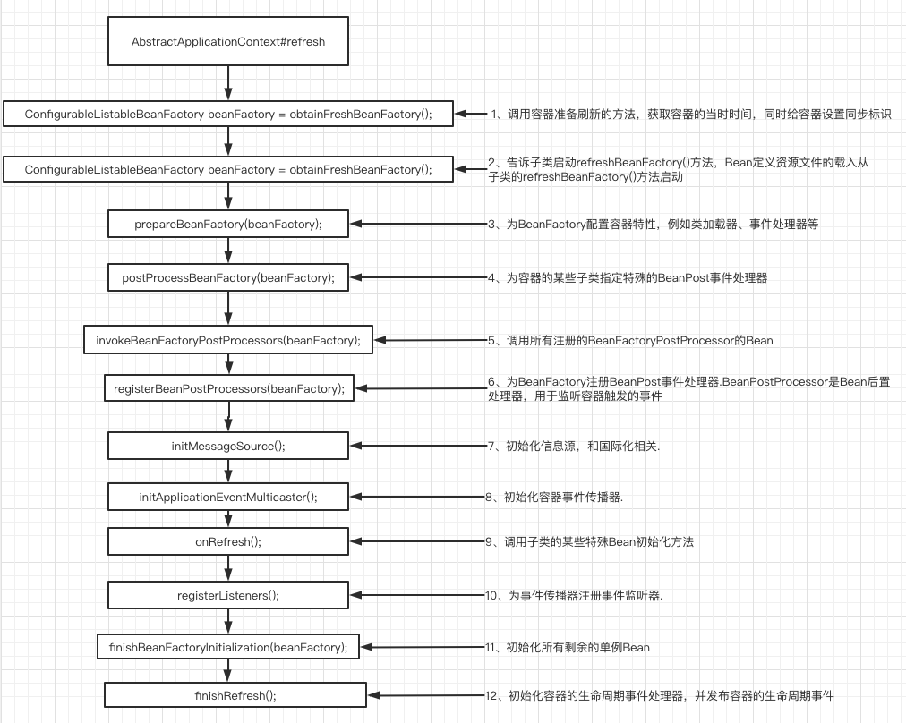

# 010-第一步-prepareRefresh-环境准备




AbstractApplicationContext#refresh()

```java
//1、调用容器准备刷新的方法，获取容器的当时时间，同时给容器设置同步标识
prepareRefresh();
```

## 主要作用

主要是做些准备工作,例如对系统属性以及环境变量的初始化和验证

```java
	protected void prepareRefresh() {
		this.startupDate = System.currentTimeMillis();
		this.closed.set(false);
		this.active.set(true);

		if (logger.isInfoEnabled()) {
			logger.info("Refreshing " + this);
		}

		// Initialize any placeholder property sources in the context environment
    //留给子类覆盖
		initPropertySources();

		// Validate that all properties marked as required are resolvable
		// see ConfigurablePropertyResolver#setRequiredProperties
    // 验证需要的属性文件是否都已经放入环境中
		getEnvironment().validateRequiredProperties();

		// Allow for the collection of early ApplicationEvents,
		// to be published once the multicaster is available...
		this.earlyApplicationEvents = new LinkedHashSet<>();
	}
```

网上有人说其实这个函数没什么用，因为最后两句代码才是最为关键的，但是却没有什么逻辑处理，initPropertySources是空的，没有任何逻辑，而getEnvironment().validateRequiredProperties也因为没有需要验证的属性而没有做任何处理。

其实这都是因为没有彻底理解才会这么说，这个函数如果用好了作用还是挺大的。那么，该怎么用呢？我们先探索下各个函数的作用。

## initPropertySources

1．initPropertySources正符合Spring的开放式结构设计，给用户最大扩展Spring的能力。用户可以根据自身的需要重写initPropertySources方法，并在方法中进行个性化的属性处理及设置。

2．validateRequiredProperties 则是对属性进行验证，那么如何验证呢？我们举个融合两句代码的小例子来帮助大家理解。

假如现在有这样一个需求，工程在运行过程中用到的某个设置（例如VAR）是从系统环境变量中取得的，而如果用户没有在系统环境变量中配置这个参数，那么工程可能不会工作。这一要求可能会有各种各样的解决办法，当然，在Spring中可以这样做，你可以直接修改Spring的源码，例如修改ClassPathXmlApplicationContext。当然，最好的办法还是对源码进行扩展，我们可以自定义类：

```java
public class MyClassPathXmlApplicationContext extends ClassPathXmlApplicationContext{
     public MyClassPathXmlApplicationContext(String... configLocations ){
         super(configLocations);
     }
			protected void initPropertySources() {
 				//添加验证要求
     		getEnvironment().setRequiredProperties("VAR");
 			}
}
```
我们自定义了继承自 ClassPathXmlApplicationContext 的 MyClassPathXmlApplicationContext ，并重写了initPropertySources方法，在方法中添加了我们的个性化需求，那么在验证的时候也就是程序走到 getEnvironment().validateRequiredProperties() 代码的时候，如果系统并没有检测到对应VAR的环境变量，那么将抛出异常。当然我们还需要在使用的时候替换掉原有的ClassPathXmlApplicationContext：

```java
public static void main(String[] args) {
         ApplicationContext bf = new MyClassPathXmlApplicationContext ("test/customtag/test.xml"); 
         User user=(User) bf.getBean("testbean");
}
```

