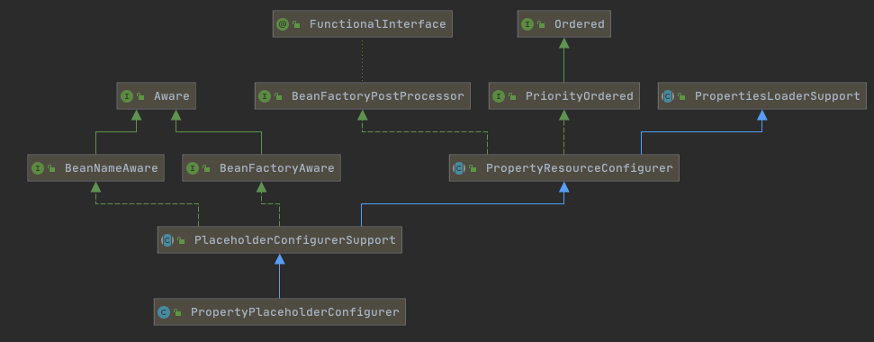

# 拓展点-BeanFactory的后处理-BeanFactoryPostProcessor

- [BeanFactoryPostProcessor是什么](#BeanFactoryPostProcessor是什么)
- [BeanFactoryPostProcessor典型实例](#BeanFactoryPostProcessor典型实例)
- [使用自定义BeanFactoryPostProcessor](#使用自定义BeanFactoryPostProcessor)
- [源码分析-BeanFactoryPostProcessor调用过程](#源码分析-BeanFactoryPostProcessor调用过程)

## BeanFactoryPostProcessor是什么

BeanFactoryPostProcessor接口跟BeanPostProcessor类似，可以对bean的定义（配置元数据）进行处理。也就是说，Spring IoC容器允许BeanFactoryPostProcessor在容器实际实例化任何其他的bean之前读取配置元数据，并有可能修改它。

#### 设置执行次数

你还能通过设置“order”属性来控制BeanFactoryPostProcessor的执行次序（仅当BeanFactoryPostProcessor实现了Ordered接口时你才可以设置此属性，因此在实现BeanFactoryPostProcessor时，就应当考虑实现Ordered接口）。

如果你想改变实际的bean实例（例如从配置元数据创建的对象），那么你最好使用BeanPostProcessor。同样地，BeanFactoryPostProcessor的作用域范围是容器级的。它只和你所使用的容器有关。

如果你在容器中定义一个BeanFactoryPostProcessor，它仅仅对此容器中的bean进行后置处理。

BeanFactoryPostProcessor不会对定义在另一个容器中的bean进行后置处理，即使这两个容器都是在同一层次上。在Spring中存在对于BeanFactoryPostProcessor的典型应用，比如PropertyPlaceholderConfigurer。

## BeanFactoryPostProcessor典型实例

BeanFactoryPostProcessor的典型应用：PropertyPlaceholderConfigurer

有时候，阅读Spring的Bean描述文件时，你也许会遇到类似如下的一些配置：

```xml
<bean id="message" class="distConfig.HelloMessage">
    <property name="mes">
       <value>${bean.message}</value>
    </property>
</bean>
```

其中竟然出现了变量引用：${bean.message}。这就是Spring的分散配置，可以在另外的配置文件中为bean.message指定值。如在bean.property配置如下定义：

```properties
bean.message=Hi,can you find me?
```

当访问名为message的bean时，mes属性就会被置为字符串“ Hi,can you find me?”，但Spring框架是怎么知道存在这样的配置文件呢？这就要靠PropertyPlaceholderConfigurer这个类的bean：

```java
<bean id="mesHandler" class="org.Springframework.beans.factory.config. Property PlaceholderConfigurer">
       <property name="locations">
           <list>
              <value>config/bean.properties</value>
           </list>
       </property>
 </bean>
```

在这个bean中指定了配置文件为config/bean.properties。

到这里似乎找到问题的答案了，但是其实还有个问题。这个“mesHandler”只不过是Spring框架管理的一个bean，并没有被别的bean或者对象引用，Spring的beanFactory是怎么知道要从这个bean中获取配置信息的呢？



查看层级结构可以看出PropertyPlaceholderConfigurer这个类间接继承了BeanFactoryPostProcessor接口。这是一个很特别的接口，当Spring加载任何实现了这个接口的bean的配置时，都会在bean工厂载入所有bean的配置之后执行postProcessBeanFactory方法。

在PropertyResourceConfigurer类中实现了postProcessBeanFactory方法，在方法中先后调用了mergeProperties、convertProperties、processProperties这3个方法，分别得到配置，将得到的配置转换为合适的类型，最后将配置内容告知BeanFactory。

正是通过实现BeanFactoryPostProcessor接口，BeanFactory会在实例化任何bean之前获得配置信息，从而能够正确解析bean描述文件中的变量引用。

## 使用自定义BeanFactoryPostProcessor

我们以实现一个BeanFactoryPostProcessor，去除潜在的“流氓”属性值的功能来展示自定义BeanFactoryPostProcessor的创建及使用，例如bean定义中留下bollocks这样的字眼。

配置文件BeanFactory.xml

```xml
<?xml version="1.0" encoding="UTF-8"?>
<beans xmlns="http://www.springframework.org/schema/beans"
       xmlns:xsi="http://www.w3.org/2001/XMLSchema-instance"
       xsi:schemaLocation="http://www.springframework.org/schema/beans
            http://www.springframework.org/schema/beans/spring-beans.xsd">

    <bean id="bfpp" class="cn.eccto.study.springframework.expand.ObscenityRemovingBeanFactoryPostProcessor">
        <property name="obscenties">
            <set>
                <value>bollocks</value>
                <value>winky</value>
                <value>bum</value>
                <value>Microsoft</value>
            </set>
        </property>

    </bean>
    <bean id="simpleBean" class="cn.eccto.study.springframework.expand.SimplePostProcessor">
        <property name="connectionString" value="bollocks"/>
        <property name="password" value="imaginecup"/>
        <property name="username" value="Microsoft"/>
    </bean>
</beans>
```


ObscenityRemovingBeanFactoryPostProcessor.java

```java
public class ObscenityRemovingBeanFactoryPostProcessor implements BeanFactoryPostProcessor {
    private Set<String> obscenties;

    public ObscenityRemovingBeanFactoryPostProcessor() {
        this.obscenties = new HashSet<String>();
    }

    @Override
    public void postProcessBeanFactory(ConfigurableListableBeanFactory beanFactory) throws BeansException {
        String[] beanNames = beanFactory.getBeanDefinitionNames();
        for (String beanName : beanNames) {
            BeanDefinition bd = beanFactory.getBeanDefinition(beanName);
            StringValueResolver valueResover = new StringValueResolver() {
                @Override
                public String resolveStringValue(String strVal) {
                    if (isObscene(strVal)) {
                        return "*****";
                    }
                    return strVal;
                }
            };
            BeanDefinitionVisitor visitor = new BeanDefinitionVisitor(valueResover);
            visitor.visitBeanDefinition(bd);
        }
    }

    public boolean isObscene(Object value) {
        String potentialObscenity = value.toString().toUpperCase();
        return this.obscenties.contains(potentialObscenity);
    }

    public void setObscenties(Set<String> obscenties) {
        this.obscenties.clear();
        for (String obscenity : obscenties) {
            this.obscenties.add(obscenity.toUpperCase());
        }
    }
}

```

```
@Data
public class SimplePostProcessor {
    private String connectionString;
    private String password;
    private String username;
}
```

执行类：

```java
public class SimplePostProcessorExample {
    public static void main(String[] args) {
        ConfigurableListableBeanFactory bf = new XmlBeanFactory(new ClassPathResource("/expand/BeanFactoryPostProcessor.xml"));
        BeanFactoryPostProcessor bfpp = (BeanFactoryPostProcessor) bf.getBean("bfpp");
        bfpp.postProcessBeanFactory(bf);
        System.out.println(bf.getBean("simpleBean"));
    }
}
```

输出结果：

```
SimplePostProcessor{connectionString=*****,username=*****,password=imaginecup
```


通过ObscenityRemovingBeanFactoryPostProcessor Spring很好地实现了屏蔽掉obscenties定义的不应该展示的属性。

## 源码分析-BeanFactoryPostProcessor调用过程

refresh第五步

```java
//5、调用所有注册的BeanFactoryPostProcessor的Bean
invokeBeanFactoryPostProcessors(beanFactory);
```

```java
protected void invokeBeanFactoryPostProcessors(ConfigurableListableBeanFactory beanFactory) {
         // Invoke BeanDefinitionRegistryPostProcessors first, if any.
         Set<String> processedBeans = new HashSet<String>();
         //对BeanDefinitionRegistry类型的处理
         if (beanFactory instanceof BeanDefinitionRegistry) {
             BeanDefinitionRegistry registry = (BeanDefinitionRegistry) beanFactory;

             List<BeanFactoryPostProcessor> regularPostProcessors = new LinkedList   
<BeanFactoryPostProcessor>();
             /**
              * BeanDefinitionRegistryPostProcessor
              */
             List<BeanDefinitionRegistryPostProcessor> registryPostProcessors = new   
LinkedList<BeanDefinitionRegistryPostProcessor>();
             /*>();
             /*
              * 硬编码注册的后处理器
              */
             for (BeanFactoryPostProcessor postProcessor : getBeanFactoryPostProcessors()) {
                 if (postProcessor instanceof BeanDefinitionRegistryPostProcessor) {
                     BeanDefinitionRegistryPostProcessor registryPostProcessor =(Bean   
DefinitionRegistryPostProcessor) postProcessor;
                     //对于BeanDefinitionRegistryPostProcessor类型，在BeanFactoryPostProcessor的基础上还有自己定义的方法，需要先调用
                     registryPostProcessor.postProcessBeanDefinitionRegistry(registry);
                     registryPostProcessors.add(registryPostProcessor);
                 }else {
                     //记录常规BeanFactoryPostProcessor
                     regularPostProcessors.add(postProcessor);
                 }
             }
             /*
              * 配置注册的后处理器
              */
             Map<String, BeanDefinitionRegistryPostProcessor> beanMap = beanFactory.   
getBeansOfType(BeanDefinitionRegistryPostProcessor.class, true, false);
             List<BeanDefinitionRegistryPostProcessor> registryPostProcessorBeans =     new ArrayList<BeanDefinitionRegistryPostProcessor>(beanMap.values());
             OrderComparator.sort(registryPostProcessorBeans);
             for (BeanDefinitionRegistryPostProcessor postProcessor : registryPostProcessorBeans) {
                 //BeanDefinitionRegistryPostProcessor的特殊处理
                 postProcessor.postProcessBeanDefinitionRegistry(registry);
             }

             //激活postProcessBeanFactory方法，之前激活的是postProcessBeanDefinitionRegistry
             //硬编码设置的BeanDefinitionRegistryPostProcessor
             invokeBeanFactoryPostProcessors(registryPostProcessors, beanFactory);
             //配置的BeanDefinitionRegistryPostProcessor
             invokeBeanFactoryPostProcessors(registryPostProcessorBeans, beanFactory);
           );
             //常规BeanFactoryPostProcessor
             invokeBeanFactoryPostProcessors(regularPostProcessors, beanFactory);
             processedBeans.addAll(beanMap.keySet());
         }
         else {
             // Invoke factory processors registered with the context instance.
             invokeBeanFactoryPostProcessors(getBeanFactoryPostProcessors(), beanFactory);
         }

         //对于配置中读取的BeanFactoryPostProcessor的处理
         String[] postProcessorNames = beanFactory.getBeanNamesForType(BeanFactoryPost Processor.class, true, false);

         List<BeanFactoryPostProcessor> priorityOrderedPostProcessors = new ArrayList <BeanFactoryPostProcessor>();
         List<String> orderedPostProcessorNames = new ArrayList<String>();
         List<String> nonOrderedPostProcessorNames = new ArrayList<String>();
         //对后处理器进行分类
         for (String ppName : postProcessorNames) {
             if (processedBeans.contains(ppName)) {
                 //已经处理过
             }else if (isTypeMatch(ppName, PriorityOrdered.class)) {
                 priorityOrderedPostProcessors.add(beanFactory.getBean(ppName, BeanFactoryPostProcessor.class));
             }else if (isTypeMatch(ppName, Ordered.class)) {
                 orderedPostProcessorNames.add(ppName);
             }else {
                 nonOrderedPostProcessorNames.add(ppName);
             }
         }

         //按照优先级进行排序
         OrderComparator.sort(priorityOrderedPostProcessors);
         invokeBeanFactoryPostProcessors(priorityOrderedPostProcessors, beanFactory);

         // Next, invoke the BeanFactoryPostProcessors that implement Ordered.
  				List<BeanFactoryPostProcessor> orderedPostProcessors = new ArrayList<BeanFactory PostProcessor>();
         for (String postProcessorName : orderedPostProcessorNames) {
             orderedPostProcessors.add(getBean(postProcessorName, BeanFactoryPostProcessor. class));
         }
         //按照order排序
         OrderComparator.sort(orderedPostProcessors);
         invokeBeanFactoryPostProcessors(orderedPostProcessors, beanFactory);


         //无序，直接调用
         List<BeanFactoryPostProcessor> nonOrderedPostProcessors = new ArrayList<BeanFactoryPostProcessor>();
         for (String postProcessorName : nonOrderedPostProcessorNames) {
             nonOrderedPostProcessors.add(getBean(postProcessorName,BeanFactoryPostProcessor.class));
         }
         invokeBeanFactoryPostProcessors(nonOrderedPostProcessors, beanFactory);
}
```

从上面的方法中我们看到，对于BeanFactoryPostProcessor的处理主要分两种情况进行，一个是对于BeanDefinitionRegistry类的特殊处理，另一种是对普通的BeanFactoryPostProcessor进行处理。而对于每种情况都需要考虑硬编码注入注册的后处理器以及通过配置注入的后处理器。
对于BeanDefinitionRegistry类型的处理类的处理主要包括以下内容。

1. 对于硬编码注册的后处理器的处理，主要是通过AbstractApplicationContext中的添加处理器方法addBeanFactoryPostProcessor进行添加。

```java
public void addBeanFactoryPostProcessor(BeanFactoryPostProcessor beanFactoryPostProcessor) {
         this.beanFactoryPostProcessors.add(beanFactoryPostProcessor);
}
```

添加后的后处理器会存放在beanFactoryPostProcessors中，而在处理BeanFactoryPostProcessor时候会首先检测beanFactoryPostProcessors是否有数据。当然，BeanDefinitionRegistryPostProcessor继承自BeanFactoryPostProcessor，不但有BeanFactoryPostProcessor的特性，同时还有自己定义的个性化方法，也需要在此调用。所以，这里需要从beanFactoryPostProcessors中挑出BeanDefinitionRegistryPostProcessor的后处理器，并进行其postProcessBeanDefinitionRegistry方法的激活。

2. 记录后处理器主要使用了3个List完成。

- registryPostProcessors：记录通过硬编码方式注册的BeanDefinitionRegistryPostProcessor类型的处理器。
- regularPostProcessors：记录通过硬编码方式注册的BeanFactoryPostProcessor类型的处理器。
- registryPostProcessorBeans：记录通过配置方式注册的BeanDefinitionRegistryPostProcessor类型的处理器。

3. 对以上所记录的List中的后处理器进行统一调用BeanFactoryPostProcessor的postProcessBeanFactory方法。
4. 对beanFactoryPostProcessors中非BeanDefinitionRegistryPostProcessor类型的后处理器进行统一的BeanFactoryPostProcessor的postProcessBeanFactory方法调用。
5. 普通beanFactory处理。

BeanDefinitionRegistryPostProcessor只对BeanDefinitionRegistry类型的ConfigurableListableBeanFactory有效，所以如果判断所示的beanFactory并不是BeanDefinitionRegistry，那么便可以忽略BeanDefinitionRegistryPostProcessor，而直接处理BeanFactoryPostProcessor，当然获取的方式与上面的获取类似。

这里需要提到的是，对于硬编码方式手动添加的后处理器是不需要做任何排序的，但是在配置文件中读取的处理器，Sping并不保证读取的顺序。所以，为了保证用户的调用顺序的要求，Spring对于后处理器的调用支持按照PriorityOrdered或者Ordered的顺序调用。

