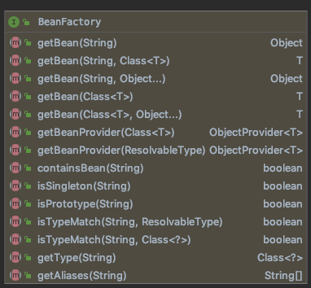

# BeanFactory

 [BeanFactory 官方文档笔记](../../02-core/01-the-ioc-container/15-the-bean-factory.md) 

BeanFactory 是典型的工厂模式

- 它的实现类负责创建 Bean
- 为 IoC 容器以及开发者管理对象依赖关系提供了便利和基础服务

## BeanFactory 的方法

BeanFactory 方法如下图:



主要是包括

- 通过各种途径获取 bean 的方法
- 判断 Bean 的属性的方法

```java
public interface BeanFactory {
//对 FactoryBean 的转义定义，因为如果使用 bean 的名字检索 FactoryBean 得到的对象是工厂生成的对象， 
//如果需要得到工厂本身，需要转义
String FACTORY_BEAN_PREFIX = "&";
//根据 bean 的名字，获取在 IOC 容器中得到 bean 实例
Object getBean(String name) throws BeansException;
//根据 bean 的名字和 Class 类型来得到 bean 实例，增加了类型安全验证机制。 
Object getBean(String name, Class requiredType) throws BeansException;
//提供对 bean 的检索，看看是否在 IOC 容器有这个名字的 bean 
boolean containsBean(String name);
//根据 bean 名字得到 bean 实例，并同时判断这个 bean 是不是单例
boolean isSingleton(String name) throws NoSuchBeanDefinitionException;
//得到 bean 实例的 Class 类型
Class getType(String name) throws NoSuchBeanDefinitionException; 
  //得到 bean 的别名，如果根据别名检索，那么其原名也会被检索出来 
String[] getAliases(String name);
}
```

## BeanFactory hierarchy 层级结构


- BeanFactory 是最顶层的抽象类,主要规范了IoC容器最基本的功能

三个子类:

- ListableBeanFactory
- HierarchicalBeanFactory
- AutowireCapableBeanFactory

最终实现类

- DefaultListableBeanFactory

对 BeanFactory 进行如此多的层次的子接口,体现了单一职责原则和迪米特法则