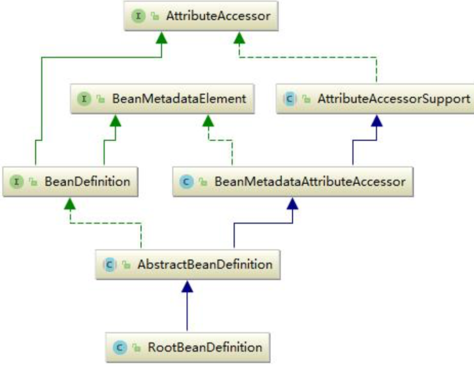
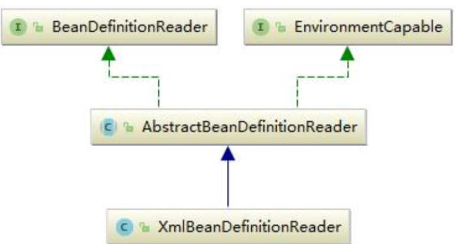

# BeanFactory

 [BeanFactory 官方文档笔记](../../02-core/01-the-ioc-container/15-the-bean-factory.md) 

BeanFactory 是典型的工厂模式

- 它的实现类负责创建 Bean
- 为 IoC 容器以及开发者管理对象依赖关系提供了便利和基础服务

## BeanFactory 的方法

BeanFactory 方法如下图:


主要是包括

- 通过各种途径获取 bean 的方法
- 判断 Bean 的属性的方法

```java

```

## BeanFactory hierarchy 层级结构


- BeanFactory 是最顶层的抽象类,主要规范了IoC容器最基本的功能

三个子类:

- ListableBeanFactory
- HierarchicalBeanFactory
- AutowireCapableBeanFactory

最终实现类

- DefaultListableBeanFactory

对 BeanFactory 进行如此多的层次的子接口,体现了单一职责原则和迪米特法则

那为何要定义这么多层次的接口呢?查阅这些接口的源码和说明发现，每个接口都有它使用的场合，它主要是为了区分在 Spring 内部在操作过程中对象的传递和转化过程时，对对象的数据访问所做的限制。 例如 `ListableBeanFactory` 接口表示这些 Bean 是可列表化的，而 `HierarchicalBeanFactory `表示的是 这些 Bean 是有继承关系的，也就是每个 Bean 有可能有父 Bean。`AutowireCapableBeanFactory `接口定义 Bean 的自动装配规则。这三个接口共同定义了 Bean 的集合、Bean 之间的关系、以及 Bean 行 为。

## 源码

在 BeanFactory 里只对 IOC 容器的基本行为作了定义，根本不关心你的 Bean 是如何定义怎样加载的。

```
public interface BeanFactory {
//对 FactoryBean 的转义定义，因为如果使用 bean 的名字检索 FactoryBean 得到的对象是工厂生成的对象， 
//如果需要得到工厂本身，需要转义
String FACTORY_BEAN_PREFIX = "&";
//根据 bean 的名字，获取在 IOC 容器中得到 bean 实例
Object getBean(String name) throws BeansException;
//根据 bean 的名字和 Class 类型来得到 bean 实例，增加了类型安全验证机制。 
Object getBean(String name, Class requiredType) throws BeansException;
//提供对 bean 的检索，看看是否在 IOC 容器有这个名字的 bean 
boolean containsBean(String name);
//根据 bean 名字得到 bean 实例，并同时判断这个 bean 是不是单例
boolean isSingleton(String name) throws NoSuchBeanDefinitionException;
//得到 bean 实例的 Class 类型
Class getType(String name) throws NoSuchBeanDefinitionException; 
  //得到 bean 的别名，如果根据别名检索，那么其原名也会被检索出来 
String[] getAliases(String name);
}
```

正如我们只关心工厂里得到什么的产品对象，至于工厂是怎么生产这些对象的，这个基本的接口不关心。

而要知道工厂是如何产生对象的，我们需要看具体的 IOC 容器实现，Spring 提供了许多 IOC 容器 的 实 现 。 比 如 `GenericApplicationContext` ， `ClasspathXmlApplicationContext `等 。

`ApplicationContext` 是 Spring 提供的一个高级的 IOC 容器，它除了能够提供 IOC 容器的基本功能
外，还为用户提供了以下的附加服务。从` ApplicationContext `接口的实现，我们看出其特点:

- 支持信息源，可以实现国际化。(实现 MessageSource 接口)
- 访问资源。(实现 ResourcePatternResolver 接口，后面章节会讲到) 
- 支持应用事件。(实现 ApplicationEventPublisher 接口)

#### BeanDefinition

SpringIOC 容器管理了我们定义的各种 Bean 对象及其相互的关系，Bean 对象在 Spring 实现中是 以 `BeanDefinition` 来描述的，其继承体系如下:



#### BeanDefinitionReader

Bean 的解析过程非常复杂，功能被分的很细，因为这里需要被扩展的地方很多，必须保证有足够的灵 活性，以应对可能的变化。Bean 的解析主要就是对 Spring 配置文件的解析。这个解析过程主要通过 `BeanDefintionReader` 来完成，最后看看 Spring 中 `BeanDefintionReader` 的类结构图:



