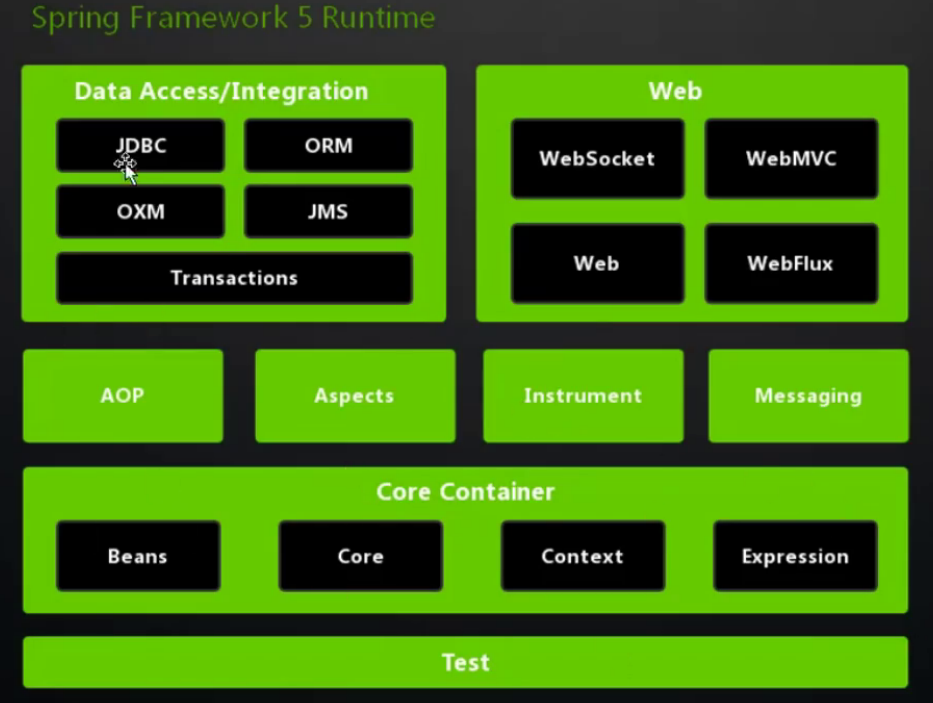
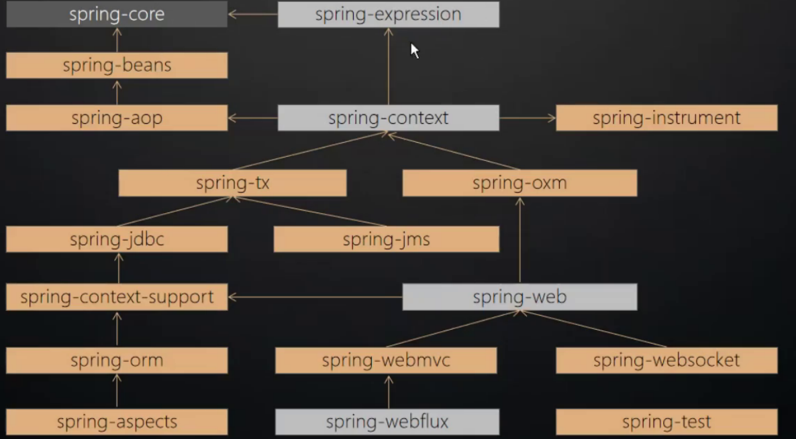

# Spring 源码分析

> <Spring 源码深度分析> 第二版 读书笔记

## Spring 的模块

### 核心模块包括

|      | 模块                   | 简介                                         |
| ---- | ---------------------- | -------------------------------------------- |
| 1    | spring-core            | 依赖注入 IoC 与 DI的最基本实现               |
| 2    | spring-beans Bean      | 工厂与 Bean 的装配                           |
| 3    | spring-context         | 定义基础的 Spring 的 Context上下文即IoC 容器 |
| 4    | spring-context-support | 对 Spring IoC 容器的拓展,以及IoC 子容器      |
| 5    | spring-context-indexer | Spring 的类管理组件和 Classpath 扫描         |
| 6    | spring-expression      | Spring 表达式语言                            |

### 切面编程模块

|      | 模块              | 简介                                           |
| ---- | ----------------- | ---------------------------------------------- |
| 7    | spring-aop        | 面向切面编程的应用模块,整合 Asm/CGlib/JDKProxy |
| 8    | spring-aspects    | 集成 AspectJ AOP应用框架                       |
| 9    | spring-instrument | 动态 Class Loading 模块                        |

### 数据访问与集成

|      | 模块               | 简介                                                         |
| ---- | ------------------ | ------------------------------------------------------------ |
| 10   | spring-jdbc        | Spring 提供 JDBC抽象框架的主要实现模块                       |
| 11   | spring-tx          | Spring JDBC 事务控制实现模块                                 |
| 12   | spring-orm         | 主要集成 Hibernate,Java Persistence API(JPA),Java Data Object(JDO) |
| 13   | spring-oxm         | 将 java 对象映射成 xml 数据,或者将 xml 数据映射成Java 对象   |
| 14   | spring-jms         | 对 Java Message Service(JSM) 的集成,主要用于消息服务的管理   |
| 15   | spring-transaction | 支持编程和声明性的事务管理,这些事务类必须要实现特定的接口,对锁头 POJO 课件 |

#### Web组件

|      | 模块             | 简介                                                         |
| ---- | ---------------- | ------------------------------------------------------------ |
| 16   | spring-web       | 对 web 最基本的支持,建立在核心容器之上,通过 Servlet 或者是 Listeners 来初始化 IoC 容器 |
| 17   | spring-web-mvc   | 实现了 SpringMVC                                             |
| 18   | spring-websocket | 对 websocket 的支持                                          |
| 19   | spring-webflux   | 非阻塞函数式 Reactive Web 框架,异步非阻塞事件驱动的服务      |

#### 通讯报文

|      | 模块           | 介绍                                         |
| ---- | -------------- | -------------------------------------------- |
| 20   | spring-message | 为 Spring 框架集成一些基础的报文传送相关服务 |
|      |                |                                              |
|      |                |                                              |

#### Test

|      | 模块        | 简介     |
| ---- | ----------- | -------- |
| 21   | spring-test | 测试相关 |
|      |             |          |
|      |             |          |

### 版本兼容

#### Test

|      | 模块                 | 简介                                                     |
| ---- | -------------------- | -------------------------------------------------------- |
| 21   | Spring-framework-bom | 解决 spring不同模块依赖版本不同的问题(bill of meterials) |
|      |                      |                                                          |
|      |                      |                                                          |

## 各模块关系依赖

