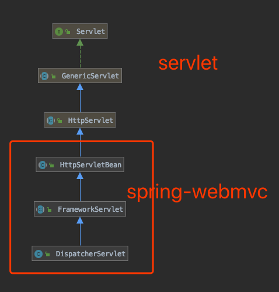

# Dispatcher Servlet 是如何被初始化的

## DispatcherServlet Hierarchy

1. Servlet 规范规定, Servlet 容器初始化时会根据 web.xml 中配置调用 Serlvet的 `init(ServletConfig config)`

2. HttpServletBean 的 init 方法会调用SpringMVC初始化相关机制

   