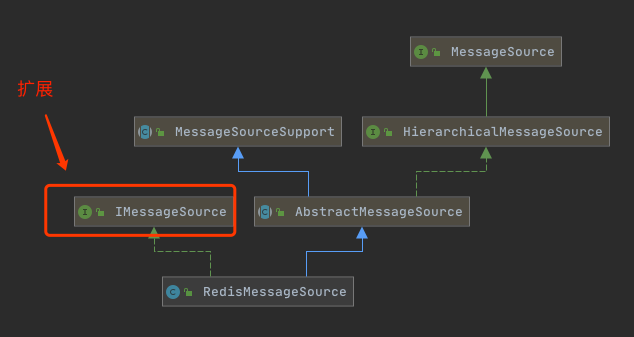

# 国际化消息机制-工程实践

国际化消息机制一个最常用的用法就是错误消息的国际化

```
org.hzero.core.message
```

- [Message消息类](#Message消息类)

- [MessageAccessor消息获取工具类](#MessageAccessor消息获取工具类)
- [IMessageSource消息源](#IMessageSource消息源)
- [基于Redis的消息源](#基于Redis的消息源)




## Message消息类

```java
/**
 * 消息及类型
 */
public class Message {

    public static final Type DEFAULT_TYPE = Type.WARN;

    private String code;

    private String desc;

    private String type;

    public Message() {
    }

    /**
     * 构建消息，默认消息类型为 警告(WARN) 基本
     */
    public Message(String code, String desc) {
        this.code = code;
        this.desc = desc;
        String[] arr = StringUtils.split(code, ".");
        if (arr != null && arr.length > 2) {
            Type t = Type.match(arr[1]);
            if (t != null) {
                this.type = t.code;
            }
        }
        if (StringUtils.isBlank(this.type)) {
            this.type = Message.DEFAULT_TYPE.code();
        }
    }

    public Message(String code, String desc, Type type) {
        this.code = code;
        this.desc = desc;
        this.type = type.code();
    }

    public String code() {
        return code;
    }

    public Message setCode(String code) {
        this.code = code;
        return this;
    }

    public String desc() {
        return desc;
    }

    public Message setDesc(String desc) {
        this.desc = desc;
        return this;
    }

    public String type() {
        return type;
    }

    public Message setType(String type) {
        this.type = type;
        return this;
    }

    public String getCode() {
        return code;
    }

    public String getDesc() {
        return desc;
    }

    public String getType() {
        return type;
    }

    public enum Type {
        INFO("info"),

        WARN("warn"),

        ERROR("error")

        ;

        private String code;

        static final Map<String, Type> MAP = new HashMap<>();

        static {
            for (Type value : Type.values()) {
                MAP.put(value.code, value);
            }
        }

        Type(String code) {
            this.code = code;
        }

        public String code() {
            return code;
        }

        public static Type match(String code) {
            return MAP.get(StringUtils.lowerCase(code));
        }
    }


  
}
```

## MessageAccessor消息获取工具类

```java
/**
 * 首先从Redis缓存中获取消息，如果没有则从 classpath 下的 message.properties 里获取，使用者可提供默认消息。
 * 该消息存取器里的静态方法返回的 Message 对象不会为 null。
 *
 * @author bojiangzhou 2018/09/15
 * @see MessageSourceAccessor
 */
public class MessageAccessor {

    private static final IMessageSource REDIS_MESSAGE_SOURCE;
    private static final ReloadableResourceBundleMessageSource PARENT_MESSAGE_SOURCE;

    private static final List<String> basenames = ImmutableList.of(
            "classpath:messages/messages",
            "classpath:messages/messages_core",
            "classpath:messages/messages_redis",
            "classpath:messages/messages_export",
            "classpath:messages/messages_ext"
    );

    private MessageAccessor() throws IllegalAccessException {
        throw new IllegalAccessException();
    }

    static {
        PARENT_MESSAGE_SOURCE = new ReloadableResourceBundleMessageSource();
        PARENT_MESSAGE_SOURCE.setBasenames(getBasenames());
        PARENT_MESSAGE_SOURCE.setDefaultEncoding("UTF-8");

        Class clazz;
        IMessageSource redisMessageSource;
        try {
            clazz = Class.forName("org.hzero.core.message.RedisMessageSource");
            // 依赖了starter
            redisMessageSource = (IMessageSource) clazz.newInstance();
        } catch (Exception e){
            redisMessageSource = new IMessageSource() {
                @Override
                public void setParent(MessageSource messageSource) {
                }
            };
        }
        redisMessageSource.setParent(PARENT_MESSAGE_SOURCE);
        REDIS_MESSAGE_SOURCE = redisMessageSource;
    }

    public static String[] getBasenames() {
        return ArrayUtils.toStringArray(basenames.toArray());
    }

    /**
     * 添加资源文件位置
     *
     * @param names 如 <code>classpath:messages/messages_core</code>
     */
    public static void addBasenames(String... names) {
        PARENT_MESSAGE_SOURCE.addBasenames(names);
    }

    /**
     * 覆盖默认资源文件位置
     *
     * @param names 如 <code>classpath:messages/messages_core</code>
     */
    public static void setBasenames(String... names) {
        PARENT_MESSAGE_SOURCE.setBasenames(names);
    }

    /**
     * 先从缓存获取多语言消息，没有则从本地消息文件获取多语言消息
     */
    public static Message getMessage(String code, String defaultMessage) {
        return REDIS_MESSAGE_SOURCE.resolveMessage(PARENT_MESSAGE_SOURCE, code, null, defaultMessage, LanguageHelper.locale());
    }

    /**
     * 先从缓存获取多语言消息，没有则从本地消息文件获取多语言消息
     */
    public static Message getMessage(String code, String defaultMessage, Locale locale) {
        return REDIS_MESSAGE_SOURCE.resolveMessage(PARENT_MESSAGE_SOURCE, code, null, defaultMessage, locale);
    }

    /**
     * 先从缓存获取多语言消息，没有则从本地消息文件获取多语言消息
     */
    public static Message getMessage(String code, Object[] args, String defaultMessage) {
        return REDIS_MESSAGE_SOURCE.resolveMessage(PARENT_MESSAGE_SOURCE, code, args, defaultMessage, LanguageHelper.locale());
    }

    /**
     * 先从缓存获取多语言消息，没有则从本地消息文件获取多语言消息
     */
    public static Message getMessage(String code, Object[] args, String defaultMessage, Locale locale) {
        return REDIS_MESSAGE_SOURCE.resolveMessage(PARENT_MESSAGE_SOURCE, code, args, defaultMessage, locale);
    }

    /**
     * 先从缓存获取多语言消息，没有则从本地消息文件获取多语言消息
     */
    public static Message getMessage(String code) {
        return REDIS_MESSAGE_SOURCE.resolveMessage(PARENT_MESSAGE_SOURCE, code, null, LanguageHelper.locale());
    }

    /**
     * 先从缓存获取多语言消息，没有则从本地消息文件获取多语言消息
     */
    public static Message getMessage(String code, Locale locale) {
        return REDIS_MESSAGE_SOURCE.resolveMessage(PARENT_MESSAGE_SOURCE, code, null, locale);
    }

    /**
     * 先从缓存获取多语言消息，没有则从本地消息文件获取多语言消息
     */
    public static Message getMessage(String code, Object[] args) {
        return REDIS_MESSAGE_SOURCE.resolveMessage(PARENT_MESSAGE_SOURCE, code, args, LanguageHelper.locale());
    }

    /**
     * 先从缓存获取多语言消息，没有则从本地消息文件获取多语言消息
     */
    public static Message getMessage(String code, Object[] args, Locale locale) {
        return REDIS_MESSAGE_SOURCE.resolveMessage(PARENT_MESSAGE_SOURCE, code, args, locale);
    }

    /**
     * 从本地消息文件获取多语言消息
     */
    public static Message getMessageLocal(String code) {
        return new Message(code, PARENT_MESSAGE_SOURCE.getMessage(code, null, LanguageHelper.locale()));
    }

    /**
     * 从本地消息文件获取多语言消息
     */
    public static Message getMessageLocal(String code, Locale locale) {
        return new Message(code, PARENT_MESSAGE_SOURCE.getMessage(code, null, locale));
    }

    /**
     * 从本地消息文件获取多语言消息
     */
    public static Message getMessageLocal(String code, Object[] args) {
        return new Message(code, PARENT_MESSAGE_SOURCE.getMessage(code, args, LanguageHelper.locale()));
    }

    /**
     * 从本地消息文件获取多语言消息
     */
    public static Message getMessageLocal(String code, Object[] args, Locale locale) {
        return new Message(code, PARENT_MESSAGE_SOURCE.getMessage(code, args, locale));
    }

}

```

## IMessageSource消息源


```java
/**
 * 获取描述的默认实现
 *
 * @author shuangfei.zhu@hand-china.com 2019/10/22 16:04
 */
public interface IMessageSource {

    Logger LOGGER = LoggerFactory.getLogger(IMessageSource.class);

    default void setParent(MessageSource messageSource){
    }

    default Message resolveMessage(ReloadableResourceBundleMessageSource parentMessageSource, String code, Object[] args, Locale locale) {
        return resolveMessage(parentMessageSource, code, args, null, locale);
    }

    default Message resolveMessage(ReloadableResourceBundleMessageSource parentMessageSource, String code, Object[] args, String defaultMessage, Locale locale) {
        Message message = new Message();
        String desc = null;
        try {
            desc = parentMessageSource.getMessage(code, null, locale);
        } catch (NoSuchMessageException e) {
            LOGGER.warn("resolveMessage not found message for code={}", code);
        }
        if (StringUtils.isBlank(desc) && StringUtils.isNotBlank(defaultMessage)) {
            desc = defaultMessage;
        }
        if (StringUtils.isNotBlank(desc) && ArrayUtils.isNotEmpty(args)) {
            desc = new MessageFormat(desc, locale).format(args);
        }
        if (StringUtils.isBlank(desc)) {
            desc = code;
        }

        String finalDesc = desc;
        message = Optional.of(message).map(m -> m.setDesc(finalDesc)).orElse(new Message(code, desc));
        LOGGER.debug("resolve message: code={}, message={}, language={}", code, message, locale);
        return message;
    }
}
```

## 基于Redis的消息源

```java
/**
 * 基于Redis的消息源
 *
 * @author bojiangzhou 2019/01/11
 */
public class RedisMessageSource extends AbstractMessageSource implements IMessageSource {

    private static final Logger LOGGER = LoggerFactory.getLogger(RedisMessageSource.class);
    private static final String MESSAGE_KEY = "hpfm:message:";

    private RedisHelper redisHelper;
    private int redisDb = 1;

    public RedisMessageSource() {
        ApplicationContextHelper.asyncInstanceSetter(RedisHelper.class, this, "setRedisHelper");
        ApplicationContextHelper.asyncInstanceSetter(Environment.class, this, "setEnvironment");
    }

    public RedisMessageSource(RedisHelper redisHelper) {
        this.redisHelper = redisHelper;
        ApplicationContextHelper.asyncInstanceSetter(Environment.class, this, "setEnvironment");
    }

    private void setRedisHelper(RedisHelper redisHelper) {
        this.redisHelper = redisHelper;
    }

    private void setEnvironment(Environment environment) {
        this.redisDb = Integer.parseInt(environment.getProperty("hzero.service.platform.redis-db", "1"));
    }

    @Override
    public void setParent(MessageSource messageSource) {
        this.setParentMessageSource(messageSource);
        this.setAlwaysUseMessageFormat(true);
    }


    @Override
    public Message resolveMessage(ReloadableResourceBundleMessageSource parentMessageSource, String code, Object[] args, Locale locale) {
        return resolveMessage(parentMessageSource, code, args, null, locale);
    }

    @Override
    public Message resolveMessage(ReloadableResourceBundleMessageSource parentMessageSource, String code, Object[] args, String defaultMessage, Locale locale) {
        Message message = getMessageObject(code, locale);
        String desc = null;
        if (message != null) {
            desc = message.desc();
        } else {
            try {
                desc = getParentMessageSource().getMessage(code, null, locale);
            } catch (NoSuchMessageException e) {
                LOGGER.warn("resolveMessage not found message for code={}", code);
            }
        }
        if (StringUtils.isBlank(desc) && StringUtils.isNotBlank(defaultMessage)) {
            desc = defaultMessage;
        }
        if (StringUtils.isNotBlank(desc) && ArrayUtils.isNotEmpty(args)) {
            desc = createMessageFormat(desc, locale).format(args);
        }
        if (StringUtils.isBlank(desc)) {
            desc = code;
        }

        String finalDesc = desc;
        message = Optional.ofNullable(message).map(m -> m.setDesc(finalDesc)).orElse(new Message(code, desc));
        LOGGER.debug("resolve message: code={}, message={}, language={}", code, message, locale);
        return message;
    }

    @Override
    protected MessageFormat resolveCode(String code, Locale locale) {
        Message message = getMessageObject(code, locale);

        String msg = null;
        if (message != null) {
            msg = message.desc();
        } else {
            try {
                msg = getParentMessageSource().getMessage(code, null, locale);
            } catch (NoSuchMessageException e) {
                LOGGER.warn("resolveCode not found message for code={}", code);
            }
        }
        if (StringUtils.isNotBlank(msg)) {
            return createMessageFormat(msg, locale);
        }
        return null;
    }

    private Message getMessageObject(String code, Locale locale) {
        if (StringUtils.isBlank(code)) {
            return new Message("null", "null");
        }
        if (redisHelper == null) {
            LOGGER.debug("redisHelper is null, use local message");
            return null;
        }
        String language;
        if (locale == null || StringUtils.isBlank(locale.toString())) {
            language = LanguageHelper.language();
        } else {
            language = locale.toString();
        }
        String obj = SafeRedisHelper.execute(redisDb, () -> redisHelper.hshGet(MESSAGE_KEY + language, code));

        if (StringUtils.isNotEmpty(obj)) {
            return redisHelper.fromJson(obj, Message.class);
        }
        return null;
    }


}
```

