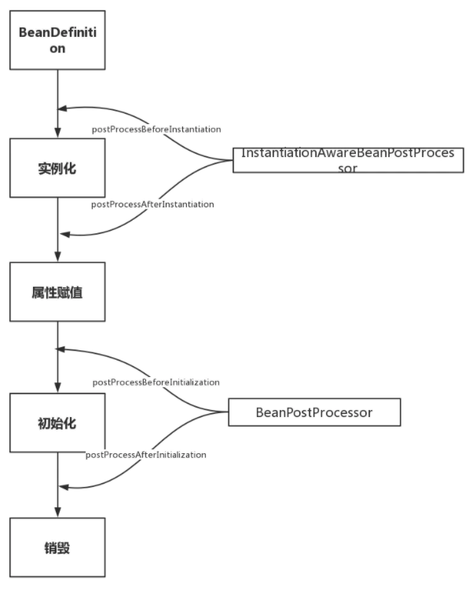

# BeanPostProcessor-Bean实例化感知后置处理器

## 目录

- [执行流程图解](#执行流程图解)

- [InstantiationAwareBeanPostProcessor简介](#InstantiationAwareBeanPostProcessor简介)

## 执行流程图解



## InstantiationAwareBeanPostProcessor简介

InstantiationAwareBeanPostProcessor 实际上继承了BeanPostProcessor接口，严格意义上来看他们不是两兄弟，而是两父子。但是从生命周期角度我们重点关注其特有的对实例化阶段的影响，图中省略了从 BeanPostProcessor 继承的方法。

```dart
InstantiationAwareBeanPostProcessor extends BeanPostProcessor
```

## 源码分析

- postProcessBeforeInstantiation调用点,忽略无关代码：

```tsx
@Override
    protected Object createBean(String beanName, RootBeanDefinition mbd, @Nullable Object[] args)
            throws BeanCreationException {
        try {
            // Give BeanPostProcessors a chance to return a proxy instead of the target bean instance.
            // postProcessBeforeInstantiation方法调用点，这里就不跟进了，
            // 有兴趣的同学可以自己看下，就是for循环调用所有的InstantiationAwareBeanPostProcessor
            Object bean = resolveBeforeInstantiation(beanName, mbdToUse);
            if (bean != null) {
                return bean;
            }
        }
        try {   
            // 上文提到的doCreateBean方法，可以看到
            // postProcessBeforeInstantiation方法在创建Bean之前调用
            Object beanInstance = doCreateBean(beanName, mbdToUse, args);
            if (logger.isTraceEnabled()) {
                logger.trace("Finished creating instance of bean '" + beanName + "'");
            }
            return beanInstance;
        }
        
    }
```

可以看到，postProcessBeforeInstantiation在doCreateBean之前调用，也就是在bean实例化之前调用的，英文源码注释解释道该方法的返回值会替换原本的Bean作为代理，这也是Aop等功能实现的关键点。

- postProcessAfterInstantiation调用点，忽略无关代码：

```tsx
protected void populateBean(String beanName, RootBeanDefinition mbd, @Nullable BeanWrapper bw) {

   // Give any InstantiationAwareBeanPostProcessors the opportunity to modify the
   // state of the bean before properties are set. This can be used, for example,
   // to support styles of field injection.
   boolean continueWithPropertyPopulation = true;
    // InstantiationAwareBeanPostProcessor#postProcessAfterInstantiation()
    // 方法作为属性赋值的前置检查条件，在属性赋值之前执行，能够影响是否进行属性赋值！
   if (!mbd.isSynthetic() && hasInstantiationAwareBeanPostProcessors()) {
      for (BeanPostProcessor bp : getBeanPostProcessors()) {
         if (bp instanceof InstantiationAwareBeanPostProcessor) {
            InstantiationAwareBeanPostProcessor ibp = (InstantiationAwareBeanPostProcessor) bp;
            if (!ibp.postProcessAfterInstantiation(bw.getWrappedInstance(), beanName)) {
               continueWithPropertyPopulation = false;
               break;
            }
         }
      }
   }
   // 忽略后续的属性赋值操作代码
}
```

可以看到该方法在属性赋值方法内，但是在真正执行赋值操作之前。其返回值为boolean，返回false时可以阻断属性赋值阶（`continueWithPropertyPopulation = false;`）。

关于BeanPostProcessor执行阶段的源码穿插在下文Aware接口的调用时机分析中，因为部分Aware功能的就是通过他实现的!只需要先记住 BeanPostProcessor 在初始化前后调用就可以了。

#### 

