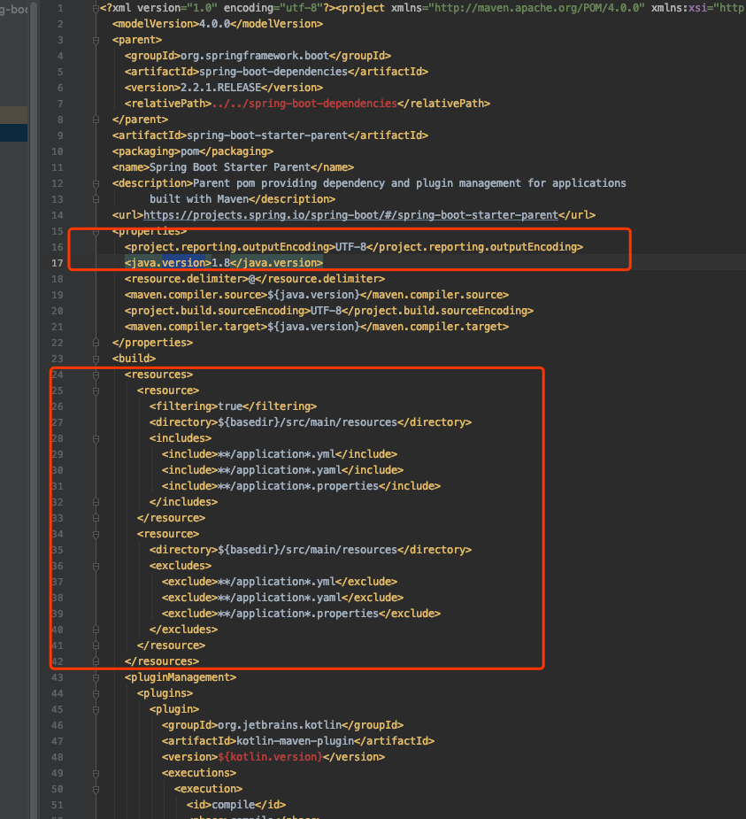

# SpringBoot Starters

- Spring Boot Starters 是 jar 包依赖
- 使用自动配置快速配置我们的应用,不需要我们手动引入依赖

## spring-boot-starter-parent 介绍

- `spring-boot-starter-parent`

- 是 spring 官方提供的父pom,包含了默认的 maven 依赖

- 我们在它基础上拓展 

  

如上图

- 规定项目编译默认的 java 版本
- 规定了 build 引入的资源
- 一些插件管理等等

